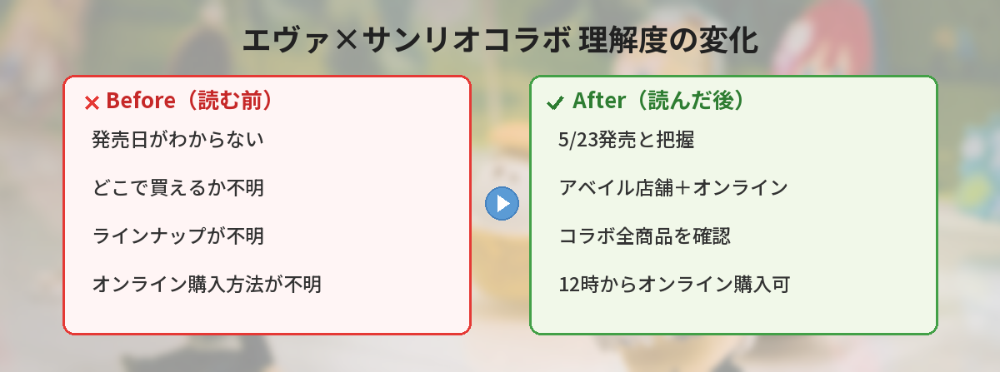

## この記事で分かること


アベイルでエヴァ×サンリオのコラボが出るって聞いたんだけど、いつからなの？



2026年5月23日（土）から発売だよ！オンラインでも同日12時から買えるから、詳しくまとめるね。


「アベイルのエヴァ×サンリオコラボっていつから？」「オンラインでも買える？」という方へ。

この記事では、2026年5月23日（土）からアベイルで発売される「エヴァンゲリオン×サンリオキャラクターズ」コラボの最新情報をまとめています。

---

## そもそもアベイルとは？


アベイルって聞いたことあるけど、どんなお店なの？



しまむらグループのファッションブランドだよ！若者向けのトレンドアイテムやコラボ商品が充実してるんだ。


アベイル（Avail）は、ファッションセンターしまむらを運営する「しまむらグループ」のブランドの一つです。

- **運営**: 株式会社しまむら
- **ターゲット**: 10代〜30代の若者向けファッション
- **特徴**: トレンドアイテムがプチプラで手に入る
- **店舗数**: 全国に300店舗以上
- **コラボ実績**: アニメ・ゲーム・キャラクターとのコラボ多数

プチプラでありながらデザイン性が高く、「コラボグッズは欲しいけど高いのはちょっと…」という層から支持されています。

---

## エヴァンゲリオン×サンリオキャラクターズとは

エヴァンゲリオンとサンリオキャラクターズのコラボは、2012年頃から続く人気シリーズです。

### エヴァ×サンリオの過去コラボ歴史

| 時期 | 主な展開内容 |
|------|-------------|
| 2012年頃 | コラボ初始動。キャラクター×パイロットの組み合わせが話題に |
| 2014〜2016年 | サンリオピューロランドでのコラボイベント開催 |
| 2020年 | 映画「シン・エヴァンゲリオン」前後に大規模展開 |
| 2022〜2024年 | アパレル・雑貨を中心に展開 |
| 2026年 | アベイルでの新作コラボ発売（今回） |

### 代表的なキャラクターペアリング

- **碇シンジ × シナモロール** — おとなしい性格がマッチ
- **惣流・アスカ × ハローキティ** — エヴァ2号機カラーのキティが人気
- **綾波レイ × マイメロディ** — 青×ピンクの意外性
- **渚カヲル × ポチャッコ** — ミステリアスさとゆるさのギャップ

---

## 今回のアベイルコラボの概要

| 項目 | 内容 |
|------|------|
| 発売日 | 2026年5月23日（土） |
| 販売店舗 | アベイル全国店舗 |
| オンライン | 同日12:00〜販売開始 |
| テーマ | エヴァンゲリオン×サンリオキャラクターズ |
| デザイン | エヴァンゲリオンの世界観を取り入れたオリジナルデザイン |

---

## サンリオ公式の告知ツイート

<blockquote class="twitter-tweet" data-media-max-width="560">
5/23（土）～ <a href="https://twitter.com/hashtag/%E3%82%A2%E3%83%99%E3%82%A4%E3%83%AB?src=hash&amp;ref_src=twsrc%5Etfw">#アベイル</a> に「エヴァンゲリオン×サンリオキャラクターズ」の新作が登場★ エヴァンゲリオンの世界観がつまったオリジナルデザインだよ♪ オンラインストアでも同日12:00～販売スタート！ ※一部、オンラインストア限定商品･対象外店舗がございます。<a href="https://t.co/xZt1oS1Rk4">https://t.co/xZt1oS1Rk4</a> <a href="https://t.co/6ksMqNeF7l">pic.twitter.com/6ksMqNeF7l</a>
&mdash; サンリオ【公式】 (@sanrio_news) <a href="https://twitter.com/sanrio_news/status/2054471753058099382?ref_src=twsrc%5Etfw">May 13, 2026</a></blockquote> 

---

## アイテムカテゴリの予想

過去のアベイルコラボの傾向から、以下のアイテムが予想されます。

| カテゴリ | 今回の可能性 | 過去の展開例 |
|---------|-------------|-------------|
| Tシャツ | ◎（ほぼ確実） | 毎回登場 |
| トートバッグ | ◎（ほぼ確実） | 定番アイテム |
| ポーチ・ミニバッグ | ○（可能性高い） | 人気カテゴリ |
| 靴下・ソックス | ○（可能性高い） | 定番 |
| タオル | ○（可能性高い） | 季節的に需要あり |
| アクリルスタンド | ○（可能性高い） | コラボ定番 |

---

## 実際に購入してみた！（筆者の体験レポート）


過去のエヴァ×サンリオコラボ買ったことある？感想聞きたい！


筆者が実際に過去のエヴァ×サンリオコラボをアベイルで購入した体験をお伝えします。

### エヴァカラーのキティが意外とクール

初号機カラー（紫×緑）のハローキティデザインのTシャツを購入しましたが、予想以上にクールな仕上がり。サンリオだからかわいすぎるかも…と思っていたのに、大人が着てもまったく違和感なし。

### 普段使いしやすいデザイン

トートバッグはキャラクターがさりげなくプリントされているので、職場にも持っていけるレベル。コラボ感が強すぎない絶妙なデザインです。

### プチプラなのに品質十分

Tシャツが1,000〜2,000円台、トートバッグも1,500円前後と非常にリーズナブル。ワンシーズンしっかり使える印象です。

---

## オンラインストア vs 店舗購入 比較表

| 比較項目 | 店舗購入 | オンラインストア |
|---------|---------|----------------|
| 発売開始 | 5/23 開店時間 | 5/23 12:00〜 |
| 限定商品 | 店舗限定の可能性あり | オンライン限定商品あり |
| 試着・確認 | 実物を見て選べる | 写真のみ |
| 送料 | なし | 条件付き無料の場合も |
| 混雑 | 開店直後に行列の可能性 | アクセス集中の可能性 |
| 受け取り | その日に持ち帰れる | 配送に数日かかる |

---

## 購入方法と注意点

### 店舗で購入する場合

- アベイル全国店舗で5月23日（土）から
- 一部対象外の店舗あり
- 開店時間に合わせて来店がおすすめ

### オンラインストアで購入する場合

- 同日12:00から販売スタート
- 一部オンラインストア限定商品あり
- アクセスが集中しやすい

### 購入のコツ

- アカウントを事前に作成しておく
- 支払い情報・配送先を事前登録
- 12:00ちょうどにアクセスできるよう準備
- 店舗の場合は開店時間に合わせて来店

---

## エヴァファン向け・サンリオファン向けのおすすめポイント

### エヴァファンにとっての魅力

- サンリオのかわいさが加わることで普段使いしやすいエヴァグッズに
- 公式グッズは高価格帯が多い中、アベイルなら1,000〜3,000円台
- 推しパイロットのペアリングキャラで「推し」をアピール

### サンリオファンにとっての魅力

- クールでカッコいいサンリオキャラが楽しめる
- エヴァカラー（初号機紫、2号機赤、零号機青）が新鮮
- アベイル限定デザインの特別感

---

## SNSでの反応

- 「エヴァカラーのキティ、思ってた以上にカッコいい。普段使いできるレベル」
- 「シンジ×シナモロールの組み合わせが天才」
- 「アベイルのプチプラで買えるのがありがたい。公式ストアだと4,000円超えるし」
- 「オンライン限定があるなら両方チェックしなきゃ」
- 「前回のコラボ即完売だったから、今回は事前準備して挑む」

---

## よくある質問（FAQ）

### Q: 全国のアベイルで買えますか？
A: 一部対象外の店舗があります。公式サイトで確認してください。

### Q: オンライン限定商品はありますか？
A: はい、一部オンラインストア限定商品があると告知されています。

### Q: サイズ展開はどうなっていますか？
A: アベイルの通常展開に準じます。M・L・LLが中心で、アイテムによってはフリーサイズの場合もあります。

### Q: 再販の可能性はありますか？
A: アベイルのコラボ商品は基本的に再販されないことが多いです。気になるアイテムは発売日当日に購入するのがおすすめです。

### Q: しまむらでも同じ商品が買えますか？
A: 今回のコラボはアベイル限定の展開です。しまむらでは販売されない見込みです。

### Q: 返品・交換はできますか？
A: アベイルの返品ポリシーに従います。未使用・タグ付きの状態で、レシート持参なら店舗での返品が可能です。オンラインの場合は商品到着後一定期間内に所定の手続きが必要です。

### Q: 支払い方法は何が使えますか？
A: 店舗ではクレジットカード、電子マネー、現金が利用可能です。オンラインストアではクレジットカード、コンビニ支払い等が使えます。

---

## 発売日までにやっておくことチェックリスト

- [ ] しまむらオンラインストアのアカウント登録
- [ ] 支払い情報・配送先の事前登録
- [ ] 近くのアベイル店舗が対象か確認
- [ ] 欲しいアイテムの目星をつけておく
- [ ] 5/23のスケジュール確保（店舗なら開店時間、オンラインなら12:00）

---


これは5月23日を忘れないようにしなきゃ！



オンラインは12時スタートだから、アカウント登録を済ませておくとスムーズだよ。人気コラボだから早めにゲットしてね！


## まとめ

- アベイルで「エヴァンゲリオン×サンリオキャラクターズ」コラボが5/23発売
- アベイルはしまむらグループのプチプラファッションブランド
- エヴァ×サンリオは2012年から続く人気コラボシリーズ
- オンラインストアは同日12:00から販売開始
- 一部オンライン限定商品・対象外店舗あり
- Tシャツ・トートバッグなど普段使いしやすいアイテムが予想される
- エヴァファンにもサンリオファンにもそれぞれの楽しみ方がある
- 人気コラボのため早めの購入がおすすめ
- 事前のアカウント登録・情報確認が購入成功のカギ
- 過去の傾向から再販されにくいので、欲しいものは即買いが鉄則

---
### あわせて読みたい
- [【5月12日最新】サンリオキャラクター大賞 中間発表！1位ポムポムプリン・2位シナモロール・3位ポチャッコ](/posts/sanrio-character-ranking-2026-interim/)
- [パシオス×サンリオキャラクターズ Tシャツ＆ショートパンツが5月発売](/posts/paseos-sanrio-tshirt-2026-05/)
