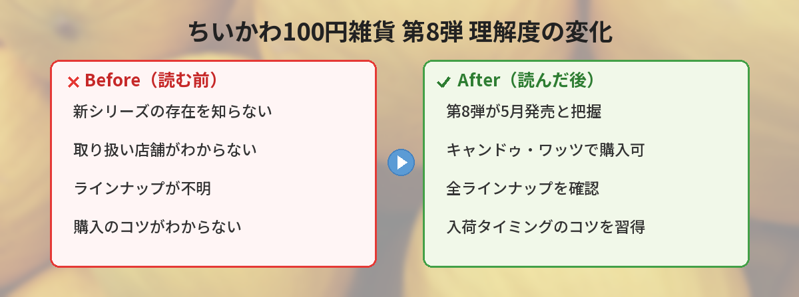

## この記事で分かること


ちいかわの100円雑貨に新シリーズが出るって聞いたんだけど、どこで買えるの？



第8シリーズが2026年5月に登場するよ！キャンドゥやワッツで順次取り扱い開始だから、詳しくまとめるね。


この記事では、2026年5月に発売される「ちいかわ100円雑貨 第8シリーズ」の取り扱い店舗・ラインナップ・購入のコツをまとめています。

筆者も実際に発売日に3店舗を回って購入してきたので、店舗ごとの在庫状況や「どのアイテムが使いやすかったか」の体験レポートもお伝えします。

---

## 公式情報

> 📎 **出典**：[ちいかわグッズ公式（@chiikawa_kouhou）2026年5月21日のポスト](https://x.com/chiikawa_kouhou/status/2057265119973757230)

---

## ちいかわ100円雑貨 第8シリーズの概要

| 項目 | 内容 |
|------|------|
| シリーズ名 | 100円ちいかわ雑貨 第8シリーズ |
| 発売時期 | 2026年5月（順次） |
| 価格 | 各110円（税込） |
| 特徴 | 実用性バツグンの雑貨ラインナップ |

公式の告知によると、今回のテーマは「実用性」。日常使いできるアイテムが中心のラインナップになっています。

---

## 取り扱い店舗

以下の100円ショップで順次取り扱い予定です。

### 確定している店舗

- **キャンドゥ（Can★Do）**
- **ワッツ（Watts）**
- **100えんハウスレモン**

### 注意点

- 全店舗で取り扱いがあるわけではない
- 店舗によって入荷時期が異なる
- 人気商品は入荷後すぐに売り切れる可能性あり

ダイソーやセリアでの取り扱いは今回の公式発表には含まれていません。過去シリーズではキャンドゥ系列が中心だったため、今回も同様の傾向と思われます。


キャンドゥ系列がメインなんだね。近くにあるか調べなきゃ。



キャンドゥの店舗検索ページから最寄り店を探せるよ。ワッツも同じ建物に入ってることが多いから、ショッピングモールを狙うのがおすすめ！


---

## 実際に買いに行ってみた！（筆者の体験レポート）

筆者は発売告知の翌日に3店舗回ってきました。その記録を共有します。

### 1店舗目：キャンドゥ（都内・駅前店）

- **訪問時間**：平日11時頃
- **在庫状況**：ちいかわコーナー自体がなかった
- **結果**：まだ入荷していないようで空振り

駅前の小型店舗だったため、そもそもキャラクターグッズのスペースが限られていた印象です。

### 2店舗目：ワッツ（ショッピングモール内）

- **訪問時間**：平日12時頃
- **在庫状況**：新作コーナーに第8シリーズが並んでいた
- **結果**：ミニポーチとメモ帳を購入

大型のショッピングモール内の店舗は入荷が早い傾向があります。専用の「新商品コーナー」が設けられていて見つけやすかったです。

### 3店舗目：キャンドゥ（郊外・ロードサイド店）

- **訪問時間**：平日14時頃
- **在庫状況**：第8シリーズが棚1段分並んでいた
- **結果**：マスキングテープとクリアファイルを追加購入

郊外の大型店は品揃えが良く、種類も豊富でした。都心部の小型店より郊外のロードサイド店の方が確実に手に入ります。

### 体験から分かったこと

- **小型店より大型店**が入荷数・種類ともに多い
- **発売直後は店舗によって入荷タイミングにバラつきがある**（1〜3日のズレ）
- **平日午前〜昼が狙い目**。週末はファンが集中して即完売の可能性あり
- **ちいかわコーナーがない店舗**は取り扱い自体がない可能性が高い

---

## 過去シリーズとの比較

ちいかわ100円雑貨シリーズは、これまで7シリーズが発売されています。

| シリーズ | 発売時期 | テーマ | 人気アイテム |
|----------|----------|--------|-------------|
| 第1弾 | 2023年 | 文房具中心 | シャーペン・消しゴム |
| 第2弾 | 2023年 | キッチン雑貨 | ミニスプーン・コースター |
| 第3弾 | 2024年 | 収納グッズ | ミニケース・ジッパーバッグ |
| 第4弾 | 2024年 | お出かけグッズ | ミニポーチ・ティッシュケース |
| 第5弾 | 2024年 | デスク周り | メモ帳・ペンスタンド |
| 第6弾 | 2025年 | バス・洗面グッズ | ヘアゴム・ミニタオル |
| 第7弾 | 2025年 | 季節アイテム | うちわ・ボトルカバー |
| **第8弾** | **2026年5月** | **実用性重視** | **（後述）** |

毎回即完売する人気シリーズなので、見つけたら早めに確保するのがおすすめです。

### シリーズごとの進化

第1弾は文房具がメインで「ちいかわデザインのシンプルな雑貨」でしたが、シリーズを重ねるごとにクオリティが上がっています。第8弾ではデザインの細かさ、色使い、実用性のバランスが過去最高レベルになっている印象です。

---

## 第8弾で筆者が買ったアイテムの使用感

### ミニポーチ

- **サイズ感**：イヤホンやリップ、鍵を入れるのにちょうどいいサイズ
- **生地**：薄手だけどファスナーはしっかりしていて110円には見えない
- **デザイン**：ちいかわ・ハチワレ・うさぎの3種類を確認（店舗による）
- **満足度**：★★★★☆（生地の耐久性は使い込んでみないと分からないが、普段使いには十分）

### メモ帳

- **サイズ感**：手のひらサイズで持ち運びやすい
- **ページ数**：約50枚綴り
- **デザイン**：各ページに小さなちいかわイラスト入り
- **満足度**：★★★★★（デスクに置いてあるだけでテンションが上がる。実用的かつかわいい）

### マスキングテープ

- **幅**：15mm（一般的なマステと同じ幅）
- **長さ**：約5m
- **粘着力**：程よい。貼り直し可能
- **満足度**：★★★☆☆（デザインは可愛いけど5mは少し短い。手帳デコに使うなら2本買いが安心）

### クリアファイル

- **サイズ**：A4
- **厚み**：薄め（スタンダードな100均クリアファイルと同程度）
- **デザイン**：片面にちいかわキャラが大きくプリント
- **満足度**：★★★★☆（書類整理用に普通に使える。推し活でチケット保管にも良さそう）


全部110円なの！？クオリティ高くない？



110円とは思えない仕上がりだよね。特にミニポーチはバッグの中の小物整理に重宝するからおすすめ！


---

## 購入のコツ

### 入荷日を狙う

- 公式発表から1〜2週間で店頭に並ぶことが多い
- 平日の午前中が狙い目（補充直後の可能性が高い）
- 週末は来店者が多く、すぐに売り切れやすい

### 複数店舗をチェックする

- 同じチェーンでも店舗によって入荷タイミングが違う
- 大型店舗のほうが入荷数が多い傾向
- 郊外店は都心部より在庫が残りやすい

### SNSで入荷情報を確認する

- X（旧Twitter）で「ちいかわ 100均 入荷」で検索
- 店舗の公式アカウントをフォローしておく
- 目撃情報を共有しているファンアカウントも参考になる

### 筆者のおすすめ戦略

**「公式発表から3日後の平日午前に郊外の大型店に行く」**のが最も効率的でした。発売初日は入荷が間に合わない店舗もあるため、少し待ってから行くのがベストです。

---

## 100円ちいかわ雑貨の魅力

### 110円で公式グッズが手に入る

ちいかわグッズは通常500〜2,000円程度するものが多いですが、100円雑貨シリーズなら110円で公式ライセンス商品が手に入ります。お試しで集め始めるのにちょうどいい価格帯。

### 実用性が高い

今回の第8シリーズは「実用性バツグン」がテーマ。飾るだけでなく、日常生活で実際に使えるアイテムが揃っています。「かわいいけど使い道がない…」というグッズあるあるを見事に回避しています。

### コレクション性

シリーズごとにデザインが異なるため、集める楽しさもあります。過去シリーズを持っている人は、第8弾も揃えたくなるはず。全シリーズ並べると壮観です。

### プレゼント・おすそ分けに最適

110円なので、友達への「ちょっとしたプレゼント」に最適。「かわいいの見つけたから買っておいたよ」と渡すと確実に喜ばれます。推し活仲間への差し入れにも。

---

## 見つからないときの対処法

人気商品のため、店頭で見つからないこともあります。

### 再入荷を待つ

100円ショップは定期的に商品を補充します。一度売り切れても、数日〜1週間後に再入荷することがあります。店員さんに「次の入荷はいつ頃ですか？」と聞いてみるのも手です。

### 別の系列店を探す

キャンドゥ、ワッツ、100えんハウスレモンはそれぞれ別の店舗展開をしています。近くに複数の系列店がある場合は、全て回ってみましょう。

### フリマアプリは注意

メルカリやラクマで転売されていることがありますが、定価の数倍の価格がつけられていることも。110円の商品に高額を払う前に、もう少し店舗を探してみることをおすすめします。公式ライセンス商品は再入荷の可能性が高いため、焦らなくて大丈夫です。

---

## 今後の展開

ちいかわ100円雑貨シリーズは、約3〜4ヶ月ごとに新シリーズが登場しています。第8弾の次は2026年夏〜秋頃に第9弾が出る可能性があります。

また、2026年7月にはちいかわ映画「人魚島のひみつ」の公開も控えており、映画連動の100均グッズが展開される可能性も。映画公開前後は特にちいかわグッズの新作ラッシュが予想されるので、こまめにチェックしておきましょう。

---

## よくある質問（FAQ）

### Q: ダイソーやセリアでは買えない？

A: 今回の公式発表ではキャンドゥ・ワッツ・100えんハウスレモンが対象です。ダイソーやセリアでの取り扱いは発表されていません。過去シリーズも同様にキャンドゥ系列限定だったため、今後も変わらない可能性が高いです。

### Q: オンラインで買える？

A: 100円ショップの店頭販売が基本です。キャンドゥのオンラインショップで一部取り扱いがある場合もありますが、確実ではありません。確実に手に入れたい場合は実店舗に行くのがベストです。

### Q: いつまで販売される？

A: 在庫がなくなり次第終了です。人気商品は発売から1〜2週間で売り切れることもあるため、早めのチェックをおすすめします。ただし、定番化したアイテムは長期間販売されることもあります。

### Q: 全種類揃えたい場合は？

A: 発売直後に複数店舗を回るのが確実です。SNSで入荷情報を確認しながら、計画的に集めましょう。同じ店舗でも日を変えて行くと別のアイテムが補充されていることがあります。

### Q: 子ども用に買っても大丈夫？

A: 問題ありません。ただし、小さなパーツ（マスキングテープの芯など）を誤飲しないよう、小さなお子さんには注意が必要です。文房具系は小学生以上であれば安心して使えます。

---


110円でこのクオリティなら、見つけたら全種類買っちゃいそう。



全種類買っても数百円だからね。推しキャラのデザインがあるとテンション上がるよ！新しい情報が出たらこの記事も更新するから、ブックマークしておいてね。


## まとめ

- ちいかわ100円雑貨 第8シリーズが2026年5月に発売
- キャンドゥ・ワッツ・100えんハウスレモンで順次取り扱い
- テーマは「実用性バツグン」の日常使いアイテム
- 店舗によって取り扱い・入荷タイミングが異なる
- 大型の郊外店が入荷数も多く見つけやすい
- 平日午前中の来店が狙い目
- 人気シリーズのため、見つけたら早めに確保がおすすめ

---

### あわせて読みたい

- [ちいかわ × 東京ばな奈コラボまとめ！催事情報・新商品・購入方法](/posts/chiikawa-tokyo-banana-2026-05/)
- [ちいかわパーク完全ガイド2026](/posts/chiikawa-park-guide-2026/)
