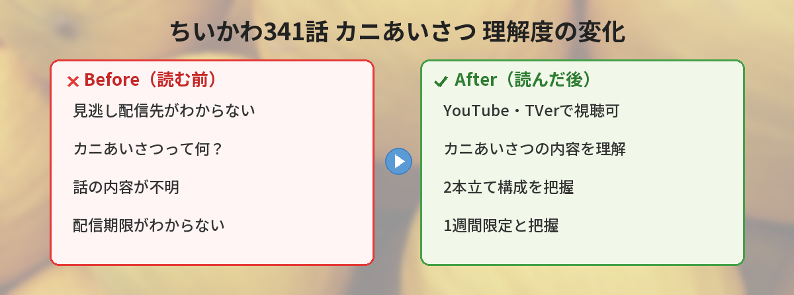

## この記事で分かること


ちいかわ第341話を見逃しちゃったんだけど、まだ見られるかな？



大丈夫！YouTubeとTVerで1週間限定の見逃し配信があるよ。カニあいさつが可愛すぎるから、見どころも一緒にまとめるね。


「ちいかわ第341話を見逃した…」「カニあいさつって何？」という方へ。

この記事では、2026年5月8日に放送されたアニメちいかわ第341話「カニ／カニあいさつ」の見逃し配信情報と、SNSで話題になったポイントをまとめています。

## 第341話「カニ／カニあいさつ」のあらすじ

第341話は2本立て構成です。

**前半「カニ」** では、古本屋が耳の部分を器用に動かしてみせるシーンが描かれます。
古本屋の意外な特技に注目です。

**後半「カニあいさつ」** では、ちいかわとハチワレがカニあいさつに大喜びする様子が描かれます。
二人のリアクションが可愛すぎると話題になりました。

## 公式ツイートで振り返る

アニメ公式アカウントから、見逃し配信の告知が投稿されています。

<blockquote class="twitter-tweet" data-media-max-width="560">
【✨1週間限定見逃し配信中✨】  第341話「カニ／カニあいさつ」  古本屋、耳の部分を器用に動かしてみせて…／ちいかわとハチワレ、カニあいさつに大喜び！  ▼YouTube<a href="https://t.co/TCLmOZxeyG">https://t.co/TCLmOZxeyG</a>  ▼TVer<a href="https://t.co/1BMGNtotE4">https://t.co/1BMGNtotE4</a> <a href="https://twitter.com/hashtag/%E3%81%A1%E3%81%84%E3%81%8B%E3%82%8F?src=hash&amp;ref_src=twsrc%5Etfw">#ちいかわ</a><a href="https://twitter.com/hashtag/%E3%82%A2%E3%83%8B%E3%83%A1%E3%81%A1%E3%81%84%E3%81%8B%E3%82%8F?src=hash&amp;ref_src=twsrc%5Etfw">#アニメちいかわ</a> <a href="https://t.co/ZXs7RWl208">pic.twitter.com/ZXs7RWl208</a>
&mdash; 『ちいかわ』アニメ公式 (@anime_chiikawa) <a href="https://twitter.com/anime_chiikawa/status/2052674878248235406?ref_src=twsrc%5Etfw">May 8, 2026</a></blockquote> 

そして、原作者ナガノ先生のアカウントからも関連イラストが投稿されました。

<blockquote class="twitter-tweet" data-media-max-width="560">
📚 <a href="https://t.co/0W19sdgp17">pic.twitter.com/0W19sdgp17</a>
&mdash; ちいかわ💫アニメ火金 (@ngnchiikawa) <a href="https://twitter.com/ngnchiikawa/status/2052718345158525292?ref_src=twsrc%5Etfw">May 8, 2026</a></blockquote> 

📚の絵文字だけで投稿されているのが、ナガノ先生らしいですね。
古本屋回ということで、本に関連した絵文字を添えているのかもしれません。


見逃し配信ってどこで見られるの？期限はある？



YouTubeとTVerで無料で見られるよ！ただし放送から1週間限定だから、早めにチェックしてね。


## 見逃し配信の視聴方法

第341話は1週間限定で見逃し配信されています。

| 配信先 | 特徴 |
|--------|------|
| YouTube（ちいかわ公式） | 無料・登録不要で視聴可能 |
| TVer | 無料・広告あり |

配信期限は放送から1週間なので、**2026年5月15日頃まで**が目安です。
見逃した方は早めにチェックしてください。


今回の見どころはどこなの？



古本屋の耳芸とカニあいさつの2つが注目ポイントだよ！どっちもSNSで大盛り上がりだったの。


## 第341話の見どころポイント

### 古本屋の耳芸

古本屋といえば、普段はクールで落ち着いた印象のキャラクターです。
そんな古本屋が耳を器用に動かしてみせるギャップが、ファンの間で大きな反響を呼びました。

### カニあいさつの破壊力

「カニあいさつ」という独特のあいさつに、ちいかわとハチワレが大喜びする姿が描かれます。
二人の無邪気なリアクションは、見ているだけで癒されます。

### 2本立て構成の満足感

今回は「カニ」と「カニあいさつ」の2本立て。
どちらもカニにまつわるエピソードで統一されていて、テーマの一貫性があります。


ちいかわアニメって毎日やってるの？



毎週火曜と金曜の放送だよ。短いから朝の忙しい時間でもサクッと見られるのが嬉しいよね。


## ちいかわアニメの放送スケジュール

アニメちいかわは毎週火曜日と金曜日に放送されています。

- **放送局**: フジテレビ系「めざましテレビ」内
- **放送時間**: 朝の番組内で放送
- **見逃し配信**: YouTube・TVerで1週間限定

短いエピソードなので、朝の忙しい時間でもサクッと楽しめるのが魅力です。

## よくある質問（FAQ）

### Q: ちいかわアニメは何分くらいですか？

A: 1話あたり約2〜3分の短編アニメです。朝の番組内で放送されるため、短い時間で楽しめます。

### Q: 見逃し配信はいつまで見られますか？

A: 放送から1週間限定です。第341話は2026年5月15日頃までが目安です。

### Q: 古本屋はどんなキャラクターですか？

A: ちいかわの世界に登場する古本屋を営むキャラクターです。落ち着いた雰囲気で、ちいかわたちに本を売っています。知的でクールな印象ですが、今回のように意外な一面を見せることもあります。

### Q: カニあいさつとは何ですか？

A: 第341話で登場するあいさつの一種です。カニのような動きを取り入れたあいさつで、ちいかわとハチワレが大喜びしていました。


カニあいさつ、早く見たくなってきた！



配信期限があるから、見逃した人は今すぐチェックしてね。2〜3分で見られるから気軽に楽しめるよ！


## まとめ

- 第341話は「カニ」「カニあいさつ」の2本立て構成
- 古本屋の耳芸という意外な見どころあり
- ちいかわとハチワレのカニあいさつへのリアクションが可愛い
- YouTubeとTVerで1週間限定の見逃し配信中
- ナガノ先生も📚絵文字で関連イラストを投稿

見逃した方は配信期限内にぜひチェックしてみてください。
短い時間で癒されること間違いなしです。
