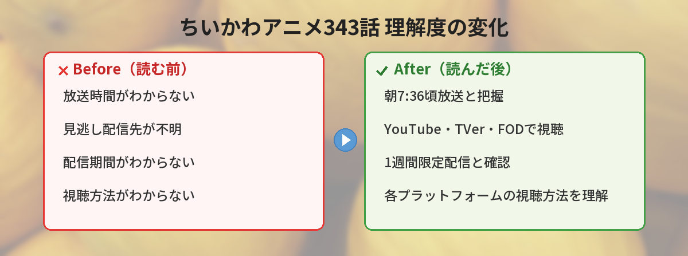

## この記事で分かること


ちいかわの343話って今日だよね！？何時から放送？見逃したらどこで見られるの？



2026年5月15日（金）の朝7:36頃にめざましテレビ内で放送だよ！見逃しても大丈夫、YouTube・TVer・FODで1週間限定配信があるから安心してね。


---

## 公式発表：アニメちいかわ第343話の放送予告

アニメちいかわ公式Xアカウントが、5月14日に第343話の放送予告を投稿しました。



---

## 第343話の放送情報まとめ

| 項目 | 内容 |
|------|------|
| 話数 | 第343話 |
| 放送日 | 2026年5月15日（金） |
| 放送時間 | 7時36分頃 |
| 放送局 | フジテレビ系列「めざましテレビ」内 |
| 見逃し配信 | YouTube / FOD / TVer |
| 配信期間 | 放送終了後〜1週間限定 |
| 無料配信 | 第1〜5話はしばらくの間無料配信中 |


朝7:36って早いな…仕事の準備中で見られないかも…



放送終了後すぐにYouTube・FOD・TVerで配信されるから、通勤中やお昼休みにも見られるよ！1週間以内にチェックすればOK。


---

## 第343話の見どころ予想


343話はどんな話になるのかな？楽しみすぎる！



直近のエピソードの流れから予想してみるね！


第341話でカニちゃん（古本屋）がアニメ初登場したことで、SNSでは大きな盛り上がりを見せました。直近のエピソードの流れを踏まえると、343話では以下のような展開が予想されます。

### 予想1：カニちゃんエピソードの続編

341話で登場したカニちゃんに関連するストーリーが続く可能性があります。原作では古本屋としてのエピソードが複数あるため、アニメでもシリーズ化されるかもしれません。

### 予想2：日常回への回帰

大きなイベント回の後は、ほのぼのとした日常回が入ることが多いパターンです。ちいかわ・ハチワレ・うさぎの3人がお仕事をしたり、おやつを食べたりする癒し回に期待。

### 予想3：新キャラ or 新展開の伏線

ちいかわアニメは定期的に原作の重要エピソードを映像化するため、新たなキャラクターの登場や伏線が張られる可能性もあります。

※実際の内容は放送後にSNSで確認してくださいね。

---

## 見逃し配信の視聴方法

第343話を見逃してしまった場合の視聴方法をまとめます。

### 無料で見る方法

| プラットフォーム | 配信期間 | 料金 | リンク |
|-----------------|---------|------|--------|
| YouTube（めざましテレビチャンネル） | 放送後〜1週間 | 無料 | [YouTubeで見る](https://www.youtube.com/@cx_mezamashi) |
| TVer | 放送後〜1週間 | 無料 | [TVerで見る](https://tver.jp/) |
| FOD | 放送後〜1週間 | 無料 | [FODで見る](https://fod.fujitv.co.jp/) |

※ YouTubeのリンクはめざましテレビチャンネルのトップページです。放送後に第343話の動画がアップされます。


YouTubeで無料で見られるのは嬉しい！登録しておけば通知も来るかな？



めざましテレビチャンネルをチャンネル登録しておくと、新しい動画がアップされたときに通知が来るよ。ちいかわは毎週火曜と金曜に更新されるから、登録しておくのがおすすめ！


---

## 視聴環境別おすすめガイド


みんなどうやって見てるの？朝リアタイは難しいんだけど…



視聴スタイルは人それぞれ！自分に合った方法で楽しめばOKだよ。


### 朝リアタイ派（めざましテレビ視聴派）

| メリット | デメリット |
|---------|----------|
| 最速で視聴できる | 朝7:36に起きている必要がある |
| SNSでリアルタイム実況に参加 | テレビ環境が必要 |
| めざましテレビの他コーナーも楽しめる | 録画し忘れると見逃す |

**こんな人向け**: 朝型の人、在宅ワーカー、テレビをつけながら朝支度する人

### お昼休み配信派（YouTube/TVer視聴派）

| メリット | デメリット |
|---------|----------|
| 好きな時間に視聴できる | 最速ではない |
| スマホで気軽に見られる | SNSでネタバレに遭う可能性 |
| 通勤中や休憩中に手軽 | Wi-Fi環境推奨 |

**こんな人向け**: 会社員、学生、通勤時間を活用したい人

### まとめて見る派（週末一気見派）

| メリット | デメリット |
|---------|----------|
| 複数話をまとめて楽しめる | 1週間SNSネタバレを避ける必要あり |
| 休日にゆっくり視聴 | 配信期限（1週間）に注意 |
| ストーリーの流れが分かりやすい | リアルタイムの盛り上がりに参加しにくい |

**こんな人向け**: 忙しい平日を過ごす人、まとまった時間で楽しみたい人

### 筆者の視聴スタイル

筆者が実際にちいかわアニメを楽しんでいるスタイルを紹介します。

「朝の支度をしながらめざましテレビをつけているんですが、ちいかわの放送時間帯（7:36頃）はちょうどバタバタしていて見逃しがち。結局、お昼休みにYouTubeで見るのが日課になっています。1分半〜2分で見られるので、ランチのお供にぴったりなんですよね。」

見終わったらXで「#アニメちいかわ」を検索して、みんなの感想を見るのも楽しみの一つです。同じシーンで笑ったり感動したりしているコメントを見ると、仲間意識が生まれて嬉しくなります。

---

## ちいかわアニメの放送スケジュール

ちいかわアニメは毎週火曜日と金曜日に放送されています。

| 曜日 | 放送時間 | 番組 |
|------|---------|------|
| 火曜日 | 7:36頃 | めざましテレビ内 |
| 金曜日 | 7:36頃 | めざましテレビ内 |

1話あたり約1分半〜2分の短いエピソードなので、朝の忙しい時間でもサクッと楽しめます。

---

## 最近のちいかわアニメの流れ

直近のエピソードを振り返ります。

| 話数 | 放送日 | 内容 |
|------|--------|------|
| 第341話 | 5月8日 | カニちゃん（古本屋）がアニメ初登場 |
| 第342話 | 5月13日 | - |
| **第343話** | **5月15日** | **本日放送** |

第341話ではファン待望のカニちゃん（古本屋）がアニメに初登場して大きな話題になりました。343話でもストーリーの続きが気になるところです。


341話のカニちゃん初登場は本当に盛り上がったよね！343話も楽しみ。放送後にSNSの反応もチェックしてみてね。


---

## 過去の人気エピソードTOP5（SNSで話題になった回）


過去のエピソードで特に盛り上がった回ってどれ？



SNSでの反応が特に大きかった回をランキングにしてみたよ！


ちいかわアニメの中でも、特にSNSで大きな反応があったエピソードを紹介します。

### 第1位：「でかつよ編」シリーズ

ちいかわの世界の危険さが描かれるシリアス回。普段のほのぼのとした雰囲気とのギャップで、放送のたびに「#ちいかわ」がトレンド入り。「朝からこれは心臓に悪い」「子どもと見てたのに泣いてしまった」などの声が殺到しました。

### 第2位：「擬態型」エピソード

見た目がかわいい敵キャラが実は…という恐怖展開。SNSでは「朝から怖い」「トラウマ回」と話題に。ちいかわの世界観の奥深さを感じさせる回として、ファンの間で語り継がれています。

### 第3位：「労働回」シリーズ

ちいかわたちが資格試験や労働に励むエピソード。「社会人共感しかない」「ちいかわ見て出勤する気力もらった」と、朝の視聴者から絶大な共感を得ました。

### 第4位：カニちゃん（古本屋）初登場回（第341話）

原作で人気の高いカニちゃんがついにアニメ化。放送直後から「待ってた」「カニちゃんの声完璧」と大盛り上がりでした。

### 第5位：「ハチワレの家」エピソード

ハチワレが洞窟に住んでいることが明かされる回。「切ないけど温かい」「ハチワレ推しになった」と、キャラクター人気に火がついたエピソードです。

---

## ちいかわアニメを最大限楽しむコツ


ちいかわアニメをもっと楽しむ方法ってある？



SNS実況やハッシュタグの活用がポイントだよ！


### SNS実況の楽しみ方

1. **放送前**: 「#アニメちいかわ」をXで検索し、予告の考察を見る
2. **放送中（リアタイ）**: リアルタイムでハッシュタグ付き投稿する
3. **放送後**: 他の視聴者の感想を見て共感する
4. **翌日以降**: 考察ツイートやファンアートを楽しむ

### おすすめハッシュタグ

| ハッシュタグ | 内容 |
|-------------|------|
| #アニメちいかわ | 公式タグ。放送後に感想が集まる |
| #ちいかわ | 汎用タグ。アニメ以外の情報も含む |
| #ちいかわ構文 | ちいかわ風の言い回しを楽しむタグ |
| #ちいかわ考察 | ストーリーの考察や伏線予想 |

### 視聴を習慣化するコツ

- めざましテレビチャンネルのYouTube通知をONにする
- スマホのリマインダーで「火・金 12:00 ちいかわチェック」を設定
- お気に入りの回はスクショを保存しておく（配信期限があるため）
- 見終わったらXで感想を一言投稿する習慣をつける

---

## TVアニメと映画の違い・映画公開に向けた伏線予想


ちいかわって映画もやるんだよね？テレビと何が違うの？



TVアニメと映画では、フォーマットやストーリーの深さが全然違うんだよ。それぞれの特徴をまとめるね。


### TVアニメと映画の違い

| 比較項目 | TVアニメ | 映画 |
|---------|---------|------|
| 尺 | 1話約1分半〜2分 | 長編（60分以上予想） |
| ストーリー | 1話完結 or 短編シリーズ | 長編ストーリー |
| 放送/公開 | 毎週火・金 | 劇場公開 |
| 視聴環境 | テレビ/配信 | 映画館 |
| 作画 | TVクオリティ | 劇場版クオリティ |
| 音響 | テレビ音声 | 映画館音響 |

### 映画公開に向けた伏線予想

ちいかわの劇場版アニメに向けて、TVアニメで伏線が張られている可能性があります。

- **新キャラクターの登場**: 映画のメインキャラとなる存在がTVアニメで先行登場する可能性
- **世界観の拡張**: ちいかわの世界の「外」が描かれるエピソードが増えれば映画への布石かも
- **シリアス展開の増加**: 映画に向けてストーリー性のあるエピソードが増える傾向

TVアニメをしっかり追っておくと、映画をより深く楽しめること間違いなしです。

---

## これからちいかわアニメを見始める人へ

「ちいかわアニメ、気になるけど今から追いつける？」という方へ。

### 第1〜5話が無料配信中

現在、第1〜5話がしばらくの間無料で配信されています。まずはここから見始めるのがおすすめです。

- [めざましテレビチャンネル（YouTube）](https://www.youtube.com/@cx_mezamashi) — 第1〜5話が無料公開中

### 1話が短いから追いやすい

1話あたり約1分半〜2分なので、343話分を全部見ても約10時間程度。週末にまとめて見ることも可能です。

### どこから見ても楽しめる

ちいかわアニメは基本的に1話完結のエピソードが多いので、途中から見ても楽しめます。気になるエピソードから見始めてOKです。


1話が短いのは助かる！通勤中にちょっとずつ見ていこうかな。


---

## SNSでの反応をチェックする方法

放送後はXで「#アニメちいかわ」「#ちいかわ」のハッシュタグで感想が盛り上がります。

ネタバレが気になる方は、視聴前にSNSを見ないように注意してくださいね。

## よくある質問（FAQ）


他にも気になることがあるから教えて！



初めての人からよく聞かれる質問もまとめたから、参考にしてね！


### Q: 見逃し配信はいつからいつまで？

A: 放送終了後すぐに配信開始され、1週間限定です。第343話の場合は5月22日頃まで視聴可能です。

### Q: 見逃し配信は無料？

A: はい。YouTube・TVer・FODすべて無料で視聴できます。会員登録も不要です（YouTubeの場合）。

### Q: 放送時間に間に合わなかったら？

A: 見逃し配信があるので問題ありません。放送後すぐにアップされるので、お昼休みや帰宅後に見られます。

### Q: 海外からも見られる？

A: YouTubeの場合、地域制限がかかっている可能性があります。TVerは日本国内限定です。FODも基本的には国内向けのサービスです。海外在住の方はVPNの利用が必要になる場合がありますが、利用規約をご確認ください。

### Q: 過去のエピソードはどこで見られる？

A: 第1〜5話はYouTubeで無料配信中。それ以外の過去話はFODプレミアム（有料）やNetflixで視聴可能です。

### Q: 字幕はありますか？

A: YouTube配信では自動字幕生成機能が利用できます。公式の日本語字幕が付いている場合もありますが、エピソードによって異なります。なお、ちいかわアニメはセリフが少なく、キャラクターの動きや表情で伝える演出が多いため、字幕がなくても楽しめるのが特徴です。

### Q: 英語字幕はありますか？

A: 公式の英語字幕は現時点では提供されていません。ただし、YouTubeの自動翻訳機能を活用することで、おおまかな内容は把握できます。

### Q: 子どもと一緒に見ても大丈夫？

A: 基本的にはほのぼのとした内容が多く、お子さんと一緒に楽しめます。ただし、一部のシリアス回（でかつよ編、擬態型の回など）はやや怖い描写があるため、小さなお子さんの場合は事前に確認するのがおすすめです。

### Q: 1話から順番に見るべき？

A: 基本的には1話完結が多いので、どこから見ても楽しめます。ただし、シリーズ物（でかつよ編、労働回シリーズなど）は順番に見たほうがストーリーが分かりやすいです。

### Q: アニメと原作（X漫画）の違いは？

A: アニメは原作のエピソードを忠実に映像化していますが、放送順と原作の掲載順は異なる場合があります。また、アニメオリジナルの演出やBGMが加わることで、原作とはまた違った楽しみ方ができます。

---

## まとめ


今回のポイントをまとめるとこんな感じ！


- ちいかわアニメ第343話は2026年5月15日（金）7:36頃放送
- フジテレビ系「めざましテレビ」内で放送
- 見逃し配信はYouTube・TVer・FODで1週間限定無料
- [めざましテレビチャンネル（YouTube）](https://www.youtube.com/@cx_mezamashi)をチャンネル登録しておくと便利
- 第1〜5話は現在無料配信中なので、これから見始める人にもおすすめ
- 視聴スタイルは朝リアタイ・お昼配信・週末まとめ見の3パターン
- SNS実況やハッシュタグ活用でさらに楽しめる
- TVアニメを追っておくと映画もより深く楽しめる
- 放送後はX（旧Twitter）で「#アニメちいかわ」をチェック

---

### あわせて読みたい

- [ちいかわアニメ341話にカニちゃん（古本屋）が登場！](/posts/chiikawa-park-guide-2026/)
- [ちいかわパーク完全ガイド2026](/posts/chiikawa-park-guide-2026/)
