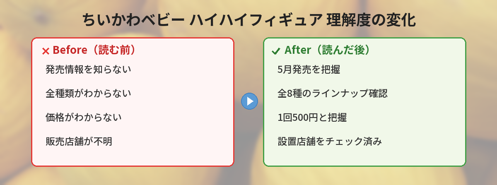

## この記事で分かること


ちいかわベビーのハイハイフィギュアが出るって聞いたんだけど、どこで買えるの？全種類知りたい！



5月にパレードから新しいカプセルトイが出たよ！ちいかわたちがベビーになってハイハイしてるフィギュアで、全8種・1回500円。一部店舗限定だから、設置場所をチェックしておこう！


この記事では、2026年5月に発売された「ちいかわベビー ハイハイフィギュア」の全種類・価格・販売店舗情報をまとめています。

筆者も実際に回してきたので、実物の可愛さや飾り方のコツもお伝えします。

---

## 公式情報

> 📎 **出典**：[パレード カプセルトイ公式X（@parade_capsule）2026年5月18日投稿](https://twitter.com/parade_capsule/status/2056208158843101501)

---

## 商品概要


| 項目 | 内容 |
|------|------|
| 商品名 | ちいかわベビー ハイハイフィギュア |
| メーカー | パレード |
| 種類 | 全8種 |
| 価格 | 1回500円 |
| 発売時期 | 2026年5月 |
| 販売形態 | カプセルトイ（一部店舗限定） |
| サイズ | 約3〜4cm（手のひらサイズ） |


---

## ラインナップ（全8種）


ちいかわたちがベビーになってハイハイしてるフィギュアだよ。おしりのくまやスタイ（よだれかけ）のデザインにも注目！


公式発表によると、ちいかわベビーシリーズのキャラクターたちがハイハイポーズのフィギュアになっています。

### 注目ポイント

- **ハイハイポーズ**: どの角度から見てもかわいいデザイン
- **おしりのくま**: 背面にくまのワンポイントが入っている
- **スタイ（よだれかけ）**: キャラクターごとに異なるデザインのスタイ付き
- **全方位かわいい**: 360度どこから見ても楽しめる立体フィギュア
- **安定感のある設計**: ハイハイポーズなので4点で支えており倒れにくい

### 予想されるキャラクター構成

全8種の内訳はちいかわ・ハチワレ・うさぎを中心に、カラーバリエーションやポーズ違い、シークレット枠が含まれると予想されます。

| 予想 | キャラクター | バリエーション |
|------|-------------|---------------|
| 1 | ちいかわ | 通常カラー |
| 2 | ハチワレ | 通常カラー |
| 3 | うさぎ | 通常カラー |
| 4 | ちいかわ | パジャマver. |
| 5 | ハチワレ | パジャマver. |
| 6 | うさぎ | パジャマver. |
| 7 | モモンガ or くりまんじゅう | 通常カラー |
| 8 | シークレット？ | ??? |

※あくまで予想です。正式なラインナップは公式発表をお待ちください。

---

## 実際に回してみた！（筆者の体験レポート）

筆者は発売翌日にガチャガチャ専門店で3回回してきました。

### 実物のクオリティ

正直に言って**500円以上の満足感**でした。

- **塗装が丁寧**: 目や口の細かい部分まできれいに仕上がっている
- **おしりのくまが最高**: 後ろから見たときの「くまパンツ」のディテールが細かい
- **スタイのデザインが凝ってる**: キャラクターごとにスタイの柄が違って、集める楽しさがある
- **自立する**: ハイハイポーズのおかげで両手両足の4点接地、デスクに置いても倒れない

### サイズ感

- 高さ約3cm、幅約4cm
- 手のひらに乗るミニサイズ
- デスクの上に並べても邪魔にならない

### 良かった点

- **造形のクオリティが高い**: カプセルトイとは思えない仕上がり
- **コレクション欲が刺激される**: 全8種、並べると壮観
- **贈り物にもちょうどいい**: ちいかわ好きの友人へのプチギフトに最適

### イマイチだった点

- **一部店舗限定で見つけにくい**: パレード製品は設置店舗が限られている
- **500円×8回=4,000円**: コンプリートしようとするとそれなりにかかる
- **ダブりリスク**: 全8種中3回回して1つダブった（確率的にはこんなもの）


おしりのくまが気になる…！実物見たいなぁ。



後ろ姿がね、もう反則的にかわいいの。デスクに並べると仕事中に癒されるよ。つい後ろから見ちゃう。


---

## 販売店舗について


どこに行けば回せるの？



一部店舗限定だから、全部のガチャコーナーにあるわけじゃないんだ。パレードの公式サイトで設置店舗を確認するのが確実だよ！


### 設置店舗の確認方法

1. [パレード公式サイト](https://www.parade-capsule.com/)にアクセス
2. 商品名で検索
3. 設置店舗一覧を確認

### 狙い目の場所

- **大型ショッピングモールのカプセルトイコーナー**（入荷が早い）
- **駅ナカのガチャガチャ専門店**（通勤ついでにチェックできる）
- **ちいかわ関連商品を多く扱う店舗**（設置率が高い傾向）
- **ガチャガチャの森**などカプセルトイ専門チェーン

### 筆者が見つけた場所

大型ショッピングモール内のガチャガチャ専門コーナー（2フロアに分かれているタイプ）で見つけました。通常のスーパーのガシャポンコーナーでは見つからなかったので、**専門店やモール内の大規模コーナー**を優先的に探すのがおすすめです。

---

## おすすめの飾り方

せっかく手に入れたフィギュア、飾り方にもこだわりたいですよね。

### デスクに並べる

ハイハイポーズで安定しているので、PCモニターの横やキーボードの隣に並べるとかわいい。仕事中のちょっとした癒しになります。

### 100均のディスプレイケースに

ダイソーやセリアのアクリルケース（3段タイプ）にぴったり収まるサイズ。ホコリも防げてコレクション映えします。

### 写真映えする撮り方

- 白い紙の上に置くとフィギュアの色が映える
- スマホのポートレートモードで背景をぼかすとプロっぽい写真に
- おしりのくまが見えるアングルが一番バズりやすい（SNS投稿用）

---

## ちいかわベビーシリーズとは


ちいかわベビーは、ちいかわのキャラクターたちが赤ちゃんになったシリーズだよ。2026年1月に第2弾グッズが発売されて大人気になったんだ！


「ちいかわベビー」は、ナガノ先生が描き下ろしたちいかわキャラクターのベビーバージョンです。

### これまでのちいかわベビー商品

| 弾 | 発売時期 | 主な商品 | 人気度 |
|----|----------|----------|--------|
| 第1弾 | 2025年 | ぬいぐるみ、アクリルスタンド | ★★★★☆ |
| 第2弾 | 2026年1月 | おまるに座るマスコット、ハイハイぬいぐるみ | ★★★★★ |
| 今回 | 2026年5月 | ハイハイフィギュア（カプセルトイ） | ★★★★★ |

ちいかわマーケット（公式オンラインショップ）やちいかわランド（公式グッズショップ）でも関連商品が販売されています。

### なぜ「ベビー」が人気なのか

- 通常のちいかわよりさらに小さく、丸い体型
- 「赤ちゃん」という設定が母性本能を刺激する
- スタイやおまるなどのベビーアイテムのディテールが凝っている
- SNSで「かわいすぎて無理…」と投稿する人が続出するバズりやすさ

---

## 購入のコツ

### 売り切れ対策

- **発売日当日〜翌日に行く**: 補充前に売り切れることが多い
- **平日の午前中が狙い目**: 土日は混雑する
- **複数店舗をチェック**: 1店舗で売り切れでも別の店舗にある場合がある
- **SNSで設置情報を確認**: X（Twitter）で「ちいかわベビー ハイハイ」で検索すると目撃情報が見つかる
- **開店直後を狙う**: 店員さんが朝イチで補充することが多い

### ダブり対策

全8種コンプリートを目指す場合、ダブりが出る可能性があります。

- **フリマアプリ**（メルカリなど）でトレード相手を探す
- **X（Twitter）の交換募集タグ**を活用する（「#ちいかわベビー交換」など）
- **友人と一緒に回してトレード**する
- **確率的に5〜6回でダブりが出始める**ので、6回を目安に交換に切り替えるのが効率的

---

## よくある質問（FAQ）

### Q: オンラインで購入できる？

A: カプセルトイなので基本的には店頭のガチャガチャ機でのみ購入可能です。ただし、発売後にちいかわマーケットでセット販売される可能性もあります。また、メルカリやラクマでバラ売りされることもありますが、定価以上になる場合が多いです。

### Q: 1回500円は高い？

A: ちいかわのカプセルトイとしては標準的な価格帯です。フィギュアタイプは300〜500円が相場なので、妥当な価格設定です。塗装の丁寧さやディテールを考えると、500円でも十分満足できるクオリティです。

### Q: 全8種の内訳は？

A: 公式からの詳細なラインナップ発表を待ちましょう。ちいかわ・ハチワレ・うさぎを中心に、カラーバリエーションやポーズ違いが含まれると予想されます。

### Q: いつまで設置されている？

A: カプセルトイは在庫がなくなり次第終了です。人気商品は数日〜1週間で売り切れることもあるので、見つけたら早めに回すのがおすすめです。

### Q: 子どもに買ってあげても大丈夫？

A: フィギュアなので小さなパーツが含まれます。対象年齢を確認の上、小さなお子さんは口に入れないよう注意してください。飾って楽しむ分には問題ありません。

---

## まとめ


おしりのくまが見たすぎる。見つけたら絶対回す！



一部店舗限定だからパレード公式サイトで場所を調べてから行ってね。実物のクオリティは500円以上の価値があるよ！


- ちいかわベビーのハイハイフィギュアが2026年5月にカプセルトイで登場
- 全8種、1回500円、一部店舗限定
- おしりのくまやスタイのデザインが注目ポイント
- 実物の塗装・造形クオリティは500円以上の満足感
- パレード公式サイトで設置場所を確認してから行くのが確実
- 人気商品なので発売直後〜1週間以内がチャンス
- コンプリート狙いならSNSでの交換も活用

---
### あわせて読みたい
- [ちいかわパーク完全ガイド](/posts/chiikawa-park-guide-2026/)
- [ちいかわ × 東京ばな奈コラボまとめ](/posts/chiikawa-tokyo-banana-2026-05/)
