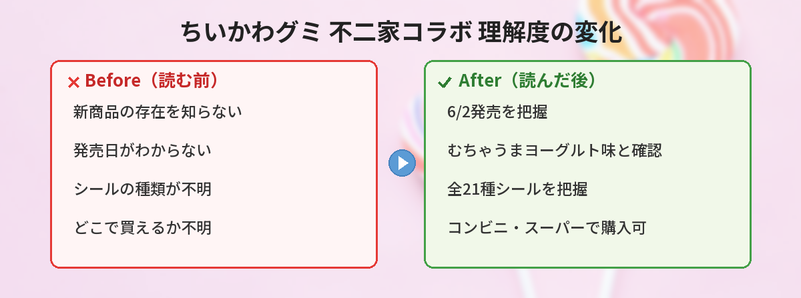

## この記事で分かること


ちいかわの新しいグミが出るって聞いたんだけど、シール付きなの！？詳しく教えて！



不二家から「6粒アニメちいかわグミ」が6月2日に発売されるよ！見る角度でシーンが変わるシール付きで、全21種類もあるの。詳しくまとめたから見ていってね！


この記事では、2026年6月2日に発売される不二家「6粒アニメちいかわグミ（むちゃうまヨーグルト味）」の商品情報、シールの種類、購入方法、そして過去のちいかわお菓子コラボの歴史まで詳しくまとめています。

---

## 公式情報



> 📎 **出典**：[ちいかわ☆お役立ちインフォ（@chiikawa_info）](https://x.com/chiikawa_info/status/2051108590770130964)
> 📎 **詳細**：[不二家公式HP](https://www.fujiya-peko.co.jp/)

---

## 新商品の基本情報


- **商品名**：6粒アニメちいかわグミ（むちゃうまヨーグルト味）
- **発売日**：2026年6月2日（火）
- **価格**：オープンプライス（店舗により異なる）
- **内容量**：6粒入り
- **味**：むちゃうまヨーグルト味
- **メーカー**：不二家
- **特典**：見る角度によってシーンが変わるシール付き（全21種）



「むちゃうまヨーグルト味」ってネーミングが可愛い！ちいかわっぽいね。



ちいかわの世界観に合わせた味名になってるよね。ヨーグルト味だから子どもから大人まで食べやすいと思う！


---

## シール情報（全21種）

今回の最大の目玉は、**見る角度によってシーンが変わるシール**が付いていること。いわゆる「レンチキュラーシール」と呼ばれるタイプで、角度を変えるとイラストが動いて見える仕組みです。

### シールの特徴

- **種類**：全21種類
- **タイプ**：レンチキュラー（角度でシーンが変わる）
- **デザイン**：アニメちいかわのシーンを再現


21種類もあるの！？コンプリートしたくなるやつだ…



全21種だからコンプリートはなかなか大変だけど、推しキャラのシールが出たら嬉しいよね！トレーディングで交換する人も多いと思うよ。


### コンプリートのコツ

- **箱買い**：コンビニやスーパーで箱単位（通常12個入り）で購入すると、重複が少ない傾向
- **トレーディング**：SNSやフリマアプリで交換相手を探す
- **複数店舗で購入**：同じ店舗だと同じシールが出やすい場合がある
- **発売直後に購入**：人気のシールは早めに売り切れる可能性あり

---

## 「むちゃうまヨーグルト味」について


味についても紹介するね。ヨーグルト味のグミって実は人気が高いジャンルなんだよ。


ヨーグルト味のグミは、甘酸っぱさとグミの食感が相性抜群で、お菓子市場でも人気のフレーバーです。不二家のグミは柔らかめの食感が特徴で、小さなお子さんでも食べやすい硬さに仕上がっていることが多いです。

**味の予想ポイント：**
- ヨーグルトの爽やかな酸味
- 甘すぎない味わい
- 6粒入りで食べきりサイズ

---

## 購入方法・販売店舗


どこで買えるの？コンビニにもある？



不二家のお菓子だから、基本的にどこでも買えるはず！ただし発売直後は品薄になる可能性があるから注意してね。


### 購入できる場所（予想）

- **コンビニ**：セブンイレブン、ファミリーマート、ローソン等
- **スーパー**：イオン、イトーヨーカドー、西友等
- **ドラッグストア**：マツモトキヨシ、ウエルシア等
- **不二家直営店**
- **オンライン**：Amazon、楽天市場等（発売後に出品される可能性）

### 購入時の注意点

- **オープンプライス**のため、店舗によって価格が異なります
- 発売直後はちいかわファンによる大量購入で品薄になる可能性あり
- コンビニは入荷数が少ないため、スーパーやドラッグストアの方が見つけやすい場合も
- 箱買いしたい場合は、事前に店舗に入荷予定を確認するのがおすすめ

---

## 過去のちいかわお菓子コラボまとめ


ちいかわのお菓子コラボは今回が初めてじゃないよ。過去にもいろんなコラボがあったから振り返ってみよう！


ちいかわは様々なお菓子メーカーとコラボしてきた実績があります。以下は主なコラボ商品の一覧です。

### 不二家とのコラボ

不二家はちいかわとの相性が良く、これまでにも複数のコラボ商品を展開しています。

| 商品名 | 発売時期 | 特徴 |
|---|---|---|
| ちいかわペコちゃんコラボ | 2024年〜 | 不二家店舗限定のコラボスイーツ |
| ちいかわミルキー | 2024年 | パッケージにちいかわデザイン |
| 6粒アニメちいかわグミ（むちゃうまヨーグルト味） | 2026年6月 | レンチキュラーシール付き ← **今回の新商品** |

### その他メーカーとのお菓子コラボ

| メーカー | 商品 | 特徴 |
|---|---|---|
| 森永製菓 | ちいかわハイチュウ | キャラクター別フレーバー |
| ロッテ | ちいかわコアラのマーチ | 限定絵柄入り |
| カルビー | ちいかわポテトチップス | カード付き |
| ブルボン | ちいかわプチシリーズ | ミニサイズパッケージ |
| 東京ばな奈 | ちいかわ×東京ばな奈 | 催事限定コラボ |


こんなにたくさんコラボしてたんだ！ちいかわの人気すごいね。



お菓子コラボは毎回すぐ売り切れるくらい人気だよ。今回のグミも早めにチェックした方がいいかも！


---

## 独自の視点・おすすめポイント

### シール集めの楽しさ

今回のレンチキュラーシールは、従来の平面シールと違って「動く」のが最大の魅力。コレクション性が高く、ファイルに入れて保管する楽しみもあります。

### お菓子としてのコスパ

6粒入りでオープンプライス（おそらく100〜150円程度）と予想されるため、気軽に複数個購入できる価格帯。シール目当てで買っても、グミ自体も美味しく食べられるのでコスパは良好です。

### プレゼント・交換にも

- 友達へのちょっとしたプレゼントに最適
- 推しキャラのシールが被ったらSNSで交換相手を探せる
- 子どものおやつとしても安心（不二家の品質管理）

### 注意点

- **アレルギー情報**は必ずパッケージで確認してください
- **転売品の購入は避けましょう**。定価で購入できる店舗を探しましょう
- シールの種類はランダムのため、**特定のシールが確実に手に入る保証はありません**
- 開封後は早めにお召し上がりください

---

## SNSでの反応


発表されてからみんなの反応はどう？


新商品の発表を受けて、SNS上では早くも大きな反響が出ています。

- 「**シールが角度で変わるやつ！？絶対集める！**」とレンチキュラーシールへの期待が非常に高い
- 「**むちゃうまヨーグルト味ってネーミングが天才**」と、ちいかわらしい商品名への反応
- 「**全21種はコンプリート大変だけど頑張る**」とコレクター魂に火がついた声
- 「**6月2日、カレンダーに入れた**」と発売日を心待ちにする声が多数
- 「**箱買いするか迷う…でもシール被りが怖い**」と購入方法を悩む声も


シール付きお菓子はちいかわファンの収集欲を刺激するよね。発売日は争奪戦になりそう！


---

## よくある質問（FAQ）

### Q. 発売日はいつですか？

A. 2026年6月2日（火）発売です。店舗によっては前日夕方から並ぶ場合や、当日朝の入荷になる場合があります。

### Q. 価格はいくらですか？

A. オープンプライスのため、店舗によって異なります。一般的なキャラクターグミの価格帯（100〜180円程度）を参考にしてください。

### Q. シールは選べますか？

A. シールはランダム封入のため、選ぶことはできません。どのシールが入っているかは開封するまで分かりません。

### Q. コンビニで買えますか？

A. 不二家の商品は主要コンビニチェーンで取り扱いがあるため、購入できる可能性が高いです。ただし、入荷数や取り扱いの有無は店舗によって異なります。

### Q. 大人が買っても大丈夫ですか？

A. もちろん大丈夫です！ちいかわファンは幅広い年齢層にいるため、大人の購入者も多いです。シールコレクションを楽しむ大人のファンもたくさんいます。

---

## まとめ


6月2日が楽しみ！コンビニ巡りしてシール集めるぞ！



レンチキュラーシール全21種、コンプリート目指して頑張ってね！新しい情報が出たらこの記事も更新するから、ブックマークしておいてね。


不二家「6粒アニメちいかわグミ（むちゃうまヨーグルト味）」は、ちいかわファン必見の新商品です。見る角度でシーンが変わるレンチキュラーシール全21種付きで、コレクション性も抜群。6月2日の発売日をお見逃しなく！

---

### あわせて読みたい
- [【2026年5月】ちいかわ × 東京ばな奈コラボまとめ！催事情報・新商品・購入方法](/posts/chiikawa-tokyo-banana-2026-05/)
