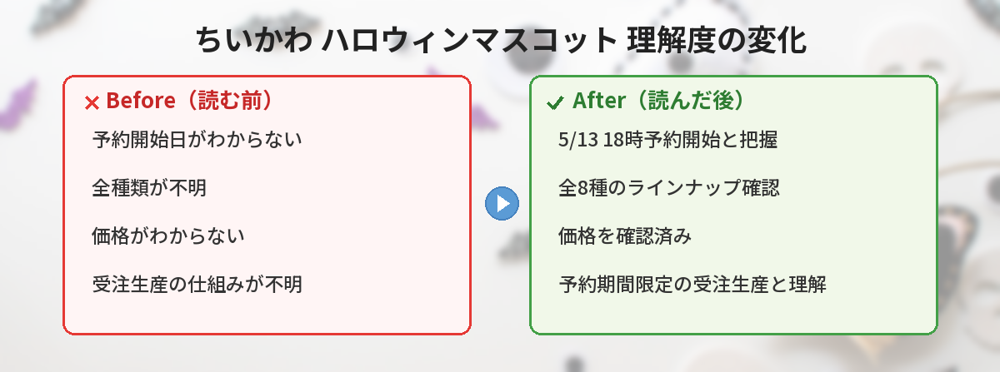

## この記事で分かること


ちいかわマーケットからハロウィンのマスコットが出るって！？まだ5月なのに！



そうなの！「みんなで仮装なマスコット」っていう全8種のマスコットが、今日5月13日の18時から予約スタートだよ。受注生産だから予約期間を逃すと手に入らないかも…！詳しくまとめたよ！


---

## 「みんなで仮装なマスコット」とは

2026年5月11日、ちいかわマーケット公式Xアカウントが新商品を発表しました。

ちいかわたちがハロウィンの仮装をしたマスコットぬいぐるみで、全8種のラインナップです。「赤く滴る 恐怖のハロウィン」というキャッチコピーがついており、ホラーテイストの仮装デザインになっています。

---

## 商品の基本情報

| 項目 | 内容 |
|------|------|
| 商品名 | みんなで仮装なマスコット |
| 種類 | 全8種 |
| 価格 | 各1,980円（税込） |
| 受注期間 | 2026年5月13日（水）18時～5月18日（月）正午12時 |
| 出荷予定 | 2026年9月下旬頃より順次 |
| 販売形式 | 受注生産 |
| 購入制限 | 1会計につき各10点まで |
| 販売場所 | ちいかわマーケット |


受注生産ってことは、予約した分だけ作るってことだよね？予約期間過ぎたら買えないやつ…！



そう！だから欲しい人は5月18日の正午までに必ず予約してね。届くのは9月下旬だから、ちょうどハロウィンシーズンに間に合う計算だよ。


---

## 予約スケジュールのポイント

### 予約開始日時

**2026年5月13日（水）18時**からちいかわマーケットで予約受付がスタートします。

### 予約締切

**2026年5月18日（月）正午12時**が締切です。約5日間の受注期間なので、うっかり忘れないように注意が必要です。

### 届くのはいつ？

**2026年9月下旬頃**から順次出荷予定です。予約から届くまで約4ヶ月ほどかかりますが、受注生産なので確実に手に入ります。


9月下旬ってことは、ハロウィン本番の10月にはバッチリ届いてるね！


---

## ハロウィン仮装のデザインについて

今回のマスコットは「赤く滴る 恐怖のハロウィン」がテーマです。

ちいかわシリーズでは過去にも仮装マスコットが発売されていますが、今回はホラー要素が強めのデザインになっている模様です。全8種ということは、ちいかわ・ハチワレ・うさぎなどのメインキャラクターたちがそれぞれ異なる仮装をしていると予想されます。

### 過去の仮装マスコットシリーズとの違い

ちいかわマーケットでは、これまでにも「おそろいピザなマスコット」など、テーマに沿った仮装マスコットシリーズが人気を集めてきました。今回のハロウィンバージョンは、季節イベントに合わせた特別感のあるデザインです。

---

## コンプリート特典について

ちいかわマーケットでの予約限定で、**単品購入**に加えて**コンプリート特典**が用意されています。


全8種コンプリートで特典がもらえるのは嬉しいポイント！ちいかわマーケット限定だから、他の通販サイトでは特典がつかない可能性が高いよ。


### コンプリートする場合の費用

全8種を1つずつ購入した場合:

**1,980円 × 8種 = 15,840円（税込）**

1会計各10点までの制限があるので、推し活で複数買いしたい場合も余裕を持って購入できます。

---

## 予約方法・購入の流れ

### ステップ1: ちいかわマーケットにアクセス

5月13日18時になったら、ちいかわマーケット公式サイトにアクセスします。

### ステップ2: 商品ページを探す

「みんなで仮装なマスコット」の商品ページから、欲しい種類を選びます。

### ステップ3: カートに入れて注文

欲しいマスコットをカートに入れて、注文手続きを完了させます。

### 注意点

- **予約開始直後はアクセスが集中する可能性あり**（人気商品のため）
- **1会計各10点まで**の制限あり
- **受注生産のためキャンセル不可の可能性**（公式の注意事項を確認してください）
- **5月18日正午を過ぎると予約できない**


18時ぴったりにスタンバイしておいた方がいいかも…ちいかわグッズは人気だから、サーバー混雑しそう。


---

## ちいかわマスコットシリーズの人気の理由

ちいかわのマスコットぬいぐるみは、コレクターの間で非常に人気が高いアイテムです。

### 人気の理由

- **手のひらサイズで飾りやすい** — デスクやカバンにつけられる
- **テーマごとに衣装が変わる** — コレクション欲を刺激する
- **受注生産で確実に手に入る** — 抽選や先着ではないので安心
- **コンプリート特典がある** — 全種集めるモチベーションになる
- **季節感がある** — ハロウィンなど季節イベントに合わせて楽しめる

ちいかわグッズの最新情報は、[ちいかわ×GUコラボ2026夏](/posts/chiikawa-gu-summer-2026/)や[ちいかわ×東京ばな奈コラボ](/posts/chiikawa-tokyo-banana-2026-05/)の記事もチェックしてみてください。

---

## 予約時の注意点まとめ

| 注意点 | 詳細 |
|--------|------|
| 予約期間が短い | 5日間のみ（5/13 18時～5/18 正午） |
| 受注生産 | 期間外の購入は不可 |
| 届くまで時間がかかる | 9月下旬頃の出荷 |
| 購入制限あり | 1会計各10点まで |
| ちいかわマーケット限定特典 | コンプリート特典は公式のみ |

---

## 5月のちいかわグッズ情報

2026年5月はちいかわ関連のグッズ展開が盛りだくさんです。

- **5月8日** — ちいかわパーク新グッズ取扱いスタート
- **5月13日** — みんなで仮装なマスコット予約開始（今回の商品）
- **GUコラボ** — 夏の新作が展開中
- **東京ばな奈コラボ** — 各地で催事開催中


5月はちいかわファンにとって出費が多い月になりそう…でも受注生産は逃すと後悔するから、優先順位をつけて予約するのがおすすめだよ！


ちいかわパークの情報は[ちいかわパーク完全ガイド](/posts/chiikawa-park-guide-2026/)で詳しくまとめています。

---

## よくある質問（FAQ）

### Q: 予約はどこからできますか？

A: ちいかわマーケット公式オンラインショップから予約できます。5月13日18時から商品ページが公開される予定です。

### Q: 届くのはいつですか？

A: 2026年9月下旬頃から順次出荷予定です。ハロウィンシーズン前に届く計算です。

### Q: 予約期間を過ぎても買えますか？

A: 受注生産のため、予約期間（5/13 18時～5/18 正午）を過ぎると購入できません。欲しい方は期間内に必ず予約してください。

### Q: 全8種の内訳（キャラクター）は？

A: 公式からの詳細発表を確認してください。ちいかわ・ハチワレ・うさぎなどのメインキャラクターが含まれると予想されます。

### Q: コンプリート特典は何ですか？

A: ちいかわマーケットでの予約限定でコンプリート特典が用意されています。詳細は商品ページで確認できます。

### Q: 転売品を買っても大丈夫ですか？

A: 受注生産品なので予約期間内に公式から購入するのが確実です。転売品は定価より高額になることが多く、コンプリート特典もつきません。公式での購入をおすすめします。

---

## まとめ


今日の18時から予約開始か…スマホのアラームセットしておこう！



ポイントをまとめるとこんな感じ！


- 「みんなで仮装なマスコット」は全8種、各1,980円（税込）
- 予約期間は5月13日（水）18時～5月18日（月）正午12時
- 受注生産なので予約期間を逃すと購入不可
- 出荷は9月下旬頃（ハロウィン前に届く）
- 1会計各10点までの購入制限あり
- ちいかわマーケット限定でコンプリート特典あり
- 全8種コンプリートで15,840円


受注生産は「欲しいけど迷ってる」人ほど後悔しやすいから、気になる人は予約期間内に決断するのがおすすめだよ！


---

### あわせて読みたい

- [【2026年最新】ちいかわパーク完全ガイド！料金・アクセス・グッズ・口コミまとめ](/posts/chiikawa-park-guide-2026/)
- [【2026夏】ちいかわ×GUコラボ新作まとめ！ラインナップ・発売日・購入方法を解説](/posts/chiikawa-gu-summer-2026/)
