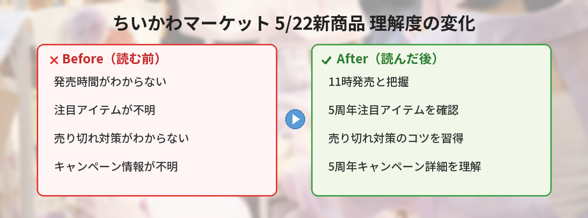

## この記事で分かること


ちいかわマーケットで今日新商品が出るって聞いたんだけど、何時から買えるの？



5月22日（金）の11時から発売だよ！5周年キャンペーン中だから注目アイテムが多いの。詳しくまとめるね。


この記事では、2026年5月22日にちいかわマーケットで発売される新商品の情報と、購入時の注意点をまとめています。

---

## 公式情報



---

## 基本情報

| 項目 | 内容 |
|------|------|
| 発売日 | 2026年5月22日（金） |
| 発売時間 | 11:00〜 |
| 販売場所 | [ちいかわマーケット公式オンラインショップ](https://chiikawamarket.jp/) |
| 決済方法 | 一部商品はクレジットカード決済のみ |
| 備考 | 5周年キャンペーン期間中 |

---

## 購入時の注意点


クレジットカード決済のみって書いてあるけど、コンビニ払いはダメなの？



一部商品はクレジットカード決済限定だよ。公式が注意喚起してるから、事前にカード情報を登録しておくのがおすすめ！


### クレジットカード決済のみの商品がある

公式ポストでも「⚠️一部クレジットカード決済のみ⚠️」と強調されています。コンビニ払いや後払いが使えない商品があるため、事前にカード情報を登録しておきましょう。

### 11時ちょうどにアクセスが集中する

ちいかわマーケットの新商品発売時は、毎回サイトが重くなります。

- 10:55頃からサイトにアクセスしておく
- 商品ページのURLが分かっていればブックマークしておく
- スマホとPCの両方でスタンバイするのも有効

### 商品ページは発売時間に掲載される

公式によると「発売時間に掲載」とのこと。事前に商品ページを見ることはできないため、11時になったらトップページをリロードして新商品を探す必要があります。

---

## ちいかわマーケット5周年キャンペーンについて


5周年キャンペーンって何かお得なことあるの？



5周年記念の限定グッズや、抽選で当たる「ありがとうバッグ」なんかもあるよ！通常の新商品とは別に特別企画が走ってるの。


ちいかわマーケットは2026年で5周年を迎え、記念キャンペーンを実施中です。

### 5周年ありがとうバッグ（抽選）

- 当選者限定で購入できる福袋形式のセット
- 5月下旬お届け予定
- キャンセル不可・同梱不可・日時指定不可

### ちいかわパークでの一部グッズ取り扱い

5月8日（金）11時から、ちいかわパークでも一部のちいかわマーケット商品が購入可能になっています。

---

## 売り切れた場合の対処法

### 再入荷通知を設定する

ちいかわマーケットでは、売り切れ商品に「再入荷通知」ボタンが表示されることがあります。メールアドレスを登録しておけば、再入荷時に通知が届きます。

### 公式SNSをフォローする

再販や追加生産の情報は公式X（@chiikawa_market）で告知されます。通知をオンにしておくと見逃しにくいです。

### フリマアプリでの転売品に注意

人気商品は即座にフリマアプリに出品されますが、定価の2〜3倍の価格がつくことも。焦って高額で購入する前に、再販の可能性を待つのも選択肢です。

---

## 過去の発売パターンから予想


どのくらいで売り切れるものなの？



人気商品だと数分で完売することもあるよ。ぬいぐるみ系やコラボ商品は特に早い。日用品系は比較的残りやすいかな。


過去のちいかわマーケット発売日の傾向：

| 商品カテゴリ | 売り切れ速度 |
|-------------|-------------|
| ぬいぐるみ・フィギュア | 数分〜30分 |
| アパレル（Tシャツ等） | 30分〜1時間 |
| 文房具・雑貨 | 数時間〜当日中 |
| 食器・キッチン用品 | 1〜2日 |

---

## よくある質問（FAQ）

### Q: 何時からサイトにアクセスすればいい？

A: 11時発売ですが、10:55頃からスタンバイしておくのがおすすめです。11時ちょうどはアクセスが集中してページが表示されにくくなります。

### Q: スマホからでも買える？

A: はい。ちいかわマーケットはスマホ対応しています。ただしアクセス集中時はPCのほうが安定する場合もあります。

### Q: 送料はいくら？

A: 注文金額や商品によって異なります。一定金額以上で送料無料になるキャンペーンが実施されていることもあるので、購入前に確認してください。

### Q: 届くまでどのくらいかかる？

A: 通常1〜2週間程度です。人気商品で注文が殺到した場合は、さらに時間がかかることがあります。

### Q: キャンセルはできる？

A: 商品によって異なります。5周年ありがとうバッグなど「キャンセル不可」と明記されている商品もあるため、注文前に確認しましょう。

---

## まとめ


11時に張り付いてないとダメなやつだね…！



そうだね。事前にカード情報の登録と、欲しい商品の目星をつけておくのが大事だよ。売り切れても再販の可能性はあるから、焦らずにね！


- 2026年5月22日（金）11時からちいかわマーケットで新商品発売
- 一部商品はクレジットカード決済のみ
- 5周年キャンペーン期間中の特別ラインナップ
- アクセス集中するため10:55頃からスタンバイ推奨
- 売り切れても再入荷通知や再販の可能性あり

---
### あわせて読みたい
- [ちいかわパーク完全ガイド2026](/posts/chiikawa-park-guide-2026/)
- [ちいかわ × 東京ばな奈コラボまとめ](/posts/chiikawa-tokyo-banana-2026-05/)
