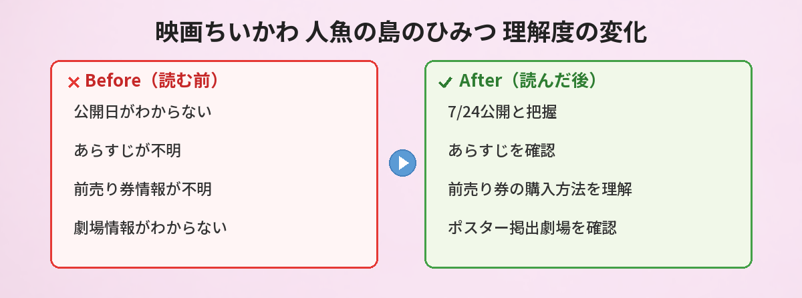

## この記事で分かること


ちいかわの映画が公開されるって聞いたんだけど、いつからやるの？



2026年7月24日（金）に公開だよ！タイトルは「人魚の島のひみつ」。全国の劇場にポスターも掲出され始めてるの。詳しくまとめるね。


この記事では、映画ちいかわ「人魚の島のひみつ」の公開日、あらすじ、前売り券情報、最新の劇場ポスター掲出情報をまとめています。

---

## 公式情報



5月22日に公式アカウントから、全国の劇場にメインビジュアルのポスターと大型バナーが掲出されることが発表されました。

---

## 基本情報

| 項目 | 内容 |
|------|------|
| タイトル | 映画ちいかわ 人魚の島のひみつ |
| 公開日 | 2026年7月24日（金） |
| 制作スタジオ | Cypic |
| 監督 | 及川啓 |
| 原作 | ナガノ「ちいかわ」（セイレーン編） |
| レーティング | G（全年齢対象） |

---

## あらすじ


どんなお話なの？ネタバレなしで教えて…！



原作の「セイレーン編」がベースになってるよ。ちいかわたちが不思議な島に招待されるところから始まるの。


ハチワレが見つけたチラシには「特別な島へのご招待」と書かれています。

島では簡単な討伐で高報酬がもらえて、限定の島ラーメンやスイーツも食べ放題。魅力的な条件に惹かれて、ちいかわたちは島へ向かうことに。

しかし、その島には「ひみつ」が隠されていて——。

原作ファンにはおなじみのセイレーン編を、劇場スケールで描く作品です。

---

## 劇場ポスター掲出情報（5月22日〜）

公式発表によると、本日以降順次、全国の劇場にメインビジュアルのポスターと大型バナーが掲出されます。

- 掲出開始：2026年5月22日以降順次
- 対象：全国の劇場（一部劇場を除く）
- 内容：メインビジュアルポスター＋大型バナー

映画館に行く予定がある方は、ぜひチェックしてみてください。

---

## 前売り券（ムビチケ）情報

映画ちいかわの前売り券（ムビチケ）は、特典付きで販売されています。

### 購入方法

- ムビチケ公式サイト
- 全国の劇場窓口
- コンビニ端末（ローソンLoppi、セブンイレブンなど）

### 注意点

- 特典は数量限定のため、なくなり次第終了
- 劇場によって取り扱い状況が異なる
- 最新情報は公式X（@chiikawa_movie）で確認


前売り券って早めに買った方がいいの？



特典付きは数量限定だから、欲しい人は早めがおすすめ。ちいかわグッズは即完売することも多いからね。


---

## 見どころ・おすすめポイント

### 1. セイレーン編の映像化

原作でも人気の高いエピソードが劇場アニメとして映像化されます。TVアニメとは異なるスケール感の映像表現に期待が高まっています。

### 2. ちいかわ初の劇場映画

TVアニメは2022年から放送されていますが、劇場映画は今回が初めてです。大スクリーンで見るちいかわたちの冒険は特別な体験になりそうです。

### 3. 夏休み公開で家族で楽しめる

7月24日は夏休み期間中の公開。全年齢対象（G）なので、お子さんと一緒に楽しめます。

---

## SNSでの反応

公式発表後、SNSでは期待の声が多数上がっています。

- 「セイレーン編が映画化されるの嬉しすぎる」
- 「ポスター見に映画館行きたい」
- 「前売り券の特典が気になる」
- 「夏が待ち遠しい」

ちいかわファンの間では、公開日までのカウントダウンが始まっています。

---

## よくある質問（FAQ）

### Q: 映画の上映時間はどのくらいですか？

A: 現時点では公式発表されていません。発表され次第、情報を更新します。

### Q: 原作を読んでいなくても楽しめますか？

A: セイレーン編がベースですが、映画として独立した作品になっているため、原作未読でも楽しめる構成になると予想されます。

### Q: 入場者特典はありますか？

A: 現時点では未発表です。ちいかわ関連の映画・イベントでは入場者特典が用意されることが多いので、公式アカウントの続報をチェックしてください。

### Q: IMAXや4DXでの上映はありますか？

A: 現時点では通常上映のみ発表されています。特殊フォーマットでの上映については続報をお待ちください。

---


7月24日が楽しみすぎる…！ポスター見に行こうかな。



ポスターは順次掲出だから、お近くの映画館をチェックしてみてね。前売り券も忘れずに！


## まとめ

- 映画ちいかわ「人魚の島のひみつ」は2026年7月24日（金）公開
- 原作の人気エピソード「セイレーン編」を劇場映画化
- 全国の劇場にメインビジュアルポスター＋大型バナーが順次掲出中
- 前売り券（ムビチケ）は特典付きで販売中（数量限定）
- 全年齢対象（G）で家族で楽しめる夏休み映画

---
### あわせて読みたい
- [ちいかわパーク完全ガイド2026](/posts/chiikawa-park-guide-2026/)
- [ちいかわマーケット5月22日新商品情報](/posts/chiikawa-park-guide-2026/)
