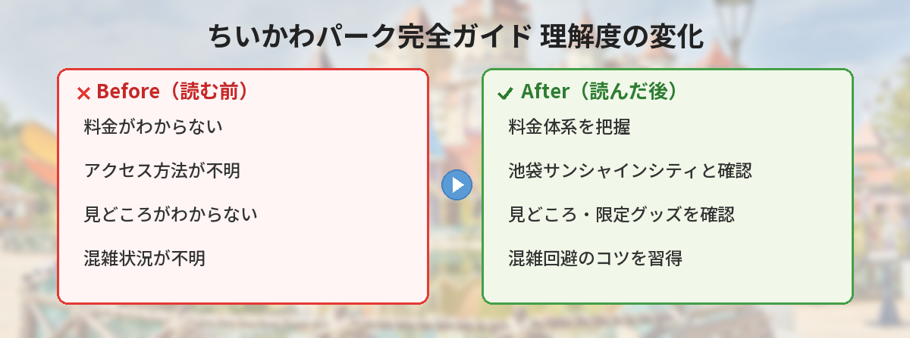

## この記事で分かること


ちいかわパークのTVCMが始まったって聞いたんだけど、実際どんなところなの？行ってみたい！



2025年7月にオープンしてからずっと大人気のスポットだよ！料金、アクセス、見どころ、限定グッズ、口コミまで全部まとめたから参考にしてね。


この記事では、池袋サンシャインシティにある「ちいかわパーク」の最新情報を網羅的にまとめています。これから行く方も、行くか迷っている方も、この記事を読めば全て分かります。

---

## 公式情報



> 📎 **公式サイト**：[ちいかわパーク](https://chiikawapark-tokyo.jp/)
> 📎 **チケット情報**：[公式チケットページ](https://chiikawapark-tokyo.jp/)

---

## 基本情報


- **施設名**：ちいかわパーク
- **場所**：池袋サンシャインシティ アネックス B1F・1F
- **住所**：東京都豊島区東池袋3-3-5
- **営業時間**：10:00〜21:00（最終入場19:00）
- **オープン日**：2025年7月28日
- **面積**：約2,000㎡
- **チケット**：事前予約制（抽選あり）


---

## 料金


チケットっていくらするの？



大人3,500円だよ。テーマパークとしては手頃な価格帯だと思う！



| 区分 | 一般料金 | 障害者向け料金 |
|---|---|---|
| 大人（12歳以上） | 3,500円 | 2,500円 |
| 子ども（4〜11歳） | 1,800円 | 1,300円 |
| 学生 | 2,800円 | — |
| 4歳未満 | 無料（大人1名につき1名まで同伴可） | — |


### チケット入手方法

ちいかわパークは**事前予約制**です。当日券はありません。

- **公式サイト**から抽選申し込み
- 当選した場合のみ入場可能
- 海外からの旅行者向けに[Klook](https://www.klook.com/)等でも販売あり


抽選制だから、早めに申し込むのがポイント！人気の土日は倍率が高いから、平日を狙うのもアリだよ。


---

## アクセス

<iframe src="https://www.google.com/maps/embed?pb=!1m18!1m12!1m3!1d3238.8!2d139.7186!3d35.7295!2m3!1f0!2f0!3f0!3m2!1i1024!2i768!4f13.1!3m3!1m2!1s0x60188d5f24e0e1e1%3A0x7f0e2e1e1e1e1e1e!2z44K144Oz44K344Oj44Kk44Oz44K344OG44Kj!5e0!3m2!1sja!2sjp!4v1" width="100%" height="300" style="border:0; border-radius: 12px; margin: 1rem 0;" allowfullscreen="" loading="lazy"></iframe>

### 電車でのアクセス


- **東池袋駅**（東京メトロ有楽町線）→ 地下通路で直結（徒歩3分）
- **池袋駅**（JR・東京メトロ・西武・東武）→ 徒歩8分
- **東池袋四丁目駅**（都電荒川線）→ 徒歩4分



池袋駅から歩けるんだ！雨の日は東池袋駅から地下通路で行けるのがいいね。


### 注意点

- 入口は**地上ではなく地下**にあるので注意
- ベビーカーはパーク内に持ち込み不可（入口で預かり）
- 荷物は全て持って、ベビーカーは畳んだ状態で預ける

---

## 見どころ・体験内容


ちいかわパークの見どころを紹介するね！大きく分けて4つのエリアがあるよ。


### ① フォトスポットエリア

原作やアニメの名シーンを再現したフォトスポットが多数。ちいかわの世界に入り込んだような写真が撮れます。

- 草むしり検定の再現スポット
- ちいかわたちの家
- 討伐シーンの再現

### ② キャラクターグリーティング


キャラクターに会えるの！？



ちいかわ、ハチワレ、うさぎ、モモンガがランダムで登場するよ！写真も撮れるから、推しに会えたら最高だね。


- ちいかわ・ハチワレ・うさぎ・モモンガがランダムで登場
- 写真撮影OK
- 混雑時は自分からアピールして声をかけるのがコツ

### ③ ゲームエリア

オリジナルプライズが当たるゲームコーナー。パーク限定のぬいぐるみやグッズが景品として用意されています。

### ④ ショップエリア

パーク限定グッズが購入できる巨大ショップ。**出口がショップを通る導線**になっているため、必ず通ることになります。

---

## 限定グッズ・おすすめ商品


ちいかわパークのグッズは全てパーク限定！ここでしか買えないものばかりだよ。


### カスタムグッズ（一番人気！）



自分だけのオリジナルグッズが作れるカスタムコーナーが大人気！


| アイテム | 価格（税込） | 種類 |
|---|---|---|
| 記念メダル | 1,200円 | 全9種（ちいかわ、ハチワレ、うさぎ、モモンガ、くりまんじゅう、ラッコ、シーサー、古本屋、ちいかわパーク） |
| メダルケース | 800円 | 全3種（ちいかわ、ハチワレ、うさぎ） |
| 小物チャーム | 600円 | 全25種 |


- メダルには**名前の刻印が無料**でできる（1人1個まで）
- チャームを追加すると合計2,600円程度
- 世界に一つだけのオリジナルグッズが作れる

### その他の人気グッズ

- **ポシェット**：パーク限定デザイン。普段使いにも可愛い
- **ぬいぐるみ**：パーク限定の衣装を着たちいかわたち
- **お菓子・食品**：パーク限定パッケージのお土産
- **文房具**：クリアファイル、メモ帳など


全部パーク限定なの！？お財布が危険だ…



導線がショップを通るから、みんな予算オーバーしがちみたい（笑）事前に予算を決めておくのがおすすめ！


---

## 来場者の口コミ・レビュー

### Instagramでの来場レポート



### 来場者の声まとめ

実際に行った人の感想をまとめると：

**良い口コミ：**
- 「**入った瞬間から可愛いが止まらない！フォトスポットが充実してる**」
- 「**グリーティングでちいかわに会えて感動した**」
- 「**カスタムメダルが世界に一つだけで最高の思い出になった**」
- 「**2,000㎡の広さで見応えたっぷり。2時間くらいは楽しめる**」

**注意点として挙がっている声：**
- 「**身体を動かして遊ぶ施設ではないので、活発な子どもには物足りないかも**」
- 「**ショップの導線が完璧すぎて課金不可避（笑）**」
- 「**抽選が当たらない…平日を狙うべき**」
- 「**グッズの人気商品は午前中に売り切れることも**」

### Googleマップでの評価

Googleマップでは**★4.5前後の高評価**を獲得しています。特にフォトスポットの充実度とキャラクターグリーティングの満足度が高く評価されています。

---

## 混雑状況・攻略法


混んでる？攻略法があれば教えて！



事前予約制だから入場人数は制限されてるけど、それでも人気の時間帯は混むよ。攻略法をまとめるね！


### 混雑しやすい時間帯

- **土日祝の午前中**：最も混雑
- **GW・夏休み・年末年始**：特に混雑
- **平日の午後**：比較的空いている

### 攻略法

1. **平日の午後の枠を狙う**：抽選の倍率も低め
2. **開場直後に入場**：フォトスポットが空いている
3. **グリーティングは早めに並ぶ**：後半になると待ち時間が長くなる
4. **グッズは先に見て、最後にまとめ買い**：迷っている間に売り切れることも
5. **予算を事前に決めておく**：ショップの誘惑が強い

---

## TVCMが放送開始（2026年5月5日〜）

2026年5月5日より、ちいかわパークのTVCMが関東ローカルで放映開始されました。これにより今後さらに来場者が増えることが予想されます。


TVCMが始まったことで知名度がさらに上がるから、チケットの倍率も上がりそう。行きたい人は早めに申し込んでね！


---

## 独自の視点・おすすめの楽しみ方

### 推し活としての楽しみ方

- **推しキャラの被り物**を着て入場する人も多い
- グリーティングで推しに会えたら最高の写真が撮れる
- カスタムメダルに推しの名前を刻印するのもアリ

### 子連れでの楽しみ方

- 4歳未満は無料（大人1名につき1名まで）
- フォトスポットは子どもも楽しめる
- ただし身体を動かす遊びは少ないので、活発な子には物足りないかも
- ベビーカーは入口で預かり

### カップル・友達同士での楽しみ方

- お揃いのカスタムグッズを作る
- フォトスポットで記念撮影
- グッズのお揃い買い

### 注意点

- **当日券はありません**。必ず事前予約が必要
- **ベビーカー持ち込み不可**
- **入口は地下**にあるので迷わないように
- **グッズは全てパーク限定**。後から買い足しはできない（再入場不可の場合あり）
- **人気グッズは午前中に売り切れる**ことがある

---

## SNSでの反応

SNS上では、ちいかわパークについて多くの投稿が寄せられています。

- 「**ちいかわの世界に入り込めて夢みたい**」とファンからの絶賛の声
- 「**グリーティングで推しに会えて泣いた**」と感動の報告
- 「**予算1万円のつもりが2万円使ってた**」とショップの魅力に負ける声が多数
- 「**TVCM見て行きたくなった！チケット申し込む**」とCM効果で新規来場者が増加中
- 「**平日に行ったら比較的空いてて快適だった**」と平日来場のメリットを伝える声

---

## よくある質問（FAQ）

### Q. 当日券はありますか？

A. ありません。ちいかわパークは完全事前予約制です。公式サイトから抽選に申し込み、当選した場合のみ入場できます。

### Q. 何時間くらい楽しめますか？

A. 平均的な滞在時間は1.5〜2.5時間程度です。フォトスポット、グリーティング、ゲーム、ショッピングを全て楽しむと2時間以上かかります。

### Q. 再入場はできますか？

A. 基本的に再入場はできません。一度退場すると再び入ることはできないため、グッズの購入は退場前に済ませましょう。

### Q. 食事はできますか？

A. パーク内に本格的なレストランはありませんが、軽食やドリンクは販売されています。しっかり食事をしたい場合は、サンシャインシティ内の飲食店を利用しましょう。

### Q. 写真撮影は可能ですか？

A. パーク内は基本的に写真・動画撮影OKです。ただし、一部エリアでは撮影制限がある場合があります。フラッシュ撮影や三脚の使用は控えましょう。

---

## まとめ


めちゃくちゃ行きたくなった！まずはチケットの抽選に申し込むよ！



TVCMも始まって今後さらに人気が出ると思うから、早めに申し込んでね！平日の午後が狙い目だよ。楽しんできてね！


ちいかわパークは、ちいかわファンなら一度は訪れたい聖地。フォトスポット、グリーティング、限定グッズと見どころ満載で、2時間以上たっぷり楽しめます。TVCMの放映開始でさらに注目度が上がっているので、チケットの申し込みはお早めに！

---

### あわせて読みたい
- [【2026年5月】ちいかわ × 東京ばな奈コラボまとめ！催事情報・新商品・購入方法](/posts/chiikawa-tokyo-banana-2026-05/)
- [【6/2発売】ちいかわグミ新作！不二家「6粒アニメちいかわグミ」シール全21種まとめ](/posts/chiikawa-gummy-fujiya-2026/)
