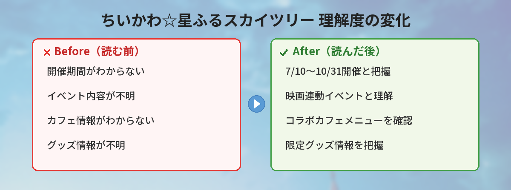

## この記事で分かること


ちいかわのスカイツリーイベントが開催されるって本当？いつからなの？



2026年7月10日から10月31日まで開催されるよ！映画「人魚の島のひみつ」との連動イベントで、カフェやグッズ、特別ライティングも楽しめるの。


「ちいかわのスカイツリーイベントっていつから？」「どんな内容なの？」「混雑するのかな？」という方へ。

この記事では、2026年7月10日から開催される「ちいかわ☆星ふるスカイツリーとひみつの島」の期間、内容、見どころをまとめています。

筆者が過去のスカイツリーコラボイベントに行った経験をもとに、混雑回避のコツや楽しみ方のアドバイスもお伝えします。

---

## イベント概要

東京スカイツリーで、映画「ちいかわ 人魚の島のひみつ」とのコラボイベントが開催されます。

| 項目 | 内容 |
|------|------|
| イベント名 | ちいかわ☆星ふるスカイツリーとひみつの島 |
| 開催期間 | 2026年7月10日（金）〜 10月31日（土） |
| 会場 | 東京スカイツリー |
| 関連作品 | 映画ちいかわ 人魚の島のひみつ（7月24日公開） |
| 入場料 | スカイツリー展望デッキ入場料（大人2,100円〜） |

約4か月間のロング開催なので、夏休みから秋まで楽しめます。

---

## イベントの見どころ

スカイツリー公式が発表した内容から、以下のお楽しみが用意されています。

### 館内装飾

スカイツリーの館内がちいかわ一色に装飾されます。過去のスカイツリーコラボイベントの傾向から、展望デッキやエレベーター内にもキャラクターが登場する可能性が高いです。

**過去のスカイツリーコラボで見られた装飾の例：**
- エレベーター内壁のフルラッピング
- 展望デッキの窓にキャラクターステッカー
- フォトスポット設置（等身大パネルやオブジェ）
- 天望回廊の通路にストーリー展示

### コラボカフェ

ちいかわをモチーフにしたフード＆ドリンクが楽しめるカフェが登場します。

**過去のちいかわカフェで人気だったメニュー傾向：**

| カテゴリ | メニュー例 | 価格帯 |
|----------|-----------|--------|
| フード | キャラクターの顔を再現したカレー | 1,500〜2,000円 |
| スイーツ | ケーキ・パフェ・ドーナツ | 1,000〜1,800円 |
| ドリンク | コラボラテ・ソーダ | 800〜1,200円 |
| 特典 | コースター・ランチョンマット | メニュー注文でプレゼント |


コラボカフェって高いイメージあるけど、どのくらいかかるの？



フード1品+ドリンク1品で2,500〜3,000円くらいが目安だよ。特典のコースターが付くことが多いから、お土産にもなるの。


### 限定グッズ

スカイツリー限定のちいかわグッズが販売されます。ここでしか買えないアイテムは毎回争奪戦になるので、早めの来場がおすすめです。

**予想されるグッズラインナップ：**
- スカイツリー×ちいかわ コラボアクリルスタンド
- 映画デザインのクリアファイル・ステッカー
- 限定ぬいぐるみ（スカイツリー衣装ver.）
- お菓子セット（パッケージ限定）
- ポストカード・メモ帳

### 特別ライティング

スカイツリーの塔体が、ちいかわをイメージした特別カラーにライトアップされます。夜のスカイツリーが映画の世界観に染まる演出は、外から見るだけでも楽しめます。

**ライティングの見どころ：**
- 夜7時以降に点灯（日没後）
- 期間中特定日に実施（毎日ではない可能性あり）
- 隅田川沿いや押上駅前から撮影スポットあり
- SNS映え間違いなし

---

## 過去のスカイツリーコラボから学ぶ攻略法

筆者は過去にスカイツリーの別作品コラボイベントに行った経験があります。その経験を活かした攻略法をお伝えします。

### 混雑のピーク

- **開催初日〜1週間**: 最も混雑。グッズは初日で一部完売
- **夏休み期間の土日**: 家族連れで混雑。展望デッキのチケットが午前中で完売することも
- **お盆期間（8月中旬）**: ピーク中のピーク
- **9月の平日**: 一気に落ち着く。ゆっくり楽しめる

### 筆者のおすすめ時期

**9月の平日午前**がベスト。混雑が落ち着いていて、グッズも再入荷されていることが多い。写真も人が映り込まず撮れます。

ただし「限定グッズの初回分が欲しい」「最速で体験したい」なら初日〜3日以内の平日朝イチを狙いましょう。

### 所要時間の目安

| 楽しみ方 | 所要時間 |
|----------|---------|
| 展望デッキ＋装飾のみ | 1〜1.5時間 |
| 展望デッキ＋カフェ | 2〜3時間 |
| 展望デッキ＋カフェ＋グッズ購入 | 3〜4時間 |
| 全部じっくり楽しむ | 半日 |

### 当日の立ち回り推奨ルート

1. **開場と同時にグッズショップへ**（人気アイテムは午前中に売り切れる）
2. **グッズ購入後にカフェへ**（カフェは待ち時間が発生しやすい）
3. **カフェの後に展望デッキへ**（装飾やフォトスポットをゆっくり撮影）
4. **夜まで滞在できるならライティングも**

---

## 映画「ちいかわ 人魚の島のひみつ」との連動

このイベントは、2026年7月24日公開の映画「ちいかわ 人魚の島のひみつ」に合わせた企画です。

### 映画の基本情報

| 項目 | 内容 |
|------|------|
| タイトル | 映画ちいかわ 人魚の島のひみつ |
| 公開日 | 2026年7月24日 |
| 制作 | Cypic |
| 原作 | ナガノ「ちいかわ」セイレーン編 |

映画はちいかわ初の劇場版作品で、原作の人気エピソード「セイレーン編」がアニメ化されます。

### イベントと映画のベストな楽しみ方

| タイミング | 楽しみ方 | おすすめ度 |
|-----------|---------|-----------|
| 映画公開前（7/10〜7/23） | イベントで映画の世界観を予習 | ★★★☆☆ |
| 映画公開直後（7/24〜8月） | 映画→イベントで余韻に浸る | ★★★★★ |
| 夏休み期間 | 家族や友達と一緒に | ★★★★☆ |
| 秋（9月〜10/31） | 混雑回避でゆっくり | ★★★★☆ |

**筆者のおすすめ**: 映画を観てからイベントに行くのがベスト。装飾や展示の意味が分かって「あのシーンだ！」と楽しめます。

---

## 予算シミュレーション

イベントを楽しむのにどのくらいかかるか、パターン別に試算しました。

### パターン1：サクッと楽しむ（1人あたり）

| 項目 | 金額 |
|------|------|
| 展望デッキ入場料 | 2,100円 |
| グッズ（1〜2点） | 1,000〜2,000円 |
| **合計** | **3,100〜4,100円** |

### パターン2：カフェも楽しむ

| 項目 | 金額 |
|------|------|
| 展望デッキ入場料 | 2,100円 |
| コラボカフェ（フード+ドリンク） | 2,500〜3,000円 |
| グッズ（2〜3点） | 2,000〜4,000円 |
| **合計** | **6,600〜9,100円** |

### パターン3：全力で楽しむ

| 項目 | 金額 |
|------|------|
| 展望デッキ入場料 | 2,100円 |
| 天望回廊（追加） | 1,000円 |
| コラボカフェ | 3,000円 |
| グッズ（たくさん） | 5,000〜10,000円 |
| **合計** | **11,100〜16,100円** |

---

## アクセス情報

| 項目 | 内容 |
|------|------|
| 最寄り駅 | とうきょうスカイツリー駅（東武スカイツリーライン） |
| 最寄り駅2 | 押上駅（半蔵門線・浅草線・京成線・東武線） |
| 住所 | 東京都墨田区押上1-1-2 |
| 営業時間 | 10:00〜21:00（最終入場20:00） |

押上駅から直結なので、雨の日でも濡れずにアクセスできます。

### 周辺のおすすめスポット

イベントと合わせて楽しめる周辺スポットも紹介します。

- **東京ソラマチ**: ショッピング＆グルメ。イベント前後の食事やお土産探しに
- **すみだ水族館**: スカイツリーの足元にある水族館。家族連れなら合わせて訪問
- **隅田公園**: スカイツリーの撮影スポット。特にライティング時は絶景

---

## よくある質問（FAQ）

### Q: 入場料はいくらですか？

A: スカイツリー展望デッキの通常入場料が必要です（大人2,100円〜）。コラボ特別チケットが販売される場合は追加料金が発生する可能性があります。

### Q: 予約は必要ですか？

A: 通常のスカイツリー入場は当日券でも可能ですが、混雑日は事前予約がおすすめです。コラボカフェは予約制になる可能性があります（公式発表待ち）。

### Q: グッズだけ買えますか？

A: 過去のイベントでは、展望デッキに上がらなくてもグッズショップにアクセスできるケースがありました。ただし今回の配置は公式発表をご確認ください。

### Q: 小さい子どもでも楽しめますか？

A: ちいかわは全年齢対象の作品なので、お子さまも楽しめます。ベビーカーでの来場も可能です。展望デッキは安全柵があるので安心。

### Q: 開催期間中に内容が変わることはありますか？

A: 長期開催イベントでは、期間限定メニューやグッズの入れ替えが行われることがあります。「第1弾」「第2弾」のように期間で区切られる場合も。公式SNSをフォローして最新情報をチェックしましょう。

### Q: 雨の日でも楽しめますか？

A: はい。スカイツリーは屋内施設なので天候に関係なく楽しめます。押上駅から直結なので、傘なしでアクセスできます。ただし展望デッキからの景色は晴れの日がおすすめ。

### Q: 写真撮影は自由にできますか？

A: 基本的に館内の装飾やフォトスポットでの撮影は自由です。ただし一部エリアで撮影制限がかかる場合があります。フラッシュ撮影や三脚の使用は禁止されていることが多いので、自然光やスマホのナイトモードで撮影しましょう。

### Q: 車で行く場合、駐車場はありますか？

A: 東京スカイツリータウンには有料駐車場があります（約950台）。イベント期間中は混雑が予想されるので、公共交通機関の利用がおすすめです。車で行く場合は平日の早い時間帯を狙いましょう。

---

## 持ち物チェックリスト

イベントを快適に楽しむために、持っていくと便利なものをリストにしました。

- **スマホ（フル充電）**: 写真撮影＆SNS投稿用。充電器も忘れずに
- **エコバッグ**: グッズをたくさん買う場合に必要
- **現金（小銭含む）**: カフェやグッズショップで電子決済非対応の場合に備えて
- **飲み物**: 展望デッキは乾燥しやすい。ペットボトルの持ち込みは可能
- **薄手の上着**: 展望デッキは冷房が効いていて肌寒い場合あり
- **推し活グッズ**: ぬいぐるみ撮影用に推しのぬい持参する人も多い

---


4か月もあるなら、ゆっくり計画を立てられるね！



そうだね。映画と合わせて夏の思い出にぴったりだよ。筆者のおすすめは9月平日だけど、限定グッズ狙いなら初日朝イチで！公式SNSをフォローして最新情報をチェックしておこうね。


## まとめ

- 「ちいかわ☆星ふるスカイツリーとひみつの島」が2026年7月10日〜10月31日に開催
- 映画「ちいかわ 人魚の島のひみつ」（7月24日公開）との連動イベント
- カフェ・グッズ・館内装飾・特別ライティングが楽しめる
- 約4か月のロング開催なので焦らず計画を立てられる
- 混雑を避けたい方は9月の平日がベスト
- 限定グッズ狙いなら初日〜3日以内の朝イチ
- 予算はサクッと3,000円台〜全力で15,000円台
- 映画を観てからイベントに行くと楽しさ倍増

---
### あわせて読みたい
- [映画ちいかわ「人魚の島のひみつ」7月24日公開！あらすじ・前売り券情報](/posts/chiikawa-movie-mermaid-island-2026/)
- [ちいかわ×東京ばな奈 2026年5月コラボまとめ](/posts/chiikawa-tokyo-banana-2026-05/)
