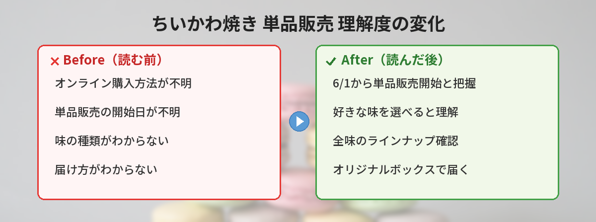

## この記事で分かること


ちいかわ焼きってオンラインで買えるの？しかも好きな味を選べるようになったって本当？



本当だよ！2026年6月1日お届け分から、オンラインショップで単品販売がスタートするの。しかもオリジナルボックスで届くんだって！


この記事では、ちいかわ焼きオンラインショップの単品販売開始について、注文方法・味の種類・注意点をまとめています。

---

## 公式情報



---

## 基本情報

| 項目 | 内容 |
|------|------|
| 開始日 | 2026年6月1日お届け分から |
| 注文受付 | 5月29日発送分から受付開始 |
| 販売形式 | 単品販売（好きな味を選べる） |
| 配送 | オンラインショップオリジナルボックスでお届け |
| 販売元 | ちいかわ焼き公式オンラインショップ |

---

## 何が変わるのか


今までのオンラインショップとは何が違うの？



今まではセット販売が中心だったんだけど、6月からは1個ずつ好きな味を選んで注文できるようになるの。苦手な味が入ってる問題が解消されるね！


### 単品販売で好きな味だけ注文可能に

これまでのオンラインショップでは、複数の味がセットになった商品が中心でした。6月1日からは、1個単位で好きな味を選んで注文できるようになります。

### オンラインショップオリジナルボックス

6月1日お届け分から、専用のオリジナルボックスでの配送に変わります。ちいかわデザインの箱で届くため、開封する楽しみも増えます。

---

## ちいかわ焼きとは


そもそもちいかわ焼きって何？たい焼きみたいなもの？



ちいかわのキャラクターの形をした焼き菓子だよ。横浜ワールドポーターズに実店舗があって、いつも行列ができる人気スイーツなの！


ちいかわ焼きは、ちいかわ・ハチワレ・うさぎなどのキャラクターの形をした焼き菓子です。

- **実店舗**: 横浜ワールドポーターズ内
- **特徴**: キャラクターの形がそのまま焼き菓子に
- **人気度**: 実店舗は常に行列、予約制を導入するほどの人気

実店舗に行けない人にとって、オンラインショップは貴重な購入手段です。

---

## 筆者が実際にオンラインで注文してみた体験レポ


実際にオンラインで頼んでみたことある？味とか食感はどうなの？



筆者が実際に注文した体験を紹介するね！冷凍なのに想像以上のクオリティだったよ。


筆者が実際にちいかわ焼きのオンラインショップで注文した体験をレポートします。

### 注文から届くまで

注文後、発送連絡が来たのは3日後。ヤマト運輸のクール便（冷凍）で届きました。段ボールを開けると、しっかり冷凍された状態のちいかわ焼きが丁寧に梱包されていました。

### 開封の瞬間

箱を開けた瞬間、「かわいい…食べるのがもったいない」という気持ちに。ちいかわ・ハチワレ・うさぎの形がきれいに再現されており、冷凍状態でもキャラクターの表情がはっきり見えます。

### 解凍して食べてみた感想

一番驚いたのが、**冷凍なのに生地がふわふわ**だったこと。解凍後のクオリティは実店舗の焼きたてには及ばないものの、十分に美味しいレベルです。

- **カスタード**: クリームがとろっとしていて濃厚。甘すぎず上品な味
- **チョコレート**: ビターよりのチョコクリームで大人向け
- **あんこ**: 粒あんでしっかりした甘さ。和菓子好きにはこれ

### 解凍のベストな方法（結論）

いろいろ試した結果、**電子レンジ20秒がベスト**でした。外はほどよくしっとり、中のクリームがちょうどいい温度になります。詳しい解凍方法は後述します。

---

## 解凍方法の詳細ガイド


冷凍で届くってことは、解凍が大事だよね？ベストな方法を教えて！



解凍方法によって食感がかなり変わるから、好みに合わせて試してみてね！


### 解凍方法比較表

| 解凍方法 | 時間 | 食感 | おすすめ度 | 備考 |
|---------|------|------|----------|------|
| 電子レンジ（500W） | 約20秒 | ふわふわ・しっとり | ★★★★★ | 筆者イチオシ。温かさもちょうどいい |
| 電子レンジ（500W） | 約30秒 | 柔らかめ・熱々 | ★★★☆☆ | やりすぎると生地がべちゃっとする |
| 常温解凍 | 30分〜1時間 | しっとり・冷たさ残る | ★★★★☆ | 時間に余裕がある時向け。自然な食感 |
| トースター | 2〜3分 | 外カリッ・中ふわ | ★★★★☆ | 焼きたて感を求める人向け |
| 冷蔵庫解凍 | 4〜6時間 | しっとり・冷製 | ★★★☆☆ | 夜に移して翌朝食べる方法 |

### 電子レンジ解凍のコツ

1. 冷凍庫から取り出し、ラップをふんわりかける
2. 500Wで20秒加熱する
3. 取り出して10秒ほど待つ（余熱で均一に温まる）
4. 中のクリームが熱くなりすぎていないか確認してからいただく

**注意**: 加熱しすぎると生地が硬くなったり、クリームが飛び出したりするので、最初は短めの時間から試すのがおすすめです。

### トースター解凍のコツ

1. アルミホイルを敷いた上にちいかわ焼きを置く
2. 予熱なしで2〜3分加熱する
3. 表面にうっすら焼き色がついたら取り出す
4. 1〜2分冷ましてからいただく

**ポイント**: トースターだと外側がカリッとして、たい焼きに近い食感になります。焼きたて感を再現したい方におすすめ。

---

## おすすめの味ランキング（SNS人気順）


どの味が一番人気なの？迷っちゃうんだけど…



SNSでの反応を参考に、人気順をまとめてみたよ！


SNSでの購入報告や感想をもとにした、味の人気ランキングです。

| 順位 | 味 | SNSでの評価 | こんな人におすすめ |
|------|------|------------|-----------------|
| 1位 | カスタードクリーム | 「間違いない美味しさ」「迷ったらこれ」 | 万人向け。初めての人にイチオシ |
| 2位 | チョコレート | 「ビターで大人の味」「甘すぎなくて好き」 | 甘さ控えめが好きな人 |
| 3位 | あんこ | 「北海道産小豆が本格的」「和菓子好きにはたまらない」 | 和菓子派・あんこ好き |

### 味選びのポイント

- **初めて注文する方**: まずはカスタードから。外さない定番の味
- **甘いものが苦手な方**: チョコレートがおすすめ。ビター寄りで大人向け
- **和菓子好きな方**: あんこ一択。粒あんの食感が楽しめる
- **プレゼント用**: カスタードとチョコの組み合わせが無難
- **全部試したい方**: 単品販売スタートを機に、各1個ずつ注文するのもアリ

---

## 味の種類

ちいかわ焼きには複数の味があります。単品販売では、これらの中から好きなものを自由に組み合わせて注文できます。

### 定番の味

- **カスタードクリーム** — 定番の人気フレーバー
- **チョコレート** — 濃厚なチョコクリーム入り
- **あんこ** — 北海道産小豆使用

### 季節限定の味

季節によって限定フレーバーが登場することがあります。6月以降の限定味については、公式SNSで発表される予定です。

---

## 実店舗（横浜ワールドポーターズ）との比較


実店舗に行くのとオンラインで買うのと、どっちがいいの？



それぞれメリット・デメリットがあるから、状況に合わせて選んでね！


### 実店舗の混雑状況

横浜ワールドポーターズのちいかわ焼き実店舗は、以下のような混雑傾向があります。

| 時間帯 | 混雑度 | 待ち時間目安 |
|--------|--------|------------|
| 開店直後（10:00〜11:00） | やや混雑 | 20〜40分 |
| 平日昼（11:00〜14:00） | 混雑 | 40分〜1時間 |
| 平日夕方（15:00〜17:00） | やや空いている | 15〜30分 |
| 土日祝 | 非常に混雑 | 1時間〜1時間半 |
| 長期休暇期間 | 最混雑 | 1時間半〜2時間以上 |

※時期やイベントによって変動します。整理券制が導入されている場合もあるため、事前に公式SNSで確認するのがおすすめです。

### 実店舗 vs オンライン 詳細比較

| 項目 | 実店舗（横浜） | オンラインショップ |
|------|---------------|-------------------|
| 焼きたて | ✅ | ❌（冷凍配送） |
| 待ち時間 | 行列あり（15分〜2時間） | なし |
| 味の選択 | その場で選べる | 6月から単品選択可能 |
| 限定グッズ | 店舗限定あり | オンライン限定あり |
| 配送 | 持ち帰り | 全国配送 |
| アクセス | 横浜まで行く必要あり | 自宅で注文完結 |
| 焼き加減 | 焼きたてでベスト | 解凍方法次第 |
| 数量 | 当日の在庫次第 | 在庫があれば注文可 |
| 費用 | 商品代のみ | 商品代＋送料 |
| イベント感 | ✅（お出かけの楽しさ） | ❌ |
| ボックス | 通常パッケージ | オリジナルボックス |

**結論**: 焼きたてを味わいたいなら実店舗、待ち時間なし＋全国どこでも買いたいならオンラインがおすすめです。

---

## 注文方法


いつから注文できるの？



6月1日お届け分（5月29日発送分）の注文受付から単品販売が始まるよ。公式オンラインショップをチェックしてね！


### ステップ1: 公式オンラインショップにアクセス

ちいかわ焼き公式のオンラインショップページにアクセスします。

### ステップ2: 好きな味を選ぶ

単品販売の商品一覧から、欲しい味と個数を選択します。

### ステップ3: 配送日を確認して注文

お届け日を確認し、注文を確定します。6月1日以降のお届け日が対象です。

---

## 送料・配送日数の目安


送料ってどのくらいかかるの？届くまでどれくらい？



冷凍便だから通常配送より少し高めだけど、まとめ買いで節約できるよ！


### 配送に関する目安

| 項目 | 目安 |
|------|------|
| 配送方法 | ヤマト運輸 クール便（冷凍） |
| 配送エリア | 全国対応 |
| 注文〜発送 | 2〜4日程度 |
| 発送〜到着 | 1〜3日程度（地域による） |
| 注文〜到着合計 | 3日〜1週間程度 |
| 送料 | 冷凍便のため通常配送より割高（公式サイトで確認） |
| 送料無料条件 | 一定金額以上の注文で送料無料の場合あり（公式サイトで確認） |

**送料を抑えるコツ**:
- 友人と一緒にまとめ注文する
- 送料無料ラインまで注文数を増やす
- セール時期やキャンペーンを活用する

---

## オリジナルボックスについて


オリジナルボックスってどんな感じなんだろう？



まだデザインの詳細は公開されてないけど、ちいかわデザインの専用箱みたい。箱自体がコレクションアイテムになりそうだよね！


6月1日お届け分から導入される「オンラインショップオリジナルボックス」は、通常の配送箱とは異なるちいかわデザインの専用パッケージです。

- ギフトとしてもそのまま渡せるデザイン
- 箱自体がコレクションアイテムに
- 詳細デザインは公式SNSで順次公開予定

### オリジナルボックスの活用アイデア


食べ終わった後の箱、捨てるのもったいないよね？



活用方法はたくさんあるよ！SNSでもいろんなアイデアが出てるんだ。


ちいかわデザインのオリジナルボックスは、食べ終わった後も活用できます。

| 活用方法 | 詳細 |
|---------|------|
| 小物入れ | アクセサリーや文房具の収納に |
| 推しグッズ収納 | アクスタ、缶バッジなどのコレクション整理に |
| デスク上のインテリア | 机の上に飾ってかわいい空間づくり |
| プレゼント用の箱 | 友人への手作りお菓子を入れて渡す |
| 写真撮影の小道具 | ちいかわグッズの撮影背景として活用 |
| コレクション | ボックスのデザイン違いを集める楽しみ |

---

## ギフトとしての活用法


友達へのプレゼントにもいいかも！ギフトとして贈る場合のポイントを教えて。



ちいかわ焼きはギフトにも最適だよ！特にちいかわ好きの友達には最高のサプライズになるはず。


### ギフトにおすすめのシーン

| シーン | おすすめの味・個数 | ポイント |
|--------|----------------|---------|
| 友人の誕生日 | 全味セット 6個程度 | オリジナルボックスがそのままプレゼントに |
| 推し活仲間への差し入れ | カスタード中心 5〜6個 | イベント前の集まりで配る |
| ちょっとしたお礼 | 好きな味 3個程度 | 手軽で喜ばれるサイズ感 |
| 遠方の友人に | お好みの味 | 全国配送だから直接送れる |
| 職場への手土産 | カスタード＆チョコ 10個以上 | 万人向けの味を選ぶのがポイント |

### ギフトとして贈る際の注意点

- **冷凍配送**であることを相手に伝えておく（不在時に受け取れないと品質に影響）
- **賞味期限**を確認し、届いたら早めに食べてもらえるよう伝える
- **アレルギー**がないか事前に確認する
- **配送先を相手の住所に指定**すれば、直接届けることも可能

---

## 注意点

### 冷凍配送である

オンラインショップのちいかわ焼きは冷凍状態で届きます。食べる前に解凍が必要です。

### 届くまでに時間がかかる

注文から発送まで数日、届くまでさらに数日かかります。「今すぐ食べたい」場合は実店舗がおすすめです。

### 送料がかかる

オンライン注文には別途送料がかかります。まとめ買いで送料を抑えるのがお得です。

### 再冷凍は避ける

一度解凍したちいかわ焼きを再度冷凍すると、品質が著しく低下します。解凍したら当日中に食べきりましょう。

---

## よくある質問（FAQ）


もっと細かいことも知りたい！まとめて教えて！



注文前に気になるポイントを網羅的にまとめたよ！


### Q: 単品は1個から注文できる？

A: 最低注文数については公式サイトで確認してください。送料を考えると、ある程度まとめて注文するのがお得です。過去のセット販売では3個入り・6個入りが中心だったため、単品でも最低3個以上の注文が必要になる可能性があります。

### Q: 賞味期限はどのくらい？

A: 冷凍状態での賞味期限は商品によって異なります。届いたら早めに確認しましょう。一般的に冷凍焼き菓子は1〜2ヶ月程度の賞味期限が設定されていることが多いです。

### Q: ギフト用のラッピングはある？

A: オリジナルボックスでの配送になるため、そのままギフトとして渡せるデザインになっています。

### Q: 実店舗の味とオンラインの味は同じ？

A: 基本的な味は同じですが、実店舗は焼きたて、オンラインは冷凍配送のため食感に若干の違いがあります。

### Q: 届いた後の保存方法は？

A: 冷凍庫で保存し、食べる前に常温または電子レンジで解凍してください。解凍後は当日中にお召し上がりください。

### Q: アレルギー対応はしていますか？

A: ちいかわ焼きには小麦・卵・乳成分が含まれています。そのほかのアレルギー物質については、公式サイトの商品ページで最新の原材料情報を確認してください。味によって使用原材料が異なる場合があるため、注文前に必ずご確認をおすすめします。

### Q: 最低注文数はありますか？

A: 単品販売のスタートに伴い、最低注文数の設定は公式サイトで確認が必要です。なお、冷凍便の送料を考慮すると、1個だけの注文はコスパが悪くなるため、3〜6個程度のまとめ注文が現実的です。

### Q: 注文後のキャンセルはできますか？

A: 食品のため、発送準備に入った後のキャンセルは基本的にできません。注文確定前に味・個数・配送先をよく確認してから確定しましょう。受付直後であれば対応可能な場合もあるため、キャンセルが必要な場合は早めに公式ショップに問い合わせてください。

### Q: 届いた商品が破損していた場合は？

A: 配送中の破損などの不良品は、到着後早めに公式ショップに連絡すれば対応してもらえます。開封時に写真を撮っておくとスムーズです。

### Q: 配送日時の指定はできますか？

A: クール便のため、配送日時の指定が可能です。不在で受け取れないと品質に影響するため、確実に受け取れる日時を指定しましょう。

### Q: 定期購入（サブスクリプション）はありますか？

A: 現時点では単品・都度注文のみで、定期購入の仕組みは発表されていません。今後のアップデートに期待しましょう。

---

## ちいかわ焼きをもっと楽しむアイデア


最後に、ちいかわ焼きをさらに楽しむアイデアを紹介するね！


### 写真映えする食べ方

- ちいかわのぬいぐるみやアクスタと一緒に撮影
- お気に入りのお皿に並べて「ちいかわカフェ風」に
- 3種類の味を並べて「味比べプレート」にする
- 季節のフルーツと一緒に盛り付ける

### SNSでの共有

ちいかわ焼きが届いたら、ぜひSNSで共有してみましょう。

- ハッシュタグ「#ちいかわ焼き」で投稿
- 開封の瞬間を動画で撮影
- 推し味のレビューを投稿
- オリジナルボックスのデザインを紹介

---

## まとめ


好きな味だけ選べるのは嬉しいね！オリジナルボックスも気になる。



実店舗に行けない人には待望のアップデートだよね。5月29日発送分から受付開始だから、公式サイトをチェックしておこう！


- ちいかわ焼きオンラインショップで6月1日から単品販売開始
- 好きな味を自由に選んで注文できるように
- オンラインショップオリジナルボックスでお届け
- 5月29日発送分（6月1日お届け分）から注文受付
- 冷凍配送のため、届いたら冷凍庫で保存
- 解凍は電子レンジ500W・20秒がベスト
- カスタードが一番人気、初めての方にもおすすめ
- ギフトとしても活用可能（オリジナルボックスがそのまま使える）
- 送料を抑えるにはまとめ買いがお得
- オリジナルボックスは食べ終わった後も小物入れ等に再利用できる

---
### あわせて読みたい
- [ちいかわマーケット5/22新商品発売まとめ](/posts/chiikawa-park-guide-2026/)
- [ちいかわパーク完全ガイド2026](/posts/chiikawa-park-guide-2026/)
