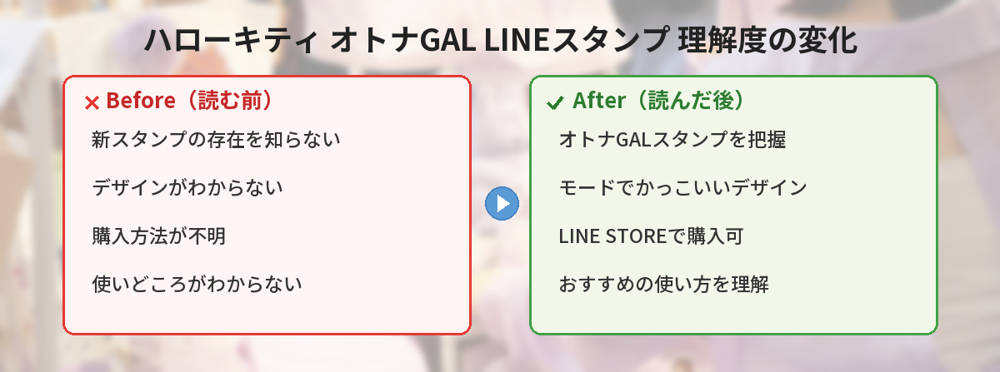

## この記事で分かること


ハローキティの新しいLINEスタンプが出たって聞いたんだけど、どんなやつ？



「ハローキティ♡オトナGAL」っていう、モードでかっこいいキティのスタンプだよ！いつものかわいいキティとはちょっと違う雰囲気なの。


この記事では、サンリオ公式から新登場した「ハローキティ♡オトナGAL」LINEスタンプの内容、購入方法、おすすめの使い方をまとめています。

実際に購入して使ってみた感想や、既存のサンリオスタンプとの違いも紹介するので、「買おうか迷ってる…」という方の参考になれば嬉しいです。

---

## 公式情報



サンリオ公式X（@sanrio_news）から5月24日に発表されました。

---

## 基本情報

| 項目 | 内容 |
|------|------|
| スタンプ名 | ハローキティ♡オトナGAL |
| 販売元 | サンリオ |
| 販売場所 | LINE STORE |
| 価格 | 250円（税込）/ 100コイン |
| スタンプ数 | 40個 |
| 購入リンク | [LINE STOREで購入する](https://store.line.me/stickershop/author/7869/ja) |

---

## スタンプの特徴

### モードでかっこいいキティ

通常のハローキティとは一味違う「オトナGAL」テイストのデザインです。ファッショナブルでスタイリッシュなキティが描かれています。

従来のキティスタンプが「ほんわか・やさしい」雰囲気なのに対して、オトナGALは「クール・モード・自立した大人」というイメージ。サングラスをかけていたり、ヒョウ柄を取り入れていたり、今までのキティにはなかった攻めたデザインが特徴です。

### 従来のキティスタンプとの違い

| 比較項目 | 従来のキティスタンプ | オトナGAL |
|----------|---------------------|-----------|
| テイスト | かわいい・ほんわか | かっこいい・モード |
| 色味 | ピンク・パステル中心 | 黒・ゴールド・レオパード |
| 文字の雰囲気 | やさしい丸文字 | スタイリッシュなフォント |
| 使う場面 | 日常のゆるいやり取り | おしゃれに決めたい場面 |
| 対象年齢 | 全年齢 | 20代〜30代の大人向け |


いつものキティとは全然違う感じなんだ。ギャルっぽいキティ、意外と新鮮かも。



「かわいいだけじゃなくて、かっこよくもありたい」っていう人にぴったり。大人のサンリオファンに刺さるデザインだよ。


### こんなシーンで使える

- 友達とのカジュアルなやり取り
- 「了解」「OK」などの返事をおしゃれに
- テンション高めのリアクション
- 大人っぽい雰囲気を出したいとき
- 彼氏・彼女への返信（甘すぎないのがちょうどいい）
- 推し活グループでのテンション高い会話

---

## 実際に使ってみた！（筆者の感想）

筆者も発売当日に購入して実際に使ってみたので、正直な感想をお伝えします。

### 良かったところ

**1. 「了解」系スタンプが使いやすい**

仕事関係の人にもギリギリ送れるくらいのおしゃれさ。「りょ」「OK」「おつかれ」あたりは、かわいすぎず堅すぎずで絶妙なバランスです。

**2. 40種類あるから使い分けできる**

40個もあるとかなりのシーンをカバーできます。「おはよう」から「おやすみ」まで日常会話がこのスタンプだけで完結するレベル。1セットでここまで揃ってるのはコスパ良いです。

**3. 送った相手の反応が良い**

友達数人に送ってみたら「なにこれかわいい！」「キティってこんなかっこいいのあるの？」と食いつきが良かったです。会話のきっかけにもなります。

### イマイチだったところ

**1. 背景が暗いトーク画面だと見えにくい**

黒ベースのデザインが多いので、ダークモード設定のトーク画面だと少し見づらい場面がありました。ライトモードで使う方が映えます。

**2. フォーマルな場面には向かない**

「オトナ」とはいえGALテイストなので、上司や取引先へのメッセージには不向き。あくまでカジュアルな関係性で使うのがベストです。

**3. 文字が小さいスタンプがある**

一部のスタンプは文字が小型で、スマホの画面サイズによっては読みにくいかもしれません。プレビューで確認してから送るのがおすすめ。


正直なレビューありがたい。ダークモードだと見えにくいのは盲点だね。



トーク画面の背景色との相性は意外と大事だよね。購入前にプレビューで確認するといいよ！


---

## 購入方法

### LINE STOREから購入する場合

1. [LINE STORE](https://store.line.me/stickershop/author/7869/ja)にアクセス
2. 「ハローキティ♡オトナGAL」を検索
3. 「購入する」ボタンをタップ
4. 支払い方法を選択して完了

### LINEアプリから購入する場合

1. LINEアプリを開く
2. 「スタンプショップ」をタップ
3. 検索で「ハローキティ オトナGAL」と入力
4. スタンプを選んで購入

### 支払い方法

- LINEコイン（100コイン）
- LINE Pay
- クレジットカード
- キャリア決済

### 購入時のちょっとしたコツ

- **LINE STOREの方がポイント還元がある場合も**。キャンペーン中はLINE STORE経由がお得です
- **友達にプレゼントする場合**は必ずLINE STORE経由で。アプリ内からはプレゼント機能がない場合があります
- **LINEコインが余っている人**はアプリ内購入が手軽。コインの端数消化にもちょうどいい金額です

---

## おすすめの使い方

### 日常使いに

「おはよう」「おやすみ」「ありがとう」など、毎日使うフレーズがオトナGALテイストで揃っています。いつものやり取りがちょっとおしゃれになります。

毎日同じスタンプを使っていると飽きてくるもの。今使っているスタンプのローテーションに加えると、気分転換になります。

### 推し活仲間とのやり取りに

サンリオ好き同士のグループLINEで使えば、テンションが上がること間違いなし。特に「キャーッ」「尊い…」系のリアクションスタンプは推し活に最適です。

### 仕事のカジュアルなやり取りに

「了解です」「お疲れさまです」など、ビジネスカジュアルな場面でも使いやすいデザインです。ただし、相手との関係性は見極めましょう。同僚や後輩にはOK、上司や取引先には従来の落ち着いたスタンプがおすすめ。

### 友達へのプレゼントとして

LINEスタンプは250円で贈れるちょっとしたギフト。誕生日や「ありがとう」の気持ちを込めてプレゼントするのにぴったりの価格帯です。サンリオ好きの友達には特に喜ばれます。

---

## サンリオLINEスタンプの選び方ガイド

「オトナGAL」以外にもサンリオのLINEスタンプはたくさんあります。どれを買うか迷っている方向けに、選び方のポイントをまとめました。

### 使用頻度で選ぶ

毎日使うなら「挨拶系（おはよう・おやすみ・ありがとう）」が充実しているセットを。イベント時だけ使うなら季節限定スタンプがおすすめです。

### 送る相手で選ぶ

| 送る相手 | おすすめスタンプ |
|----------|-----------------|
| 親しい友達 | オトナGAL（テンション高め） |
| 家族 | 従来のキティ（やさしい雰囲気） |
| 仕事関係 | シナモロール敬語スタンプ |
| 恋人 | マイメロディ（甘め） |

### 推しキャラで選ぶ

サンリオ好きなら推しキャラのスタンプを揃えるのも楽しみ方のひとつ。キティだけでも10種類以上のスタンプセットが販売されています。

---

## SNSでの反応

公式発表後、サンリオファンの間で話題になっています。

- 「オトナGALなキティ、新鮮でかわいい」
- 「大人っぽいスタンプ探してたからうれしい」
- 「サンリオのスタンプどんどん増えてく…全部欲しい」
- 「友達にプレゼントしたい」
- 「ダークモードユーザーだけど買っちゃった。映える背景に変えればOK」
- 「職場のグループLINEで使ったら好評だった」

特に20代〜30代の女性を中心に「今までのキティにない大人っぽさが良い」という声が多く見られました。

---

## よくある質問（FAQ）

### Q: スタンプはプレゼントできますか？

A: はい、LINE STOREから友達にプレゼントとして贈ることができます。購入画面で「プレゼントする」を選択してください。相手のLINEアカウントを指定するだけで簡単に贈れます。

### Q: 有効期限はありますか？

A: 購入したLINEスタンプに有効期限はありません。一度購入すれば、ずっと使い続けられます。LINEのアカウントを変更しない限り、機種変更後も引き継がれます。

### Q: iPhoneとAndroidの両方で使えますか？

A: はい、同じLINEアカウントであれば、どちらの端末でも使用できます。タブレットやPC版LINEでも利用可能です。

### Q: 他のサンリオキャラのスタンプもありますか？

A: サンリオ公式からは多数のLINEスタンプが販売されています。LINE STOREで「サンリオ」と検索すると一覧が確認できます。マイメロディ、シナモロール、ポムポムプリンなど人気キャラクターは特にラインナップが豊富です。

### Q: 絵文字セットもありますか？

A: サンリオからはLINE絵文字も多数販売されています。スタンプと組み合わせて使うとトーク画面の統一感が出ておすすめです。ただし「オトナGAL」シリーズの絵文字は2026年5月時点では未発売です。

### Q: 返金はできますか？

A: LINEスタンプは購入後の返金ができません。購入前にプレビューで全スタンプを確認してから決めましょう。

---

## 筆者のおすすめ活用法

最後に、実際に1週間使ってみて見つけた個人的なおすすめ活用法を紹介します。

### トーク画面の背景を白系にする

前述の通り、暗い背景だとスタンプが見えにくくなります。オトナGALスタンプを頻繁に使うトーク相手の画面だけ、白やパステル系の背景に変更するとスタンプが映えます。

### 「スタンプだけ返信」に使う

文字を打つのが面倒なとき、このスタンプだけで返信するのがちょうどいい。デザインがおしゃれなので「スタンプだけで返された感」が薄く、相手に失礼になりにくいです。

### 季節イベントのときに組み合わせる

クリスマスやバレンタインなど、季節の話題のときに通常スタンプとオトナGALを使い分けると、会話にメリハリが出ます。

---


250円でこのクオリティはいいね。買ってみようかな。



友達へのプレゼントにもおすすめだよ。サンリオ好きな人にはきっと喜ばれるはず！新しい情報が出たらこの記事も更新するからチェックしてみてね。


## まとめ

- サンリオ公式から「ハローキティ♡オトナGAL」LINEスタンプが新登場
- モードでかっこいい大人テイストのキティデザインで従来とは雰囲気が異なる
- LINE STOREまたはLINEアプリ内スタンプショップから購入可能
- 価格は250円（税込）/ 100コイン、全40種類
- 友達へのプレゼントにもおすすめ（LINE STOREから贈れる）
- ダークモードの画面では見えにくい場合があるので背景色に注意
- 20代〜30代の大人サンリオファンに特におすすめ

---
### あわせて読みたい
- [サンリオキャラクター大賞2026中間結果まとめ](/posts/sanrio-character-ranking-2026-interim/)
- [タキシードサム LINEきせかえ新登場](/posts/tuxedosam-line-theme-2026-05/)
