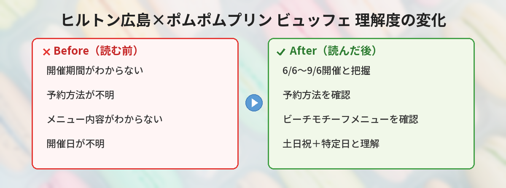

## この記事で分かること


ヒルトン広島でプリンのビュッフェがあるって聞いたんだけど、いつからやってるの？



6月6日から9月6日まで、土日祝と特定日に開催されるよ！ポムポムプリン30周年記念のコラボなの。詳しくまとめるね。


「ヒルトン広島のプリンビュッフェっていつから？」「毎日やってるの？」「予約は必要？」という方へ。

この記事では、2026年夏にヒルトン広島で開催されるポムポムプリンコラボスイーツビュッフェの詳細をまとめています。

## ヒルトン広島×ポムポムプリン コラボビュッフェの概要

| 項目 | 内容 |
|------|------|
| 開催期間 | 2026年6月6日（土）〜9月6日（日） |
| 開催日 | 土・日・祝日および特定日 |
| 会場 | ヒルトン広島（広島県） |
| テーマ | ビーチでのんびり過ごすプリンとお友だち |
| コラボ理由 | ポムポムプリン30周年記念 |

## サンリオ公式の告知ツイート

<blockquote class="twitter-tweet" data-media-max-width="560">
ヒルトン広島×ポムポムプリン♪ 6/6（土）～9/6（日）の土･日･祝日および特定日に、ヒルトン広島（広島）で夏のスイーツビュッフェを開催☆ ビーチでのんびり過ごすプリンとお友だちがモチーフの、楽しいメニューがいっぱいだよ！<a href="https://t.co/l3bOzi0jLZ">https://t.co/l3bOzi0jLZ</a><a href="https://twitter.com/hashtag/%E3%82%B5%E3%83%B3%E3%83%AA%E3%82%AA?src=hash&amp;ref_src=twsrc%5Etfw">#サンリオ</a> <a href="https://twitter.com/hashtag/%E3%83%9D%E3%83%A0%E3%83%9D%E3%83%A0%E3%83%97%E3%83%AA%E3%83%B330%E5%91%A8%E5%B9%B4?src=hash&amp;ref_src=twsrc%5Etfw">#ポムポムプリン30周年</a> <a href="https://t.co/sMvvSIxyWN">pic.twitter.com/sMvvSIxyWN</a>
&mdash; サンリオ【公式】 (@sanrio_news) <a href="https://twitter.com/sanrio_news/status/2054366057469809149?ref_src=twsrc%5Etfw">May 13, 2026</a></blockquote> 

## ポムポムプリン30周年とは

ポムポムプリンは1996年にデビューしたサンリオの人気キャラクターです。
ゴールデンレトリバーの男の子で、茶色いベレー帽がトレードマーク。

2026年はデビュー30周年のアニバーサリーイヤーにあたります。
サンリオキャラクター大賞2026の中間発表では**第1位**を獲得するなど、今年特に注目を集めています。

30周年を記念して、全国各地でさまざまなコラボイベントが開催されており、今回のヒルトン広島もその一環です。


ビーチテーマって夏らしくていいね！どんなメニューが出るのかな？



ヒルトンのコラボビュッフェはクオリティが高いことで有名だよ。プリンの顔のケーキや夏フルーツのデザートが期待できるの！


## ビュッフェのテーマ：ビーチでのんびりプリン

今回のスイーツビュッフェは「ビーチでのんびり過ごすプリンとお友だち」がモチーフです。

夏らしいビーチテーマで、プリンたちが海辺でリラックスしている世界観が楽しめます。

### 期待できるメニューの傾向

ヒルトンのキャラクターコラボビュッフェは、毎回クオリティが高いことで知られています。

- キャラクターモチーフのスイーツ（プリンの顔をかたどったケーキなど）
- 夏らしいフルーツを使ったデザート
- ビーチテーマの装飾やフォトスポット
- 軽食メニュー（ビュッフェ形式）

詳細なメニューは公式サイトで順次公開される見込みです。


毎日やってるわけじゃないんだ？予約はどうすればいいの？



土日祝と特定日だけだから注意してね。ヒルトンのビュッフェは予約制が多いから、公式サイトで早めに予約するのがおすすめだよ。


## 開催スケジュールの注意点

### 毎日開催ではない

このビュッフェは**土・日・祝日および特定日のみ**の開催です。
平日に行っても開催されていないので注意してください。

### 開催期間が長い

6月6日〜9月6日と約3ヶ月間の開催です。
夏休み期間をカバーしているので、旅行の計画に組み込みやすいのが嬉しいポイントです。

### 特定日とは

「特定日」の詳細はヒルトン広島の公式サイトで確認できます。
お盆期間や夏休みの平日が含まれる可能性があります。

## 予約・アクセス情報

### 予約について

ヒルトンのスイーツビュッフェは人気が高く、予約制の場合が多いです。
公式サイトで予約開始日を確認し、早めに予約することをおすすめします。

### 予約のコツ

- **公式サイトでの予約が最安**。一休.comやOZmallでもプランが出ることがあるが、特典内容が異なる場合あり
- **土日は1ヶ月前でも埋まる**ことがある。予約開始と同時に押さえるのが確実
- **キャンセル待ちも活用**。直前にキャンセルが出ることもあるので、諦めずにチェック
- **平日開催日があるか確認**。「特定日」に平日が含まれていればそちらが穴場

### ヒルトン広島へのアクセス

ヒルトン広島は2022年に開業した比較的新しいホテルです。

| アクセス方法 | 詳細 |
|-------------|------|
| 路面電車 | JR広島駅から約15分「中電前」下車 |
| 徒歩 | 広島平和記念公園から徒歩約5分 |
| バス | 広島バスセンターから徒歩約10分 |
| 車 | 広島ICから約20分（駐車場あり・有料） |

---

## 実際にヒルトンのコラボビュッフェに行ってみた！


実際にホテルビュッフェ行ったことある？雰囲気とか気になる！



筆者が実際にヒルトンのキャラクターコラボビュッフェを体験した感想を紹介するね！


筆者が実際にヒルトンのキャラクターコラボビュッフェに参加した体験をお伝えします。

### 会場の雰囲気

- **フォトスポットが充実**。入口付近にキャラクターのパネルやオブジェが設置されていて、開始前から撮影を楽しめる
- **テーブルのナプキンやコースターもコラボデザイン**。細部までこだわっていて没入感がすごい
- **BGMがキャラクターに合わせたポップな選曲**。雰囲気づくりが徹底されている

### スイーツのクオリティ

- **見た目のかわいさが異次元**。キャラクターの顔を再現したケーキは「食べるのがもったいない」と感じるレベル
- **味もしっかり美味しい**。見た目だけじゃなくパティシエの技術が感じられる。ホテルクオリティ
- **種類が豊富で飽きない**。スイーツだけで10種以上+軽食メニューもあるので、甘いものが苦手な同行者も楽しめる

### コスパについて

正直、ビュッフェ代だけで見ると「高い」と感じる人もいると思います。ただし：

- **フォトスポット利用料込み**と考えれば妥当
- **キャラクターの世界観に浸れる体験**は他では得られない
- **コースター等の特典がお土産になる**
- **2時間たっぷり楽しめる**のでカフェ2回分と考えると◎

---

## ビュッフェ当日の持ち物チェックリスト


ビュッフェを最大限楽しむための持ち物をまとめたよ！


- **スマホ（フル充電）**: フォトスポットでの撮影に必須。充電器も持参推奨
- **推しぬいぐるみ**: プリンのぬいと一緒に撮影する人が多い
- **エコバッグ**: グッズ購入時に便利
- **ウェットティッシュ**: スイーツで手が汚れやすい
- **カーディガン等の羽織り**: ホテル内は冷房が効いている

---

## 広島観光との組み合わせプラン


せっかく広島に行くなら、ビュッフェ以外も楽しみたいな。



ヒルトン広島は平和記念公園の近くだから、観光と組み合わせやすいよ！


### おすすめ1日プラン

| 時間 | 予定 | 備考 |
|------|------|------|
| 10:00 | 広島平和記念公園を散策 | ヒルトンから徒歩5分 |
| 11:30 | ヒルトン到着・ビュッフェ受付 | 開始前にフォトスポット撮影 |
| 12:00〜14:00 | スイーツビュッフェ | たっぷり2時間 |
| 14:30 | 広島城を観光 | 路面電車で約10分 |
| 16:00 | 本通り商店街でお土産探し | もみじ饅頭等 |

### 宿泊する場合

ヒルトン広島にそのまま宿泊すれば、ビュッフェの後もゆっくりくつろげます。ビュッフェ付き宿泊プランが設定されている場合はセットで予約するのがお得。

## こんな人におすすめ

- ポムポムプリンが好きな方
- 30周年記念イベントを楽しみたい方
- 広島旅行を計画中の方
- ホテルスイーツビュッフェが好きな方
- 夏休みのお出かけ先を探している方（親子にもおすすめ）

## 他のポムポムプリン30周年イベント

2026年はポムポムプリン30周年ということで、各地でコラボが展開されています。

- サンリオピューロランド 30周年記念イベント（4月〜）
- サンリオキャラクター大賞2026 中間1位獲得
- 各種コラボグッズの発売

30周年の勢いで、今年はプリンファンにとって特別な1年になりそうです。

## よくある質問（FAQ）

### Q: 予約なしでも入れますか？
A: ヒルトンのビュッフェは予約制の場合が多いです。公式サイトで事前に確認・予約することをおすすめします。

### Q: 子どもも参加できますか？
A: はい。ホテルのスイーツビュッフェは年齢制限がないことが一般的です。子ども料金が設定されている場合もあります。

### Q: 料金はいくらですか？
A: 詳細な料金はヒルトン広島の公式サイトで確認してください。ヒルトンのスイーツビュッフェは一般的に4,000〜6,000円程度です。

### Q: 写真撮影はできますか？
A: キャラクターコラボビュッフェではフォトスポットが設置されることが多く、撮影可能な場合がほとんどです。

### Q: 宿泊しなくても利用できますか？
A: はい。ビュッフェのみの利用が可能です。宿泊者以外も予約できます。


広島旅行と合わせて行きたいな！



3か月間開催だから夏休みの旅行にぴったりだよ。宿泊しなくてもビュッフェだけ利用できるから、気軽に楽しんでね！


## まとめ

- ヒルトン広島でポムポムプリン30周年コラボスイーツビュッフェが開催
- 期間は6/6〜9/6の土・日・祝日および特定日
- テーマは「ビーチでのんびり過ごすプリンとお友だち」
- 予約制の可能性が高いので、公式サイトで早めに確認を
- 夏休みの広島旅行と合わせて楽しめる

---
### あわせて読みたい
- [【5月12日最新】サンリオキャラクター大賞 中間発表！1位ポムポムプリン・2位シナモロール・3位ポチャッコ](/posts/sanrio-character-ranking-2026-interim/)
- [【5/23発売】アベイル×エヴァンゲリオン×サンリオキャラクターズ コラボ新作まとめ](/posts/avail-evangelion-sanrio-2026-05/)
