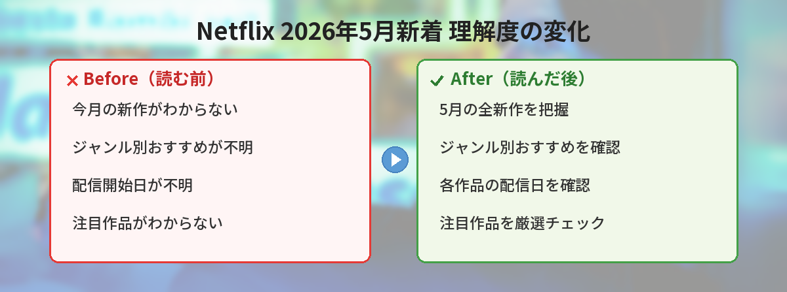

## この記事で分かること


今月のNetflix、何か面白い新作ある？GWに一気見したいんだけど！



2026年5月は注目作品が目白押しだよ！ドラマ、映画、リアリティ番組まで幅広くラインナップされてるから、ジャンル別に紹介するね。


この記事では、2026年5月にNetflixで配信開始される新作の中から、特に注目の作品を厳選して紹介します。ジャンル別のおすすめも紹介するので、次に何を観るか迷っている方はぜひ参考にしてください。

---

## 公式情報

> 📎 **出典**：[Netflix公式 - New on Netflix](https://about.netflix.com/en/new-to-watch)
> 📎 **参考**：[Netflix Tudum - New on Netflix in May 2026](https://www.netflix.com/tudum/articles/new-on-netflix)

---

## 2026年5月 注目作品一覧


| 作品名 | ジャンル | 配信開始日 |
|---|---|---|
| Remarkably Bright Creatures | ドラマ | 5月配信 |
| Legends | SFスリラー | 5/7 |
| Perfect Match 新シーズン | リアリティ | 5月配信 |
| The Four Seasons 新シーズン | ドラマ | 5月配信 |
| Swapped | 映画 | 5月配信 |
| Love Is Blind: Poland | リアリティ | 5/6 |
| Countdown: Rousey vs. Carano | ドキュメンタリー | 5/6 |


---

## 注目作品の詳細紹介

### Remarkably Bright Creatures（小説原作の感動ドラマ）


これは個人的に一番楽しみな作品！ベストセラー小説が原作の感動ドラマだよ。



- **ジャンル**：ヒューマンドラマ
- **原作**：Shelby Van Pelt著の同名小説
- **配信開始**：2026年5月
- **あらすじ**：水族館で夜間清掃員として働く女性と、驚くほど賢いタコとの心温まる交流を描く物語


ベストセラー小説を原作とした本作は、孤独を抱える主人公が水族館のタコとの出会いを通じて、人生の謎を解き明かしていく感動的なストーリーです。原作ファンからの期待も高く、映像化によってどのように表現されるか注目されています。

**こんな人におすすめ：**
- 心温まるヒューマンドラマが好きな人
- 小説原作の映像化作品に興味がある人
- 静かで丁寧なストーリーテリングを楽しみたい人

### Legends（5/7配信開始・SFスリラー）


Legendsって何？SFスリラーって気になる！



Stranger Thingsのクリエイターがプロデュースした新作シリーズだよ！退職者コミュニティにエイリアンが潜んでいるっていう設定が面白いの。



- **ジャンル**：SFスリラー
- **配信開始**：2026年5月7日
- **プロデュース**：Stranger Thingsクリエイター陣
- **キャスト**：Alfred Molina, Geena Davis, Bill Pullman, Alfre Woodard, Ed Begley Jr.
- **あらすじ**：退職者コミュニティに潜むエイリアンの脅威に立ち向かうベテラン俳優陣による新感覚SFスリラー


豪華キャストとStranger Things制作陣のタッグが話題の本作。詳しくは別記事で紹介しています。

→ [Netflix『Legends』5月7日配信開始！あらすじ・キャスト・見どころまとめ](/posts/netflix-legends-2026/)

### Perfect Match 新シーズン


- **ジャンル**：リアリティ・恋愛バラエティ
- **配信開始**：2026年5月
- **概要**：Netflixの人気リアリティ番組出演者が集結し、理想のパートナーを見つける恋愛サバイバル


Netflixの各リアリティ番組から選ばれた出演者たちが一堂に会し、最高のカップルを目指す人気シリーズの新シーズン。過去シーズンのファンはもちろん、Netflix恋愛リアリティの入門としてもおすすめです。


リアリティ番組のオールスター戦みたいな感じ？面白そう！



そうそう！他の番組を見てなくても楽しめるけど、知ってるとさらに面白いよ。


### The Four Seasons 新シーズン


- **ジャンル**：コメディドラマ
- **配信開始**：2026年5月
- **概要**：友人グループの人間関係を四季を通じて描くコメディドラマの新シーズン


友情、恋愛、家族の問題を軽快なタッチで描くコメディドラマ。前シーズンからのストーリーが続くため、未視聴の方は前シーズンから観ることをおすすめします。

### Swapped


- **ジャンル**：映画（コメディ）
- **配信開始**：2026年5月
- **概要**：入れ替わりをテーマにしたコメディ映画


身体が入れ替わってしまった登場人物たちが巻き起こすドタバタコメディ。気軽に楽しめる作品で、家族や友人と一緒に観るのにぴったりです。

### Love Is Blind: Poland（5/6配信開始）


Love Is Blindシリーズのポーランド版が登場！国が変わると文化も恋愛観も違って面白いんだよね。



- **ジャンル**：リアリティ・恋愛
- **配信開始**：2026年5月6日
- **概要**：顔を見ずに会話だけで恋に落ち、プロポーズまで進む恋愛リアリティのポーランド版


世界中で人気の「Love Is Blind」シリーズのポーランド版。外見を見ずに会話だけでパートナーを選ぶという斬新なフォーマットはそのままに、ポーランドの文化や恋愛観が反映された新鮮な内容が楽しめます。

### Countdown: Rousey vs. Carano（5/6配信開始）


- **ジャンル**：ドキュメンタリー（格闘技）
- **配信開始**：2026年5月6日
- **概要**：女子格闘技界のレジェンド、ロンダ・ラウジーとジーナ・カラーノの対決に迫るドキュメンタリー



格闘技のドキュメンタリーか！普段あまり見ないジャンルだけど面白そう。


女子MMA（総合格闘技）の歴史に名を刻む二人のファイターに焦点を当てたドキュメンタリー。格闘技ファンはもちろん、スポーツドキュメンタリーが好きな方にもおすすめです。彼女たちのキャリアや対決の裏側に迫る内容で、格闘技に詳しくなくても楽しめます。

---

## ジャンル別おすすめガイド


「何を観ればいいか分からない！」という人のために、タイプ別におすすめをまとめたよ。


### ドラマ好きにおすすめ

1. **Remarkably Bright Creatures** — 心温まる感動ストーリーを求めるなら
2. **Legends** — SFスリラーでハラハラしたいなら
3. **The Four Seasons 新シーズン** — 軽快なコメディドラマを楽しみたいなら

### 映画好きにおすすめ

1. **Swapped** — 気軽に笑えるコメディ映画
2. **Countdown: Rousey vs. Carano** — 実話ベースのドキュメンタリー映画

### リアリティ番組好きにおすすめ

1. **Love Is Blind: Poland** — 恋愛リアリティの新シリーズ
2. **Perfect Match 新シーズン** — Netflix恋愛番組のオールスター

### GWに一気見するなら


GWに一気見するならどれがいい？



5月上旬に配信開始のLove Is Blind: PolandとLegendsがGW一気見にぴったり！エピソード数が多いから、連休中ずっと楽しめるよ。


---

## 独自の視点・おすすめポイント

### 今月の「隠れた名作」候補

注目度は高くないものの、クオリティが期待できる作品として**Remarkably Bright Creatures**を推します。原作小説は世界中で高い評価を受けており、映像化のクオリティ次第では今月最大の話題作になる可能性があります。

### 視聴の優先順位

配信日順に整理すると：
1. **5/6**：Love Is Blind: Poland、Countdown: Rousey vs. Carano
2. **5/7**：Legends
3. **5月中**：Remarkably Bright Creatures、Perfect Match、The Four Seasons、Swapped

まずは5月上旬の作品から視聴を始め、気に入ったジャンルを深掘りしていくのがおすすめです。

### 注意点

- 配信日は変更になる場合があります。Netflix公式で最新情報を確認してください
- 一部作品は地域によって配信日が異なる場合があります
- シリーズものは前シーズンの視聴が必要な場合があります

---

## SNSでの反応


みんなはどの作品に注目してるの？


SNS上では、5月のNetflix新着作品について様々な声が上がっています。

- 「**Legendsのキャストが豪華すぎる。Stranger Thingsチームの新作ってだけで期待大**」と、Legendsへの期待が最も高い
- 「**Remarkably Bright Creatures、原作が大好きだから映像化嬉しい！**」と原作ファンからの歓喜の声
- 「**Love Is Blind のポーランド版、文化の違いが面白そう**」と海外版への興味を示す声
- 「**Perfect Matchの新シーズン待ってた！前シーズンのカップルどうなったか気になる**」とリアリティファンの期待
- 「**5月はNetflix充実してるからGW引きこもり確定**」と、ラインナップの充実ぶりを喜ぶ声が多数


特にLegendsとRemarkably Bright Creaturesへの期待が高いみたい。どっちも5月の目玉作品だね！


---

## よくある質問（FAQ）

### Q. Netflixは無料で見れますか？

A. Netflixは有料の動画配信サービスです。視聴にはサブスクリプション（月額会員）への登録が必要です。2026年5月現在、広告付きスタンダードプラン、スタンダードプラン、プレミアムプランの3つのプランがあります。無料トライアルの有無は時期によって異なるため、公式サイトで確認してください。

### Q. 配信はいつまで見れますか？

A. Netflixオリジナル作品（Legends、Perfect Matchなど）は基本的に配信終了日が設定されていないため、長期間視聴可能です。ただし、ライセンス作品は配信期間が限定される場合があります。作品ページに「○月○日まで」と表示がある場合は、その日までに視聴しましょう。

### Q. 日本語字幕・吹替はありますか？

A. Netflixオリジナル作品は基本的に日本語字幕が用意されています。吹替については作品によって異なりますが、話題作は吹替版も同時配信されることが多いです。配信開始後に作品ページで確認できます。

### Q. スマホでも見れますか？

A. はい、Netflix公式アプリをダウンロードすれば、スマートフォンやタブレットでも視聴可能です。また、事前にダウンロードしておけばオフライン環境でも視聴できます（一部プランでは制限あり）。

### Q. 家族で共有できますか？

A. Netflixのプランによって同時視聴可能な画面数が異なります。スタンダードプランは2画面、プレミアムプランは4画面まで同時視聴可能です。同一世帯内での利用が基本ルールとなっています。

---

## まとめ


今月は見たい作品がいっぱいだ！まずはLegendsから見てみようかな。



Legendsは5/7配信開始だからGW明けすぐに見られるよ！感動系が好きならRemarkably Bright Creaturesもチェックしてみてね。新しい情報が入ったら更新するから、ブックマークしておいてね！


2026年5月のNetflixは、SFスリラーから感動ドラマ、リアリティ番組まで幅広いジャンルの新作が揃っています。GWから5月いっぱい楽しめるラインナップなので、気になる作品からぜひチェックしてみてください。

配信日や作品情報は変更になる場合があるため、最新情報はNetflix公式サイト・アプリで確認することをおすすめします。
