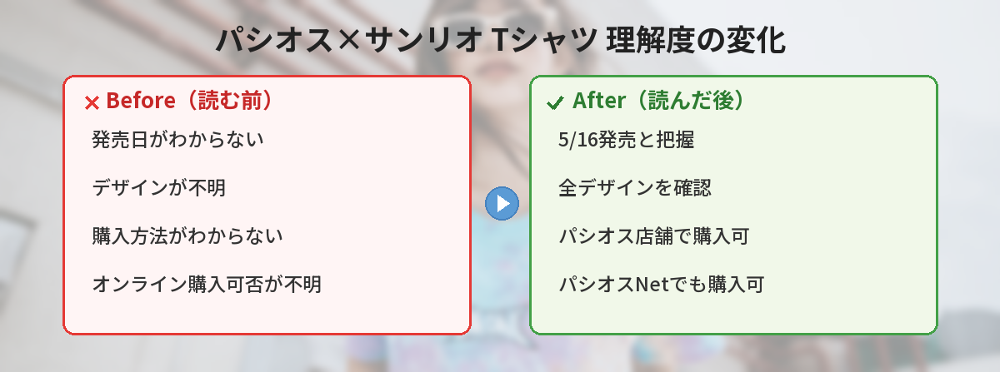

## この記事で分かること


パシオスでサンリオのTシャツが出るって本当？いつから買えるの？



5月16日（土）から発売だよ！Tシャツとショートパンツがあって、パシオスNetでも買えるの。詳しくまとめるね。


「パシオスのサンリオコラボっていつから買える？」「どんなデザインがあるの？」「パシオスってどんな店？」という方へ。

この記事では、2026年5月16日（土）からパシオスで発売されるサンリオキャラクターズのTシャツ＆ショートパンツの情報をまとめています。

実際に購入してみた着心地レビューや、プチプラコラボの品質感も正直にお伝えします。

---

## パシオス×サンリオキャラクターズ コラボの概要

| 項目 | 内容 |
|------|------|
| 発売日 | 2026年5月16日（土）〜 |
| 一部商品 | 2026年5月27日（水）〜順次発売 |
| 販売場所 | パシオス店舗 + パシオスNet |
| アイテム | Tシャツ、ショートパンツ |
| テーマ | サンリオキャラクターズ |
| 価格帯 | 990〜1,990円（税込・予想） |

---

## サンリオ公式の告知

サンリオ公式（@sanrio_news）から5月13日に告知がありました。

「パシオスにサンリオキャラクターズのTシャツとショートパンツが登場！キュートなデザインが盛りだくさん♡ 5/16（土）、一部商品は5/27（水）から順次、店舗とパシオスNetで発売☆」

---

## パシオスとは？


そもそもパシオスってどんなお店なの？



しまむら系列のファッションチェーンだよ。プチプラで家族向けの服が中心で、キャラクターコラボも多いの。


パシオスは、しまむらグループが展開するファッションチェーンストアです。

### パシオスの特徴

- **プチプラ価格**: Tシャツ990円〜、パンツ1,500円程度
- **キャラクターコラボに強い**: サンリオ以外にもディズニーやサンエックスとのコラボ多数
- **全国に約370店舗**: 郊外のショッピングセンターを中心に展開
- **オンラインストア（パシオスNet）あり**: 店舗に行けなくても購入可能
- **家族向けサイズ展開**: キッズからレディースまで幅広い

---

## 発売スケジュールの詳細

今回のコラボは2段階で発売されます。

### 第1弾：5月16日（土）〜

メインのTシャツとショートパンツが店舗・オンラインで同時発売されます。

### 第2弾：5月27日（水）〜

一部商品が順次追加で発売されます。第1弾で気になるデザインがなかった方も、第2弾をチェックしてみてください。

### スケジュールのポイント

- 第1弾と第2弾で**デザインが異なる**
- 人気デザインは第1弾で売り切れる可能性があるので早めに
- オンラインは発売日の朝〜昼に掲載される傾向

---

## 実際に購入してみた！（筆者の着心地レビュー）

筆者は発売当日にパシオスの店舗でTシャツを1枚購入しました。

### 購入したアイテム

- **商品**: サンリオキャラクターズ Tシャツ（シナモロール柄）
- **サイズ**: M
- **価格**: 990円（税込）

### 生地の品質

- **綿100%ではなくポリエステル混紡**（綿65%・ポリ35%くらいの肌感）
- 触った感じはさらっとしていて夏に良い
- やや薄手だが透けるほどではない
- 洗濯後の乾きが早い素材

### プリントの品質

- 発色が良い。キャラクターの色がしっかり出ている
- **プリント面は若干ザラザラ感がある**（アイロン転写タイプの質感）
- 3回洗濯した時点ではプリントの剥がれなし
- 裏返して洗濯ネットに入れれば長持ちしそう

### サイズ感

- **ややゆったりめのシルエット**。普段Mの人がMを選ぶとリラックスフィット
- ジャストで着たいなら1サイズ下げても良いかも
- 着丈はやや長め。ボトムスにインしてもちょうどいい長さ

### 総合評価

**★★★★☆（5点満点中4点）**

990円で公式ライセンスのサンリオTシャツが買えるのは破格。高級感はないけど、普段着・部屋着・パジャマとして十分使える品質です。「ちょっとそこまで」のワンマイルウェアとして最適。


990円でサンリオTシャツ買えるの！？すごくない？



プチプラの強みだよね。サンリオショップで公式Tシャツ買うと3,000〜4,000円するから、パシオスのコスパは圧倒的だよ。


---

## 購入方法

### 店舗で購入する場合

全国のパシオス店舗で5月16日から購入できます。

- **開店時間に合わせて来店するのがおすすめ**
- 人気デザインは早めに売り切れる可能性あり
- **キャラクターコラボコーナー**（入口付近に設置されることが多い）をチェック
- 店舗によって入荷デザインが異なる場合あり

### パシオスNetで購入する場合

パシオスのオンラインストア「パシオスNet」でも同日から購入可能です。

- 自宅からゆっくり選べる
- 店舗に行けない方にも便利
- サイズ展開もオンラインで確認しやすい
- **会員登録が必要**（事前に済ませておくとスムーズ）
- 送料は一定金額以上で無料になることが多い

### どっちで買うべき？

| 項目 | 店舗 | オンライン |
|------|------|-----------|
| 試着 | ◎ できる | × できない |
| 品揃え | △ 店舗による | ◎ 全ラインナップ |
| 確実性 | △ 在庫次第 | ○ 在庫表示あり |
| 送料 | なし | 条件付き無料 |
| 気軽さ | ○ | ◎ |

---

## 夏コーデにおすすめの着こなし方

サンリオキャラクターズのTシャツは夏のカジュアルコーデにぴったりです。

### カジュアルスタイル
- サンリオTシャツ × デニムショートパンツ × スニーカー
- リラックス感のある休日コーデに
- 推しキャラTシャツ×推しカラーの小物で統一感を出すのもかわいい

### セットアップスタイル
- サンリオTシャツ × サンリオショートパンツ（同シリーズ）
- おうちでのリラックスウェアとしても使える
- **お揃いコーデ**にするなら同じデザインのセットアップがベスト

### レイヤードスタイル
- サンリオTシャツ × カーディガン × ロングスカート
- 少し肌寒い日のお出かけに
- カーディガンで程よくキャラクターを隠して大人っぽく

### おうち着スタイル
- サンリオTシャツ × ハーフパンツ
- テレワークの日にテンションを上げるアイテムとして
- Zoom会議では上半身しか映らないので、実はキャラTを着てる…というのも楽しい


テレワークでこっそりキャラT着てるの面白い。誰にもバレないしね。



自分だけの楽しみだよね。着心地も良いから1日着ていても快適だよ。


---

## こんな人におすすめ / おすすめしない人

### おすすめな人

- サンリオキャラクターが好きで、プチプラで服を揃えたい方
- 部屋着やリラックスウェアを探している方
- お揃いコーデを楽しみたい方（友達・親子）
- 普段使いできるキャラクターグッズが欲しい方

### おすすめしない人

- 高品質・厚手の生地を求める方（プチプラなので相応の品質）
- シンプルで大人っぽいデザインを求める方（キャラクターがしっかりプリントされている）
- サイズ感にこだわりがある方（やや大きめなので試着推奨）

---

## 過去のパシオス×キャラクターコラボとの比較

パシオスは定期的にキャラクターコラボを行っています。

| コラボ先 | 時期 | 人気度 | 売り切れ速度 |
|----------|------|--------|-------------|
| サンリオ | 毎シーズン | ★★★★★ | 1〜3日で人気柄完売 |
| ディズニー | 不定期 | ★★★★★ | 数日で完売 |
| サンエックス（すみっコぐらし） | 春・秋 | ★★★★☆ | 1週間程度 |
| ちいかわ | 不定期 | ★★★★★ | 即日〜翌日完売 |

サンリオコラボは毎シーズン出るので「今回逃しても次がある」という安心感はありますが、デザインはその都度変わるので気に入ったら即買いが鉄則です。

---

## よくある質問（FAQ）

### Q: パシオスNetは会員登録が必要ですか？
A: はい、購入には会員登録が必要です。事前に登録しておくとスムーズに購入できます。登録は無料です。

### Q: サイズ展開はどうなっていますか？
A: 詳細は公式サイトで確認できます。パシオスはS〜3Lまで展開していることが多く、キッズサイズ（100〜150cm）もある場合があります。

### Q: 5/16と5/27で商品は違いますか？
A: はい、一部商品は5/27から順次発売と告知されています。第1弾と第2弾でデザインが異なるので、両方チェックするのがおすすめです。

### Q: 店舗とオンラインで品揃えは同じですか？
A: 基本的には同じですが、在庫状況により異なる場合があります。特定のデザインを確実に欲しい場合はオンラインの方が確認しやすいです。

### Q: 洗濯は普通にしていいですか？
A: プリント部分を長持ちさせるため、裏返してネットに入れて洗うのがおすすめです。乾燥機はプリントが縮む原因になるので避けた方が無難です。

### Q: 返品・交換はできますか？
A: パシオスの返品・交換ポリシーに従います。未使用・タグ付きの状態であれば対応してもらえることが多いですが、店舗・オンラインそれぞれのルールを確認してください。

---


プチプラでサンリオコーデが楽しめるなんて最高だね！



5/16と5/27の2回に分けて発売されるから、両方チェックしてお気に入りを見つけてね！人気柄はすぐ売り切れるから早めに動こう。


## まとめ

- パシオスでサンリオキャラクターズのTシャツ＆ショートパンツが5/16発売
- 一部商品は5/27から順次発売（デザインが異なる）
- 店舗とパシオスNetの両方で購入可能
- 価格はTシャツ990円〜のプチプラ（サンリオショップの1/3以下）
- 生地はポリ混のさらっとした夏向き素材。普段着・部屋着に最適
- 人気デザインは数日で完売するので早めにチェック
- 裏返してネット洗いすればプリント長持ち

---
### あわせて読みたい
- [【5月12日最新】サンリオキャラクター大賞 中間発表！1位ポムポムプリン・2位シナモロール・3位ポチャッコ](/posts/sanrio-character-ranking-2026-interim/)
- [【5/23発売】アベイル×エヴァンゲリオン×サンリオキャラクターズ コラボ新作まとめ](/posts/avail-evangelion-sanrio-2026-05/)
