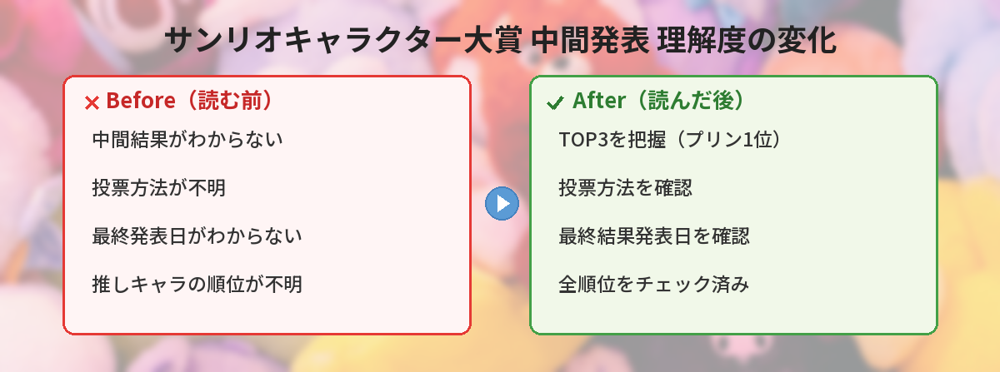

## この記事で分かること


サンリオキャラクター大賞の中間発表が出たんだって！推しキャラが何位か気になるよ〜！



2026年5月12日に中間結果が発表されたよ。TOP3の結果と投票方法をまとめたから、チェックしてみてね。


「サンリオキャラクター大賞の中間発表、結果はどうなった？」「推しキャラは何位？」という方へ。

この記事では、2026年5月12日に発表されたサンリオキャラクター大賞の中間結果と、各キャラクターの注目ポイント、投票方法をまとめています。

## 2026年サンリオキャラクター大賞とは

サンリオキャラクター大賞は、サンリオが毎年開催するファン投票イベントです。
2026年で第41回を迎えます。

今年のテーマは **「みんなでトライ！みんなでエール！スマイリングオベーション！」** です。

| 項目 | 内容 |
|------|------|
| 投票開始 | 2026年4月9日 |
| 中間発表 | 2026年5月12日 |
| 最終結果発表 | 2026年6月28日 |
| 参加キャラクター数 | 90キャラクター |

## 中間発表 TOP3の結果

2026年5月12日、公式Xアカウントから中間発表が行われました。

### 第1位：ポムポムプリン

<blockquote class="twitter-tweet" data-media-max-width="560">
／ 2026年 <a href="https://twitter.com/hashtag/%E3%82%B5%E3%83%B3%E3%83%AA%E3%82%AA%E3%82%AD%E3%83%A3%E3%83%A9%E3%82%AF%E3%82%BF%E3%83%BC%E5%A4%A7%E8%B3%9E?src=hash&amp;ref_src=twsrc%5Etfw">#サンリオキャラクター大賞</a> 中間発表☆ ＼  第1位！ <a href="https://twitter.com/hashtag/%E3%83%9D%E3%83%A0%E3%83%9D%E3%83%A0%E3%83%97%E3%83%AA%E3%83%B3?src=hash&amp;ref_src=twsrc%5Etfw">#ポムポムプリン</a> ポムポムプリン「みんな〜たっくさんのエールをどうもありがとう！とっても嬉しいよ〜。ぼくからポムポムエールを送るよ！ポムポム〜♪ みんなと一緒に頑張って、ぼくのアニバーサリーイヤーを楽しもうね☆」<a href="https://twitter.com/hashtag/%E3%82%AD%E3%83%A3%E3%83%A9%E5%A4%A7?src=hash&amp;ref_src=twsrc%5Etfw">#キャラ大</a> <a href="https://t.co/5hwJ0YGGwF">pic.twitter.com/5hwJ0YGGwF</a>
&mdash; サンリオキャラクター大賞【公式】 (@sanrio_ranking) <a href="https://twitter.com/sanrio_ranking/status/2054047685649600723?ref_src=twsrc%5Etfw">May 12, 2026</a></blockquote> 

2026年はポムポムプリンの **デビュー30周年アニバーサリーイヤー** です。
1996年に誕生して以来、ゴールデンレトリバーの男の子として多くのファンに愛されてきました。

30周年の記念イヤーということもあり、ファンの応援が一段と熱くなっているようです。
サンリオピューロランドでも4月10日から30周年記念イベントが開催されています。

### 第2位：シナモロール

<blockquote class="twitter-tweet" data-media-max-width="560">
／ 2026年 <a href="https://twitter.com/hashtag/%E3%82%B5%E3%83%B3%E3%83%AA%E3%82%AA%E3%82%AD%E3%83%A3%E3%83%A9%E3%82%AF%E3%82%BF%E3%83%BC%E5%A4%A7%E8%B3%9E?src=hash&amp;ref_src=twsrc%5Etfw">#サンリオキャラクター大賞</a> 中間発表☆ ＼  第2位！ <a href="https://twitter.com/hashtag/%E3%82%B7%E3%83%8A%E3%83%A2%E3%83%AD%E3%83%BC%E3%83%AB?src=hash&amp;ref_src=twsrc%5Etfw">#シナモロール</a> シナモロール「たくさんのエール、どうもありがとう！みんなの笑顔がぼくのパワーになるよ♪ さいごまでいっしょに楽しもうね！」<a href="https://twitter.com/hashtag/%E3%82%AD%E3%83%A3%E3%83%A9%E5%A4%A7?src=hash&amp;ref_src=twsrc%5Etfw">#キャラ大</a> <a href="https://t.co/0AiC16U7JV">pic.twitter.com/0AiC16U7JV</a>
&mdash; サンリオキャラクター大賞【公式】 (@sanrio_ranking) <a href="https://twitter.com/sanrio_ranking/status/2054046425814818917?ref_src=twsrc%5Etfw">May 12, 2026</a></blockquote> 

シナモロールは近年のキャラクター大賞で圧倒的な強さを見せてきたキャラクターです。
2023年には4連覇を達成しています。

今年は中間2位ですが、最終発表までにどう巻き返すかが注目ポイントです。

### 第3位：ポチャッコ

<blockquote class="twitter-tweet" data-media-max-width="560">
／ 2026年 <a href="https://twitter.com/hashtag/%E3%82%B5%E3%83%B3%E3%83%AA%E3%82%AA%E3%82%AD%E3%83%A3%E3%83%A9%E3%82%AF%E3%82%BF%E3%83%BC%E5%A4%A7%E8%B3%9E?src=hash&amp;ref_src=twsrc%5Etfw">#サンリオキャラクター大賞</a> 中間発表☆ ＼  第3位！ <a href="https://twitter.com/hashtag/%E3%83%9D%E3%83%81%E3%83%A3%E3%83%83%E3%82%B3?src=hash&amp;ref_src=twsrc%5Etfw">#ポチャッコ</a> ポチャッコ「たくさんのエールをありがとう！みんなの気持ちが嬉しくて、ボク、自然と顔がニコニコしちゃう♪ みんなもニコニコ、最後まで一緒に楽しもうね！」<a href="https://twitter.com/hashtag/%E3%82%AD%E3%83%A3%E3%83%A9%E5%A4%A7?src=hash&amp;ref_src=twsrc%5Etfw">#キャラ大</a> <a href="https://t.co/lr0rvVXdcq">pic.twitter.com/lr0rvVXdcq</a>
&mdash; サンリオキャラクター大賞【公式】 (@sanrio_ranking) <a href="https://twitter.com/sanrio_ranking/status/2054045168316395922?ref_src=twsrc%5Etfw">May 12, 2026</a></blockquote> 

ポチャッコは1989年デビューのベテランキャラクターです。
近年は再ブームが起きており、若い世代からの支持も集めています。

おっとりした性格と、どこか懐かしいデザインが幅広い世代に刺さっているようです。


ポムポムプリンが1位なんだ！30周年の力ってすごいね。シナモロールは今年どうなるんだろう？



シナモロールは近年ずっと強かったけど、今年は中間2位なの。最終発表まで逆転があるかもしれないから、まだまだ目が離せないよ。


## 中間発表から見える2026年の傾向

### 30周年パワーが炸裂

ポムポムプリンが中間1位を獲得した最大の要因は、30周年アニバーサリーイヤーの盛り上がりです。
サンリオピューロランドでの記念イベント、限定グッズ、コラボ企画など、露出が大幅に増えています。

記念イヤーのキャラクターは毎年ファンの投票意欲が高まる傾向があります。

### シナモロール王朝に変化？

シナモロールは2020年代に入ってからキャラ大を席巻してきました。
しかし今年は中間2位。最終結果で逆転するのか、それともポムポムプリンが30周年の勢いで逃げ切るのかが最大の見どころです。

### レトロキャラの復権

ポチャッコ（1989年）、ポムポムプリン（1996年）と、90年代前後のキャラクターがTOP3に2つ入っています。
「Y2Kブーム」や「平成レトロ」の流れがサンリオにも波及しているのかもしれません。


レトロキャラが人気なのって面白いね！投票ってどうやるの？



投票方法はいくつかあるよ。公式サイトから1日1回無料でできるから、毎日コツコツ応援するのがポイントだよ。


## 投票方法

サンリオキャラクター大賞への投票は、以下の方法で参加できます。

### 公式サイトから投票

サンリオ公式サイトの特設ページから、1日1回無料で投票できます。
スマートフォンからも参加可能です。

### サンリオショップ・ピューロランドで投票

店頭やピューロランド内に設置された投票ボックスからも参加できます。
来場記念に推しキャラへ一票入れるのも楽しいです。

### コラボ企画での投票

不二家などのコラボ企業でも投票カードが配布されています。
対象商品を購入すると投票に参加できる仕組みです。

## 最終結果発表はいつ？

最終結果発表は **2026年6月28日** に公式サイトで行われます。

中間発表から最終発表までの約1ヶ月半が、ファンにとっての追い込み期間です。
推しキャラの順位を上げたい方は、毎日コツコツ投票するのがポイントです。

## よくある質問（FAQ）

### Q: サンリオキャラクター大賞は誰でも投票できますか？

A: はい。公式サイトから無料で参加できます。年齢制限もありません。1日1回投票可能です。

### Q: 中間発表と最終結果は変わることがありますか？

A: あります。過去にも中間発表から順位が入れ替わった例は多いです。最後まで結果は分かりません。

### Q: ポムポムプリンの30周年イベントはどこで開催されていますか？

A: サンリオピューロランド（東京都多摩市）で2026年4月10日から開催中です。限定グッズや特別ショーが楽しめます。

### Q: 今年は何キャラクターがエントリーしていますか？

A: 2026年は90キャラクターが参加しています。


6月28日の最終発表が楽しみだね！毎日投票して推しを応援するぞ〜！



中間から最終で順位が変わることもよくあるから、最後まで諦めずに投票してね。結果発表の日を楽しみに待とう！


## まとめ

- 2026年サンリオキャラクター大賞の中間発表が5月12日に公開
- 第1位はポムポムプリン（30周年アニバーサリーイヤーの追い風）
- 第2位はシナモロール（近年の王者、最終発表での逆転なるか）
- 第3位はポチャッコ（レトロキャラ人気の復権）
- 最終結果発表は2026年6月28日
- 投票は公式サイトから1日1回無料で参加可能

推しキャラがいる方は、最終発表まで毎日投票して応援しましょう。
6月28日の結果発表が楽しみです。
