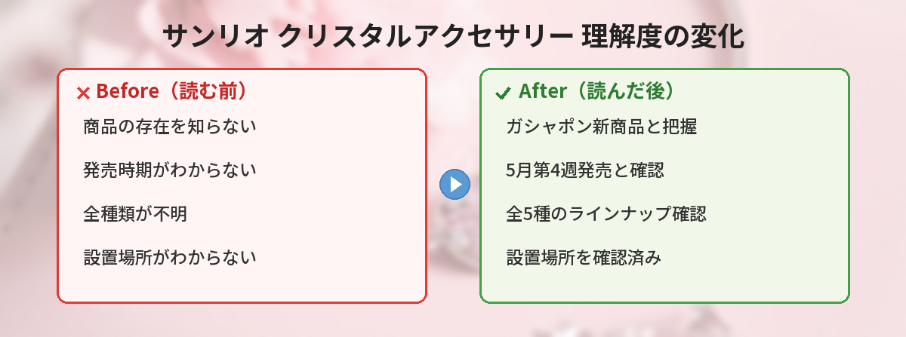

## この記事で分かること


サンリオのクリスタルアクセサリーがガシャポンで出るって聞いたんだけど、どんなものなの？



全面ダイヤモンドカットでキラキラ輝くアクセサリーだよ！全5種で5月第4週から発売されるの。詳しく紹介するね。


「サンリオのクリスタルめじるしアクセサリーって何？」「いつどこで買えるの？」「全部で何種類あるの？」という方へ。

この記事では、バンダイのガシャポンから登場する「サンリオキャラクターズ クリスタルめじるしアクセサリー」の発売日・ラインナップ・設置場所をまとめています。

筆者も発売後に実際にガシャポンを回してきたので、実物のクオリティや「これは回す価値あるのか？」の正直な感想もお伝えします。

---

## サンリオキャラクターズ クリスタルめじるしアクセサリーとは

バンダイのカプセルトイブランド「ガシャポン」から登場する、サンリオキャラクターをモチーフにしたアクセサリーです。

最大の特徴は **全面にダイヤモンドカットが施されている** こと。光を受けるとキラキラと輝く仕様になっています。

| 項目 | 内容 |
|------|------|
| 商品名 | サンリオキャラクターズ クリスタルめじるしアクセサリー |
| メーカー | バンダイ（ガシャポン） |
| 種類 | 全5種 |
| 発売時期 | 2026年5月第4週〜順次 |
| 販売場所 | 全国のカプセルトイ自販機 |
| 価格帯 | 300〜500円（設置場所で確認） |

---

## 発売日と販売場所

発売は **2026年5月第4週から順次** です。

全国のカプセルトイ自販機に設置されます。ショッピングモールやゲームセンター、駅ナカなどガシャポンコーナーがある場所をチェックしてみてください。

### 設置場所を探すコツ

- **バンダイ公式「ガシャポンワールド」サイト**で設置店舗を検索できます
- 大型ショッピングモールのガシャポンコーナーは入荷が早い傾向があります
- 人気商品は初日〜数日で売り切れることもあるので、早めに回るのがおすすめです
- **ガシャポン専門店**（ガシャポンのデパート等）は品揃えが豊富で見つけやすい

---

## 全5種のラインナップ

サンリオ公式の発表によると全5種のラインナップです。

ダイヤモンドカットが全面に施されたクリスタル素材で、キャラクターの「めじるし」（シンボルマーク）がアクセサリーになっています。

### 「めじるし」とは？

サンリオキャラクターにはそれぞれ象徴的なモチーフがあります。

| キャラクター | めじるし（シンボル） |
|-------------|---------------------|
| ハローキティ | リボン |
| マイメロディ | 頭巾（ずきん） |
| シナモロール | 雲・星 |
| ポムポムプリン | ベレー帽 |
| クロミ | どくろ |

今回の全5種がどのキャラクターかは公式の詳細発表待ちですが、上記のような人気キャラクターのモチーフがクリスタルアクセサリーになっていると予想されます。


ダイヤモンドカットってすごいね！普通のガシャポンとは違う感じなの？



そうなの！光の角度で輝き方が変わるクリスタル素材で、ガシャポンとは思えないクオリティだよ。バッグチャームにもぴったりなの。


---

## 実際に回してみた！（筆者の体験レポート）

筆者は発売3日後にショッピングモール内のガシャポンコーナーで2回回してきました。

### 実物のクオリティ

- **想像以上にキラキラ**: 蛍光灯の下でもしっかり輝く。自然光だとさらにきれい
- **サイズ感**: 3cm × 2cmくらいで、バッグチャームとして丁度いい大きさ
- **重さ**: 軽い。アクリル系の素材で、重さでバッグが傷む心配なし
- **金具の品質**: カプセルトイにしてはしっかりした金具。すぐ壊れそうな感じはしない

### 良かった点

- **300〜500円でこのクオリティは大満足**。アクセサリーショップで同じようなものを買ったら1,000円以上しそう
- **推しキャラのモチーフを身につけられる**のが嬉しい。さりげなくサンリオ好きをアピールできる
- **透明感のあるデザイン**で、夏のコーデに合わせやすい

### イマイチだった点

- **狙ったキャラが出るとは限らない**。ガシャポンなのでランダム。2回回して同じものが出る可能性もある
- **パッケージの台紙がペラい**。コレクション用に飾りたい人は台紙ごと保管が難しい
- **アクセサリーとしてのチェーン長さ**が固定で調整できない

### 結論：回す価値あり？

**あり**です。300〜500円でこの輝きと品質なら大満足。推しキャラのめじるしが出たら嬉しさ倍増。3回くらい回す覚悟で行くのがおすすめです。

---

## デザインの特徴

### ダイヤモンドカット仕様

通常のガシャポンアクセサリーとは一線を画す、全面ダイヤモンドカットが最大のポイントです。

- 光の角度によって輝き方が変わる
- クリスタル素材で透明感がある
- キャラクターのシンボルマークをモチーフにしたデザイン
- 色味はキャラクターカラーに合わせたクリスタルカラー

### 他のサンリオガシャポンとの違い

| 比較項目 | クリスタルめじるし | 一般的なサンリオガシャポン |
|----------|-------------------|--------------------------|
| 素材 | クリスタル（アクリル系） | ラバー・PVC |
| 輝き | ダイヤモンドカットで光る | マットな質感 |
| 用途 | アクセサリー・チャーム | ストラップ・マスコット |
| 対象年齢 | 10代〜大人 | 全年齢 |
| デザイン | シンプル・上品 | キャラクターそのまま |

### アクセサリーとしての使い方

「めじるしアクセサリー」という名前の通り、バッグやポーチにつけたり、キーホルダーとして使ったりできます。

**おすすめの付ける場所:**
- バッグのファスナー部分
- ポーチのチャック
- リュックのDカン
- 鍵束にまとめる
- スマホケースのストラップホール

推しキャラのめじるしを身につけて、さりげなくサンリオ好きをアピールできるアイテムです。


バッグにつけるのかわいいね。普段使いできそう！



キャラクターそのものじゃなくて「めじるし」だから、シンプルで大人っぽく使えるのがポイントだよ。仕事用のバッグにつけても浮かないの。


---

## 価格の目安

ガシャポンの価格は商品によって異なりますが、サンリオコラボのアクセサリー系は **300円〜500円** の価格帯が多いです。

### コスパは良い？

同じようなクリスタルアクセサリーをサンリオショップで購入すると1,000〜2,000円程度。ガシャポンなら300〜500円で手に入るので、コスパはかなり良いです。

ただしガシャポンはランダムなので、「全5種コンプリートしたい」場合は最低2,500円（5回×500円）、被り込みで4,000〜5,000円くらいかかる可能性があります。

---

## こんな人におすすめ / おすすめしない人

### おすすめな人

- サンリオキャラクターが好きで、さりげなく推しグッズを身につけたい方
- キラキラしたアクセサリーが好きな方
- 300〜500円で気軽にサンリオグッズが欲しい方
- ガシャポン巡りが趣味の方
- 友達へのちょっとしたプレゼントを探している方

### あまりおすすめしない人

- 「特定のキャラクターだけ絶対欲しい」という人（ランダムなので運次第）
- コレクションとして台紙ごと飾りたい人（台紙は簡素）
- 子ども用のおもちゃを探している人（アクセサリーなので小さい）

---

## 入手のコツ

### コンプリートを目指す場合

全5種をコンプリートしたい場合は、以下のポイントを押さえておくと効率的です。

- 発売初日〜3日以内に回る（人気商品は早く売り切れる）
- 複数の設置場所を把握しておく
- SNSで在庫情報をチェックする（X検索で「クリスタルめじるし」と検索）
- **ガシャポン専門店が最も確実**。一般的なスーパーのガシャポンコーナーは設置されない場合あり

### 被りを避けたい場合

ガシャポンはランダムなので被りが出ることもあります。

- **フリマアプリ**でのトレード（交換）が効率的
- **X（旧Twitter）**で「#クリスタルめじるし 交換」と検索すると交換希望者が見つかる
- 友達と一緒に回して、被りを交換するのもおすすめ

---

## よくある質問（FAQ）

### Q: いつから買えますか？
A: 2026年5月第4週から順次、全国のカプセルトイ自販機に設置されます。地域によって設置タイミングが異なる場合があります。

### Q: どこで買えますか？
A: 全国のカプセルトイ自販機です。ショッピングモール、ゲームセンター、駅ナカなどのガシャポンコーナーを探してみてください。バンダイ公式「ガシャポンワールド」で設置場所を検索できます。

### Q: 全部で何種類ありますか？
A: 全5種です。キャラクターの「めじるし」がそれぞれ異なるデザインになっています。

### Q: 1回いくらですか？
A: 正確な価格は設置場所で確認してください。サンリオコラボのアクセサリー系は300円〜500円の価格帯が多いです。

### Q: 金属アレルギーでも大丈夫ですか？
A: 本体部分はアクリル系のクリスタル素材ですが、金具部分は金属です。金属アレルギーがある方は、金具部分に透明マニキュアを塗るか、直接肌に触れない使い方（バッグチャームなど）がおすすめです。

### Q: 子どもでも回していいですか？
A: もちろん大丈夫です。ただし小さなパーツが含まれるため、3歳未満のお子さんには注意が必要です。

---


キラキラのアクセサリー、推しキャラのやつ絶対ほしい！早めにガシャポン巡りしなきゃ！



5月第4週からだから、カレンダーにメモしておいてね。バンダイ公式サイトで設置場所も確認できるよ！推し以外が出ても交換相手を探せるからね。


## まとめ

- バンダイのガシャポンから「サンリオキャラクターズ クリスタルめじるしアクセサリー」が登場
- 全面ダイヤモンドカットのキラキラ仕様で全5種
- 2026年5月第4週から全国のカプセルトイ自販機で順次発売
- 実物は300〜500円とは思えない高クオリティ
- さりげなく推しキャラをアピールできる大人向けデザイン
- 人気商品は早めに売り切れる可能性があるので、発売直後にチェックするのがおすすめ
- 被りが出たらSNSやフリマアプリで交換が効率的

---
### あわせて読みたい
- [サンリオキャラクター大賞 2026年中間発表まとめ](/posts/sanrio-character-ranking-2026-interim/)
- [ヒルトン広島×ポムポムプリン コラボビュッフェ情報](/posts/hilton-hiroshima-pompompurin-buffet-2026/)
