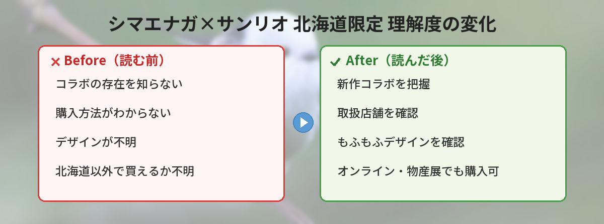

## この記事で分かること


シマエナガとサンリオのコラボグッズが出たんだって！北海道限定ってことは現地に行かないと買えないの？



基本は北海道限定だけど、オンラインや物産展で買える方法もあるよ。新作のデザインや購入方法をまとめたから見てみてね。


「シマエナガ×サンリオの新作グッズってどんなもの？」「北海道限定ってどこで買えるの？」という方へ。

この記事では、2026年5月に発表されたシマエナガ×サンリオキャラクターズの北海道限定新作アイテムについて、デザインの特徴や購入方法をまとめています。

北海道に行けない方向けの入手方法もしっかり解説するので、「限定グッズ欲しいけど北海道は遠い…」という方も参考にしてください。

---

## シマエナガ×サンリオキャラクターズとは

シマエナガは北海道に生息する小さな野鳥で、真っ白でまるい体が「雪の妖精」と呼ばれて大人気です。

このシマエナガとサンリオキャラクターズがコラボした「ご当地シマエナガ」シリーズは、北海道限定で展開されているグッズラインです。

サンリオ公式が2026年5月19日に新作アイテムの登場を発表しました。

### なぜシマエナガが人気なのか

- 体長約14cmの小さな体で**真っ白・まんまる**
- 冬になるとさらにふくらんで雪だるまのような見た目に
- **「雪の妖精」**という愛称がキャッチーで覚えやすい
- 北海道でしか見られない希少性
- SNS映えする見た目で、写真がバズりやすい


シマエナガってなんでこんなに人気なの？SNSでよく見かけるけど。



真っ白でまんまるな見た目が「雪の妖精」って呼ばれてるの。写真映えするし、北海道限定っていう希少性もあって、グッズが出るたびにバズるんだよ。


---

## 新作アイテムのデザインの特徴

今回の新作は、もふもふフワフワなシマエナガとサンリオキャラクターたちが「ぎゅっと寄り添う」デザインが特徴です。

### コラボの魅力ポイント

- シマエナガの白くてまるいフォルムとサンリオキャラの組み合わせ
- 北海道の冬をイメージした雪の妖精モチーフ
- 自分用にもお土産にもぴったりなサイズ感
- サンリオならではのキュートな色使い
- **「かわいい×かわいい」の最強タッグ**

### 登場キャラクター

過去のシリーズでは以下のキャラクターとのコラボが展開されています。新作でも同様のラインナップが予想されます。

| キャラクター | シマエナガとの組み合わせ | 人気度 |
|-------------|--------------------------|--------|
| ハローキティ | 白×白で統一感抜群 | ★★★★★ |
| マイメロディ | ピンク×白のコントラスト | ★★★★★ |
| シナモロール | 空・雲モチーフで相性◎ | ★★★★☆ |
| ポムポムプリン | 黄色×白で元気な印象 | ★★★★☆ |
| ポチャッコ | ブルー×白で爽やか | ★★★☆☆ |

---

## 筆者が以前購入した過去シリーズのレビュー

筆者は以前の北海道旅行で第2弾のシマエナガ×シナモロールのキーホルダーを購入しました。

### 品質について

- **もふもふ素材の手触りが最高**: シマエナガ部分がファー素材で、触り心地が良い
- **サイズ感が絶妙**: 5cm程度でバッグに付けても邪魔にならない
- **耐久性はそこそこ**: 3ヶ月毎日使っていたら若干毛羽立ちが出た。でも普通に使える範囲
- **金具はしっかり**: カニカンタイプで取り外しやすく、壊れにくい

### お土産として渡した反応

友人3人にお土産として購入して渡したところ：

- 「かわいすぎる！北海道限定ってところが特別感あって嬉しい」
- 「シナモン推しだから最高。しかもシマエナガ付き」
- 「バッグにずっとつけてるよ」

全員に好評でした。「北海道限定」のレア感がプレゼントの満足度を上げてくれます。

---

## 購入方法・取扱店舗

### 北海道限定の販売場所

シマエナガ×サンリオキャラクターズは北海道限定商品のため、購入できる場所が限られています。

| 販売場所 | 品揃え | アクセスしやすさ |
|----------|--------|-----------------|
| 新千歳空港のお土産ショップ | ◎ 最も豊富 | ◎ 空港内なので便利 |
| 北海道内のサンリオショップ | ○ 一部 | ○ 札幌中心 |
| 北海道どさんこプラザ | ○ 定番品 | ◎ 東京・有楽町にもあり |
| 北海道物産展 | △ 期間限定 | △ 開催時のみ |
| オンラインショップ | ○ 一部 | ◎ 自宅から購入可 |

### 北海道に行ける人向け

- **新千歳空港がベスト**。品揃えが最も豊富で、帰りの飛行機前にまとめ買いできる
- 空港内の「Snow Sweet」や「Sky Shop小笠原」で取り扱いがある場合が多い
- 札幌駅のお土産エリアにもあることがある

### 北海道に行けない人向けの入手方法

1. **北海道どさんこプラザ**
   - 東京・有楽町、名古屋、大阪にある北海道のアンテナショップ
   - 定番品は常時置いてある可能性あり
   - 新作は入荷が遅れる場合がある

2. **オンライン購入**
   - Yahoo!ショッピング「シマエナガ サンリオ 北海道限定」で検索
   - 楽天市場で北海道土産の専門ショップが出品していることがある
   - **定価購入ができるショップを選ぶ**（転売品は割高）

3. **フリマアプリ**
   - メルカリ・ラクマで「シマエナガ サンリオ」と検索
   - 定価より高くなる場合があるので注意
   - 「北海道旅行のお土産代行」を受け付けている人もいる

4. **北海道物産展**
   - 全国の百貨店で定期的に開催される
   - 事前にラインナップを確認してから行く
   - 物産展は食品メインのこともあるので、グッズの取り扱いは要確認


北海道に行けなくても買えるんだね！お土産にも良さそう。



キーホルダーやポーチならかさばらないし、サンリオ好きな友達へのプレゼントにもぴったりだよ。限定感があるから喜ばれるの。


---

## お土産としてのおすすめポイント

北海道旅行のお土産として、シマエナガ×サンリオグッズが喜ばれる理由をまとめます。

### 喜ばれるポイント5つ

1. **北海道でしか買えない限定感** — 「わざわざ現地で買ってきてくれた」という特別感
2. **サンリオファンにも刺さる** — キャラクター好きな友人へのプレゼントに最適
3. **かさばらないアイテムが多い** — キーホルダーやポーチなど持ち帰りやすい
4. **幅広い年齢層に対応** — 子どもから大人まで使えるデザイン
5. **推しキャラを選べる** — 相手の推しキャラに合わせて選べる気遣い

### 価格帯別おすすめアイテム

| 予算 | おすすめアイテム | 相手 |
|------|-----------------|------|
| 500〜800円 | キーホルダー・マスコット | 友人・同僚への気軽なお土産 |
| 1,000〜1,500円 | ポーチ・ミニタオル | 仲のいい友達へ |
| 2,000〜3,000円 | ぬいぐるみ | 大切な人・自分用 |
| 3,000円〜 | ぬいぐるみセット | コレクター向け |

---

## SNSでの反応

シマエナガ×サンリオの新作が発表されるたびに、SNSでは大きな反響があります。

- 「もふもふシマエナガとサンリオキャラの組み合わせ、最強すぎる」
- 「北海道行く理由がまたひとつ増えた」
- 「どさんこプラザに入荷されたら即買いに行く」
- 「お友達にお土産で頼んだら品切れだったって言われた…」
- 「今年の夏の北海道旅行、新千歳空港でまとめ買いする予定」

サンリオとのコラボは「かわいい×かわいい」の最強タッグとして、毎回発表のたびにX（旧Twitter）で話題になっています。

---

## よくある質問（FAQ）

### Q: 北海道以外で買える場所はありますか？

A: 北海道どさんこプラザ（東京・有楽町、名古屋など）や、オンラインショップで一部取り扱いがあります。ただし在庫は限られるため、確実に欲しい場合は北海道内での購入がおすすめです。

### Q: 新作の発売日はいつですか？

A: サンリオ公式が2026年5月19日に発表しました。詳しい発売日は公式サイトで順次公開される予定です。

### Q: 過去のシリーズはまだ買えますか？

A: 一部の定番アイテムは継続販売されていますが、限定デザインは売り切れ次第終了です。オンラインショップで在庫が残っている場合もあります。

### Q: 値段の相場はどのくらいですか？

A: キーホルダーやマスコットで500〜1,500円程度、ポーチやぬいぐるみで1,500〜3,000円程度が目安です。

### Q: 通販だと送料がかかりますか？

A: ショップによって異なりますが、多くの場合送料がかかります（500〜1,000円程度）。まとめ買いで送料無料になるショップもあるので、複数購入する場合は1店舗でまとめるのがお得です。

### Q: 本物かどうかの見分け方は？

A: 公式ライセンス商品にはサンリオの著作権表記（©1976,2026 SANRIO CO., LTD.等）が必ずパッケージに記載されています。フリマアプリで購入する場合は、パッケージの写真を確認しましょう。

### Q: 北海道旅行のついでに買うならどこが効率的？

A: 新千歳空港が最も効率的です。到着ロビーのお土産エリアにまとまっているので、帰りのフライト前にまとめ買いするのがベスト。出発前だと荷物が増えるので、帰りにまとめて購入するのがおすすめです。

---

## 北海道旅行で買うときのコツ

### 新千歳空港での探し方

新千歳空港にはお土産ショップが複数ありますが、シマエナガ×サンリオグッズが置かれやすいのは以下のエリアです。

- **国内線出発ロビー2F**: 「Snow Sweet」「Sky Shop小笠原」など
- **3F スマイルロード**: キャラクターグッズ専門のショップ
- **2F 到着ロビー近く**: 小規模だけど穴場のことがある

### 札幌市内での探し方

- **JR札幌駅 パセオ/エスタ**: 駅直結のお土産エリア
- **大通公園周辺のサンリオショップ**: 限定品の取り扱いがある場合あり
- **狸小路のお土産店**: 品揃えは空港に劣るが、旅行中に立ち寄りやすい

### 荷物対策

- キーホルダー・マスコット類はかさばらないのでスーツケースに余裕がなくてもOK
- ぬいぐるみはスーツケースの隙間に詰めるか、手持ちで
- 壊れやすい商品はプチプチに包んで保護（空港のショップなら梱包してくれることも）

---


もふもふシマエナガとサンリオキャラの組み合わせ、最強すぎるね！見つけたら即買いだ！



人気商品は売り切れが早いから、オンラインショップもこまめにチェックしてね。新作情報はサンリオ公式をフォローしておくと安心だよ。


## まとめ

- シマエナガ×サンリオキャラクターズの新作アイテムが2026年5月に発表
- もふもふシマエナガとキャラクターが寄り添うキュートなデザイン
- 北海道限定販売だが、どさんこプラザやオンラインでも入手可能
- 新千歳空港が最も品揃え豊富で確実に買える
- お土産としても自分用としても人気が高い
- 500〜3,000円の価格帯で予算に合わせて選べる
- 人気商品は売り切れが早いので早めのチェックがおすすめ

---
### あわせて読みたい
- [【5月12日最新】サンリオキャラクター大賞 中間発表！1位ポムポムプリン・2位シナモロール・3位ポチャッコ](/posts/sanrio-character-ranking-2026-interim/)
- [サンリオ クリスタルアクセサリーガシャポン 2026年新作まとめ](/posts/sanrio-gashapon-crystal-accessory-2026/)
